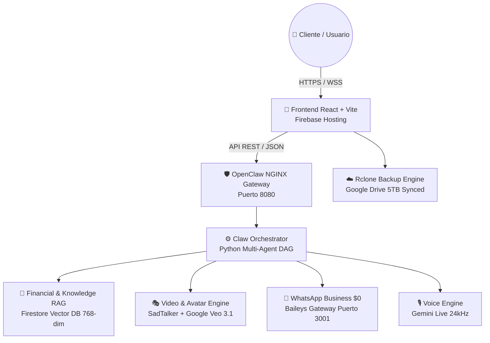
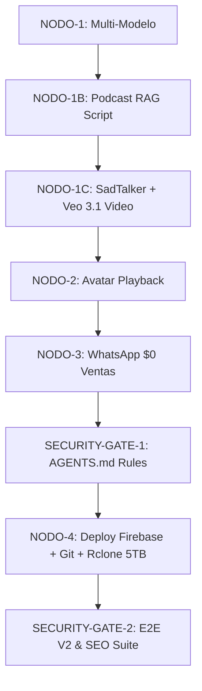

# Arquitectura de Sistema — OpenClaw Cloud & HB Jewelry Enterprise 2026

> **Versión:** v2026.7.1  
> **Fecha de Certificación:** 2026-07-29  
> **Arquitecto Maestro:** Guillermo / OpenClaw + Antigravity AI IDE  
> **Hosting Live:** [https://hb-jewelry-app.web.app/](https://hb-jewelry-app.web.app/)

---

## 🏛️ Visión General del Sistema

**OpenClaw Enterprise 2026** es una plataforma autónoma multimodal de comercio electrónico de lujo y atención al cliente integrada con **HB Jewelry 18k**.

---

## 🐳 Stack de Contenedores Docker (10/10 Activos)

| Contenedor | Servicio | Puerto | Descripción |
| :--- | :--- | :---: | :--- |
| `openclaw_gateway` | NGINX Reverse Proxy | `8080` | Enrutamiento seguro SSL y balanceo de carga |
| `claw-orchestrator` | Python DAG Engine | Inner | Orquestación de fases y ejecución de agentes |
| `financial_rag_worker` | Firestore Vector DB | Inner | Conversión matemática a vectores de 768-dim |
| `video_veo_worker` | Video Generativo | Inner | Generación cinemática Veo 3.1 + SadTalker 3D |
| `voice_worker` | Gemini Live Voice | `8091` | Síntesis vocal bilingüe con Audio Ducking -20dB |
| `openclaw_whatsapp` | WhatsApp Business | `3001` | Protocolo Baileys $0 para ventas conversacionales |
| `openclaw_app` | Node.js Core Backend | `3000` | APIs de productos, pedidos e inventario |
| `chat_worker` | Chat Multi-modelo | Inner | Ruteo inteligente Claude / Gemini / DeepSeek |
| `openclaw_qdrant` | Qdrant Vector Engine | `6333` | Índice de búsqueda vectorial rápida |
| `openclaw_redis` | Cache & Pub/Sub | `6379` | Cache en memoria y bus de eventos inter-proceso |

---

## 🔄 Orquestador DAG de 8 Nodos (Pipeline Integrado)

---

## 🔍 Infraestructura SEO & Indexación Buscadores

- **Dominio Principal:** `https://hb-jewelry-app.web.app/`
- **Robots Config:** [https://hb-jewelry-app.web.app/robots.txt](https://hb-jewelry-app.web.app/robots.txt)
- **Sitemap XML:** [https://hb-jewelry-app.web.app/sitemap.xml](https://hb-jewelry-app.web.app/sitemap.xml)
- **Marcado Estructurado:** Schema.org JSON-LD (`@type: JewelryStore`)
- **Open Graph & Twitter Cards:** Habilitados con soporte de miniatura `avatar_pro.png`

---

## 🔒 Protocolo de Blindaje Permanente (AGENTS.md)

Archivos protegidos bajo regla de solo lectura estricta:
- `Layout.jsx`
- `Header.jsx`
- `Sidebar.jsx`
- `layout.css`
- `sidebar.css`

---

*Certificado por el Motor Autónomo OpenClaw Enterprise v2026.7.1*
