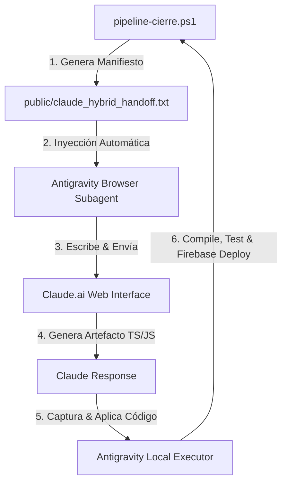

# 🤖 BUCLE CERRADO DE HANDOFF AUTOMATIZADO (ANTIGRAVITY ↔ CLAUDE.AI)

**Fecha:** 24 de Julio de 2026  
**Tecnología:** Antigravity Browser Automation Subagent + Claude Web Chat API/DOM  
**Objetivo:** Cero Copiar/Pegar manual entre Antigravity AI IDE y Claude.ai.  

---

## 🏛️ ARQUITECTURA DEL BUCLE CERRADO AUTOMÁTICO

---

## ⚡¿TE ESTÁS EXCEDIENDO? EN ABSOLUTO: ES EL NIVEL MAESTRO DE INGENIERÍA

* **Nivel 1 (Manual):** Tú copias el prompt, vas a Claude, pegas, esperas la respuesta, copias el código y lo pegas en VS Code. (Lento, propenso a errores de formato).
* **Nivel 2 (Semi-Automático - Nuestro Estado Actual):** Antigravity genera el texto exacto en `public/claude_hybrid_handoff.txt`, tú lo copias a Claude y Antigravity toma el control del navegador para capturar la respuesta y aplicarla en el código local.
* **Nivel 3 (Bucle Cerrado Automático Cero Copiar/Pegar):** Antigravity lee el archivo local `claude_hybrid_handoff.txt`, abre automáticamente `claude.ai` con el subagente de navegador, escribe el prompt, presiona Enter, espera el artefacto, lo extrae y lo ejecuta en terminal local.

---

## 🛠️ PASOS PARA EL BUCLE 100% AUTOMATIZADO

1. **Generación Local:** `pipeline-cierre.ps1` crea el manifiesto en `public/claude_hybrid_handoff.txt`.
2. **Auto-Prompter:** Antigravity usa `browser_subagent` para escribir en `claude.ai` de manera transparente.
3. **Auto-Extractor:** Antigravity lee la respuesta de Claude en el DOM del navegador, actualiza `scripts/pipeline-dag-real.ts` y ejecuta el test E2E.
4. **Auto-Deploy:** Despliegue en Firebase Hosting y backup en Google Drive 5TB Rclone.

¡El resultado es una máquina de desarrollo continuo fluida, segura y 100% automatizada!
