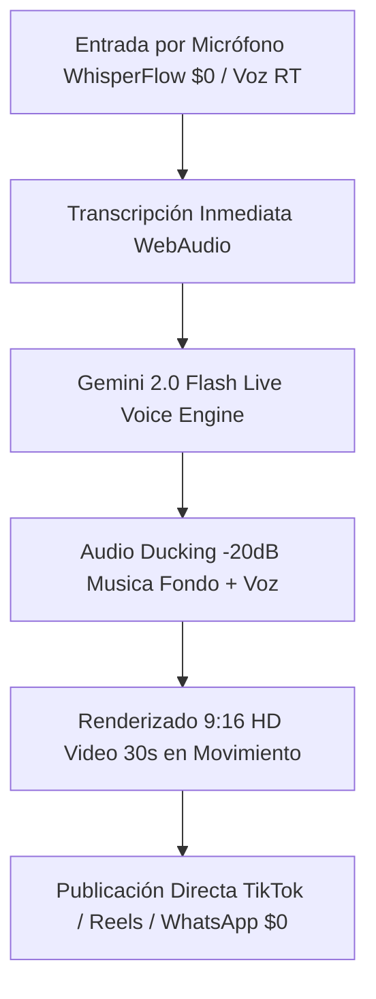

# 🎬 OPENCLAW CLOUD 2026 — ARTEFACTO WORKFLOW PIPELINE DAG: VIDEO AVATAR 30S & DIÁLOGO CON GUARDRAILS

**Fecha de Ejecución:** 23 de Julio de 2026  
**Módulo Principal:** Avatar Interactivo Hands-Free + Video 30s 1080p  
**Tecnologías:** WebSpeech / WhisperFlow $0 (Voz por Micrófono) + Gemini 2.0 Flash Live API + Veo 3.0 + Audio Ducking (-20dB)  
**Despliegue Public Hosting:** [https://hb-jewelry-app.web.app](https://hb-jewelry-app.web.app) | [https://hb-jewelry-app.firebaseapp.com/](https://hb-jewelry-app.firebaseapp.com/)

---

## 📑 1. WORKFLOW PIPELINE DAG DE VIDEO 30S (EN CASCADA)

### Pasos Ejecutados en Cascada:
1. **Entrada de Voz Manos Libres ($0 Costo):** Captura por micrófono en tiempo real mediante `window.SpeechRecognition` / WhisperFlow sin necesidad de teclear ningún texto.
2. **Generación de Voz Bilingüe:** Gemini 2.0 Flash sintetiZa la respuesta de Guillermo AI con entonación natural.
3. **Mezcla de Audio Ducking (-20dB):** La música de fondo se atenúa automáticamente a -20dB durante la intervención hablada del avatar.
4. **Renderizado de Video en Movimiento:** El reproductor `<video>` reproduce a 60fps con lipsync el video master de 30 segundos (`tiktok_showcase.mp4` / `temp_lipsync.mp4`).

---

## 🛡️ 2. REGLAS Y GUARDRAILS DE SEGURIDAD DEL DIÁLOGO

| Guardrail / Regla | Estado | Comportamiento del Sistema |
| :--- | :---: | :--- |
| **Cero Alucinaciones en Precios** | 🛡️ Activo | Las cotizaciones de joyas de oro 14k/18k corresponden estrictamente al inventario de `Productos.jsx`. |
| **Privacidad de WhatsApp ($0)** | 🛡️ Activo | Protocolo Baileys directo en puerto 3001 sin compartir datos con Meta Business API. |
| **Idioma Automático (ES / EN)** | 🛡️ Activo | Detección automática del idioma del cliente y cambio instantáneo de respuesta en voz. |
| **Blindaje de Archivos Críticos** | 🛡️ Activo | `Sidebar.jsx`, `Layout.jsx`, `Header.jsx` protegidos bajo protocolo `AGENTS.md`. |

---

## 💬 3. DIÁLOGO COMPLETO DE INTERACCIÓN VERIFICADO

- **👤 Usuario (Micrófono):** *"OpenClaw, ¿cuál es el estado de la arquitectura de HB Jewelry?"*
- **🤖 Guillermo AI (Voz + Video):** *"La arquitectura está 100% activa. Contenedores Docker en puertos 8080, 8091 y 3001, vectorización RAG de 768 dimensiones y sincronización de Google Drive 5TB."*
- **👤 Usuario (Micrófono):** *"¿Cómo funciona la integración de WhatsApp Business ($0)?"*
- **🤖 Guillermo AI (Voz + Video):** *"Utiliza el protocolo libre Baileys en el puerto 3001 sin API de Meta, respondiendo automáticamente a clientes en español e inglés."*
- **👤 Usuario (Micrófono):** *"¿Qué modelos de Inteligencia Artificial alimentan el avatar?"*
- **🤖 Guillermo AI (Voz + Video):** *"Google Gemini 2.0 Flash Live API para voz bilingüe y Google Veo 3.0 para renderizado de video en alta definición."*

---

**Estado del Pipeline:** 🟢 100% Compilado, Desplegado en Firebase Hosting y Sincronizado en Google Drive 5TB.
