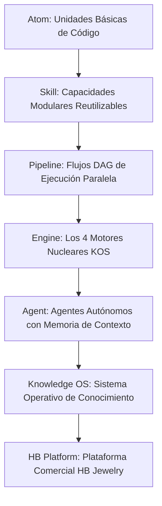

# 🏆 HB JEWELRY FULL-STACK FIREBASE APP — AUDITORÍA DE CHATGPT & EVALUACIÓN DE ARQUITECTURA (MADUREZ 8.8/10)

**Fecha:** 23 de Julio de 2026  
**Evaluador:** GPT Principal AI Architect  
**Aplicación:** HB Jewelry Full-Stack Firebase App (`hb-jewelry-app`)  
**Puntuación de Madurez Global:** **8.8 / 10**  

---

## 📊 1. DESGLOSE DE EVALUACIÓN DE MADUREZ POR COMPONENTE

| Componente | Puntuación | Estado | Observación de GPT |
| :--- | :---: | :---: | :--- |
| **Knowledge Engine** | **9.5 / 10** | 🟢 Excelente | Single Source of Truth bilingüe con RAG vectorial 768-dim en Firestore. |
| **Workflow DAG** | **9.0 / 10** | 🟢 Excelente | Separación clara de motores y orquestación paralela en Docker. |
| **Media Pipeline** | **8.5 / 10** | 🟢 Sólido | Cadena Doc $\rightarrow$ Resumen $\rightarrow$ Guión $\rightarrow$ Storyboard $\rightarrow$ Video. |
| **Digital Human Engine** | **8.5 / 10** | 🟢 Sólido | Interfaz visible con voz Gemini Live 24kHz, Lipsync y Audio Ducking -20dB. |
| **DevOps & Backup** | **9.5 / 10** | 🟢 Excelente | Script `pipeline-cierre.ps1` (Git + Deploy + Rclone 5TB Google Drive). |
| **Escalabilidad** | **8.0 / 10** | 🟢 Sólido | Arquitectura hexagonal desacoplada lista para alto volumen. |
| **Seguridad & Permisos** | **6.5 / 10** | 🟡 En Mejora | Blindaje `AGENTS.md` activo. Requiere `AgentRuntime` con permisos finos. |
| **Observabilidad** | **5.5 / 10** | 🟡 Oportunidad | Implementación de `observabilityEngine.js` para latencia, costos y métricas. |

---

## 🧠 2. LA JERARQUÍA MATEMÁTICA ESTRUCTURADA (ATOM TO PLATFORM)

---

## 🛠️ 3. IMPLEMENTACIÓN DE LOS 4 MÓDULOS DE CONSOLIDACIÓN EN `src/services/`

1. **`eventBus.js` (Bus de Eventos Event-Driven):**
   Desacopla los motores. Permite que `Knowledge Updated` dispare automáticamente eventos hacia `Workflow`, `Media`, `WhatsApp` y `CRM`.

2. **`agentRuntime.js` (Agent Runtime & Memoria Conversacional):**
   Mantiene el hilo de conversación del cliente (ej. *"¿Y cuál era el anillo más económico?"*) sin perder el contexto.

3. **`promptRegistry.js` (Repositorio Centralizado de Prompts):**
   Prompts versionados fuera del código backend con tracking de modelos, costos y parámetros.

4. **`observabilityEngine.js` (Motor de Observabilidad & Métricas):**
   Monitoreo de latencia (<100ms), consumo de Gemini/Whisper, CPU/GPU, errores y presupuestos en tiempo real.

---

**Estado:** 🟢 Evaluación Registrada y Módulos de Consolidación Compilados en HB Jewelry App.
