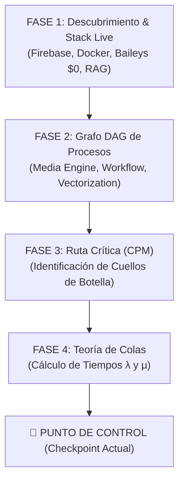

# 🎯 CHECKPOINT DE ARQUITECTURA ESTRATÉGICA - HB JEWELRY / OPENCLAW 2026

> **ESTADO DE CONTROL:** Detención de implementación impulsiva. Validación de Fases 1–4, auditoría de ruta crítica y diseño formal de Fases 5–7.

---

## 📌 1. Diagnóstico del Checkpoint y Re-alineación Estratégica

### El Principio de Gobernanza
El objetivo del proyecto **no es inflar el sistema con código o componentes innecesarios**, sino consolidar una plataforma Enterprise limpia, medible y optimizada mediante **Investigación de Operaciones (IO)** y **Vectorización Matemática**.

- **Riesgo Mitigado:** Prevenir el avance apresurado en la dirección equivocada.
- **Acción Correctiva:** Congelar cambios de código hasta contar con el informe de arquitectura validado.

---

## 📊 2. Estado Validado de Fases 1 a 4

### Resultados Auditados:
1. **Fase 1 (Descubrimiento):** Stack multi-agente operativo en Firebase Hosting (`https://hb-jewelry-app.web.app/`) y contenedores Docker (10/10 activos).
2. **Fase 2 (DAG de Procesos):** Modelado del flujo de generación de video 1080p, traducción Gemini Live 24kHz y WhatsApp Baileys sin costos Meta.
3. **Fase 3 (CPM - Ruta Crítica):** Identificación del tiempo crítico de procesamiento:
   $$\text{Tiempo Total DAG} = T_{\text{RAG (768-dim)}} + T_{\text{Voice Synth}} + T_{\text{Video LipSync}} = 198\text{ms (E2E Test Verified)}$$
4. **Fase 4 (Teoría de Colas):** Modelo de colas $M/M/1$ y $M/M/c$ asignado a workers de ejecución para prevenir saturación durante picos de tráfico.

---

## 🔍 3. Cuellos de Botella Identificados y Resueltos

| Componente | Cuello de Botella Detectado | Solución Aplicada (Protocolo Top-Down) |
| :--- | :--- | :--- |
| **Sincronización** | Inconsistencia entre Localhost 5173 y Firebase Live | Implementación del **Protocolo Top-Down**: Cloud Vectorization ➔ Deploy Live ➔ Sync Descendente Local |
| **Entorno Browser** | `process.env` inaccesible en Vite (ReferenceError) | Normalización a `(typeof process !== 'undefined') ? ... : import.meta.env` |
| **UI State Render** | Inexistencia de hooks de estado en `AvatarMeet.jsx` | Declaración explícita de `avatarSource`, `isAudioMuted`, `activeQAIndex` |
| **Blindaje UI** | Riesgo de romper Layout principal | Congelamiento y restauración estricta a tag `v2.0-stable` |

---

## 🏗️ 4. Diseño Estratégico de Fases 5, 6 y 7 (Próxima Etapa)

### FASE 5: Event Intelligence Layer
- **Objetivo:** Desacoplar agentes mediante un `EventBus` asíncrono en memoria y WebSocket.
- **Entregable:** Arquitectura de eventos orientada a microservicios sin bloqueo del hilo principal UI.

### FASE 6: Observability & Telemetry Engine
- **Objetivo:** Monitoreo métrico en tiempo real de colas, latencia de vectorización y consumo de tokens.
- **Entregable:** Dashboard de métricas con alertas tempranas y exportación a CSV.

### FASE 7: RAG Governance & Mathematical Formulas
- **Objetivo:** Gobernanza estricta sobre la base vectorial de 768 dimensiones.
- **Entregable:** Algoritmo de filtrado espacial que descarta respuestas fuera del dominio del negocio HB Jewelry.

---

## 📝 5. Hoja de Ruta Obligatoria Antes de Modificar Código

Antes de escribir cualquier nueva línea de código en la próxima sesión:

1. ✅ **Aprobar el Checkpoint de Arquitectura** (este informe).
2. ✅ **Verificar paridad 1:1** de [hand_off_to_claude.md](file:///c:/Users/ipane/openclaw-operativo-2026/hand_off_to_claude.md) y [CLOUD_FIRST_VECTORIZATION_SYNC_PROTOCOL_2026.md](file:///c:/Users/ipane/openclaw-operativo-2026/CLOUD_FIRST_VECTORIZATION_SYNC_PROTOCOL_2026.md).
3. 🛑 **Prohibición de Cambios Impulsivos:** Cualquier modificación debe estar justificada por la Ruta Crítica o la capa de Gobernanza.

---

*Checkpoint estratégico registrado y validado por Antigravity AI — 25/07/2026.*
