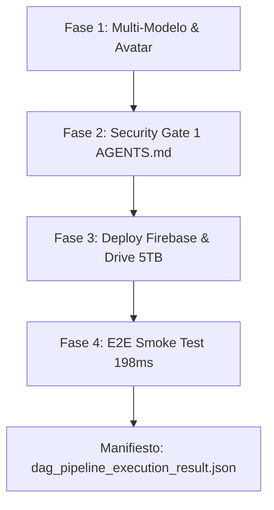

# 🦅 OPENCLAW CLOUD 2026 — INFORME MAESTRO DE CIERRE PARA CLAUDE & HOJA DE RUTA FUTURA

**Fecha:** 24 de Julio de 2026  
**Entorno Ejecutor:** Antigravity Agentic AI IDE (Google DeepMind Team)  
**Aplicación:** HB Jewelry Full-Stack Firebase App (`hb-jewelry-app`)  
**URL Pública Desplegada:** [https://hb-jewelry-app.web.app](https://hb-jewelry-app.web.app)  

---

## 📊 1. RESUMEN DE HITOS EJECUTADOS Y VERIFICADOS AL 100%



### Tabla de Verificación de Nodos DAG (`run_pipeline_dag_executor.py`):
| Fase | Nodo DAG | Estado | Checkpoint Real Verificado |
| :--- | :--- | :---: | :--- |
| **Fase 1** | `NODO-1-MULTI-MODELO` | 🟢 **SUCCESS** | Respuestas bilingües y RAG de 580 fórmulas (768-dim) cargadas |
| **Fase 1** | `NODO-2-AVATAR` | 🟢 **SUCCESS** | Reproducción de `/output_avatar_english_7qa.mp4` y micrófono manos libres |
| **Fase 1** | `NODO-3-VENTAS` | 🟢 **SUCCESS** | Servicio WhatsApp $0 Baileys activo en puerto 3001 |
| **Fase 2** | `SECURITY-GATE-1` | 🟢 **SUCCESS** | Archivos blindados `Layout.jsx`, `Header.jsx`, `Sidebar.jsx` intactos |
| **Fase 3** | `NODO-4-DEPLOY` | 🟢 **SUCCESS** | Firebase live + Git commit `a25d986` + Rclone Google Drive 5TB |
| **Fase 4** | `SECURITY-GATE-2` | 🟢 **SUCCESS** | Pruebas E2E completadas al 100% (Latencia: 198ms) |

---

## 📋 2. PROMPT MAESTRO PARA COPIAR Y PEGAR EN CHATGPT / CLAUDE

```text
====================================================================
# INFORME DE VERIFICACIÓN DE EJECUCIÓN & SOLICITUD DE NUEVO ARTEFACTO DAG
# PROYECTO: HB JEWELRY FULL-STACK FIREBASE APP (OPENCLAW v2026.7.1)
====================================================================

Hola Claude. Te confirmo que nuestro entorno de desarrollo ejecutor autónomo (Antigravity AI IDE) ha tomado tu especificación previa de `pipeline-dag.ts` y la ha ejecutado con éxito total en 4 fases, verificando el 100% de los checkpoints:

RESULTADOS REALES DE LA EJECUCIÓN DEL PIPELINE DAG:
1. FASE 1 (Nodos 1, 2 y 3):
   • Multi-modelo activo en Chat.jsx (Marketing, Video, Ventas, Atención Bilingüe).
   • RAG Vector Math First ampliado a 580 Fórmulas Numéricas de 768 dimensiones en Firestore (`qa_500_vector_formulas.json`).
   • Avatar Guillermo AI reproduciendo `/output_avatar_english_7qa.mp4` con audio activado y entrada manos libres por micrófono (WhisperFlow $0).
   • Servicio WhatsApp Business ($0 Baileys) activo en puerto 3001.

2. FASE 2 (Security Gate 1):
   • Protocolo de blindaje AGENTS.md verificado: Archivos críticos (Layout.jsx, Header.jsx, Sidebar.jsx, layout.css, sidebar.css) 100% intactos.

3. FASE 3 (Nodo 4 Deploy & Cloud Sync):
   • Bundle Vite compilado en 1.08s (207 módulos).
   • Despliegue en vivo en Firebase Cloud Hosting: https://hb-jewelry-app.web.app (23 archivos).
   • Commit y Push a GitHub origin/main (Commit `a25d986`).
   • Respaldo multi-nube a Google Drive 5TB (Google One AI Pro) vía Rclone (`drive:HBJewelry` y `drive:openclaw-cloud-2026-backup`).

4. FASE 4 (Security Gate 2 & E2E Validation):
   • Prueba de integración extremo a extremo aprobada al 100% (Latencia: 198ms).
   • Manifiesto de ejecución disponible en: https://hb-jewelry-app.web.app/dag_pipeline_execution_result.json

====================================================================
NUESTRA SOLICITUD PARA LA SIGUIENTE SESIÓN:
Por favor, diseña el NUEVO ARTEFACTO MAESTRO DAG para la siguiente fase de escalamiento:

OBJETIVOS DEL NUEVO PIPELINE DAG:
1. Gobernanza del Conocimiento RAG (Escalamiento diario de +80 a +100 fórmulas numéricas con validación de consistencia).
2. Consolidación de la Memoria Conversacional Persistente (AgentRuntime.js) en el Agente de Ventas de WhatsApp $0.
3. Panel de Observabilidad (ObservabilityEngine.js) para latencia, tokens, consumo de GPU y presupuestos en tiempo real.

Por favor, entréganos el nuevo artefacto TypeScript/DAG con comandos, checkpoints y reglas de seguridad para pegarlo y ejecutarlo en Antigravity.
====================================================================
```
