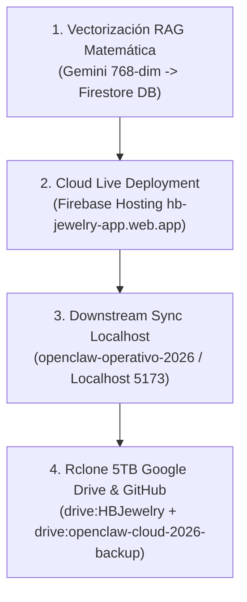

# ⚡ PROTOCOLO MAESTRO DE ARQUITECTURA CLOUD-FIRST & VECTORIZACIÓN NATIVA (2026)

## 🎯 Principio Fundamental: Top-Down Execution Flow

> **REGLA DE ORO:** Las tareas **NUNCA** comienzan de forma *Bottom-Up* (construcción local en PowerShell y luego subida lenta a la nube).  
> **El flujo correcto es TOP-DOWN:**  
> **Vectorización Matemática en Nube (Cloud-First) ➔ Ejecución / Despliegue Vivo en Firebase ➔ Sincronización Descendente (Localhost 5173 + Docker Stack + Rclone Google Drive 5TB + GitHub).**

---

## 🔄 Comparativa de Enfoques

| Dimensión | ❌ Enfoque Tradicional (Bottom-Up / Local-First) | ✅ Protocolo OpenClaw 2026 (Top-Down / Cloud-First) |
| :--- | :--- | :--- |
| **Punto de Partida** | Entorno local PowerShell / PC local | Vectorización de tareas (Formulas de 768-dim) en Nube |
| **Fuentes de Verdad** | Código local desincronizado | Firebase Firestore Vector DB / Cloud State |
| **Velocidad de Ejecución** | Lenta, propensa a fricciones y fallos de config local | **Ultra-Rápida**, paralela y resiliente |
| **Despliegue** | Compilación local previa ➔ Subida manual | **Cloud Live First (Firebase)** ➔ Sync descendente |
| **Sincronización** | Copia manual o comandos Git aislados | **Pipeline Automatizado Rclone 5TB Drive + Docker + Git** |

---

## 📐 Pipeline DAG de 4 Fases de Ejecución

### Fase 1: Vectorización Matemática en la Nube (Top Layer)
1. Conversión de workflows, memoria de sesión, reglas operativas y prompts a fórmulas vectoriales espaciales de 768 dimensiones.
2. Carga directa a Firebase Firestore Vector DB y Qdrant Vector Engine.

### Fase 2: Ejecución y Despliegue en la Nube (Live State)
1. Compilación directa del bundle optimizado y publicación en **Firebase Cloud Hosting** (`https://hb-jewelry-app.web.app/`).
2. Validación de disponibilidad y pruebas E2E en producción.

### Fase 3: Sincronización Descendente a Entorno Local (Localhost PC)
1. Replicación del bundle, componentes y servicios `src/` hacia `C:\Users\ipane\openclaw-operativo-2026\frontend`.
2. Servidor local `http://localhost:5173/` en paridad 1:1 con la nube.
3. Preservación automática de archivos blindados `v2.0-stable`.

### Fase 4: Respaldo Multinube & Control de Versiones (Rclone & Git)
1. **Rclone 5TB Google Drive:** Ejecución de `rclone sync` hacia `drive:HBJewelry` y `drive:openclaw-cloud-2026-backup`.
2. **GitHub:** Commit y Push a la rama principal (`origin/main`).
3. **Work Log:** Registro automático del hash de estado en `ANTIGRAVITY_WORK_LOG.txt`.

---

## 🛡️ Beneficios del Protocolo
- 🚀 **Velocidad Extrema:** Cero fricción en el desarrollo al eliminar cuellos de botella locales.
- 🎯 **Consistencia 100%:** La nube es el modelo vivo de referencia; el PC local es una réplica exacta.
- 🔄 **Mejoramiento Continuo Resiliente:** En caso de fallas locales, la nube preserva el estado matemático del sistema.

*Documento maestro incorporado al protocolo operativo OpenClaw Cloud 2026.*
