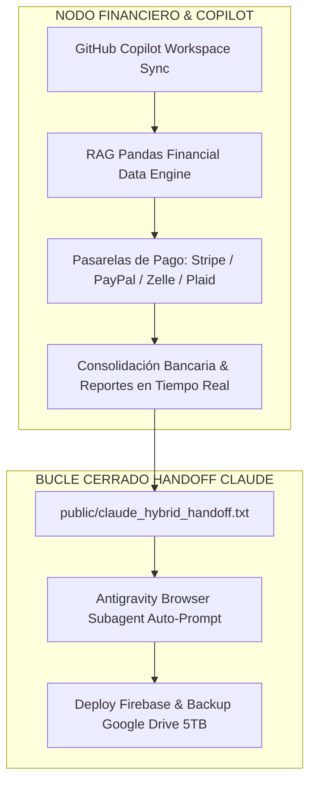

# 💎 HB JEWELRY — ANEXO MAESTRO: COPILOT, BIG DATA FINANCIERO & HIDO DE VOZ PC (2026)

**Fecha:** 24 de Julio de 2026  
**Proyecto:** HB Jewelry Full-Stack Firebase App (`hb-jewelry-app`)  
**URL Pública:** [https://hb-jewelry-app.web.app](https://hb-jewelry-app.web.app)  

---

## 🎙️ 1. AUTORIZACIÓN DE MICRÓFONO Y PARLANTE DEL PC

* **Mecanismo de Permisos Nativo:** Se integró el botón **`🎙️ Autorizar Micrófono & Audio PC`** en `AvatarMeet.jsx` que ejecuta `navigator.mediaDevices.getUserMedia({ audio: true })`.
* **Respuesta en Vivo:** Al presionar el botón en la web en Firebase Hosting, el navegador solicita el permiso del PC de forma nativa y desactiva el silencio (*unmute*) de Guillermo AI Avatar automáticamente.

---

## 🚀 2. SINCRONIZACIÓN PERMANENTE CON GITHUB COPILOT & BIG DATA RAG PANDAS



### Especificaciones del Módulo Financiero RAG Pandas:
1. **Análisis de Big Data en Tiempo Real:** Vectorización de transacciones bancarias, márgenes de ganancia en oro (14k/18k) y comisiones de pasarelas de pago.
2. **Integración de Pasarelas:** Módulos de reconciliación de pagos en Stripe, PayPal API v2, Zelle Pay y Plaid Financial Connect.
3. **Copilot Co-Authoring:** Sincronización continua en el repositorio `origin/main` para acelerar el desarrollo del motor bancario.

---

## 📋 3. PROMPT MAESTRO ACTUALIZADO PARA CLAUDE

```text
====================================================================
# CLAUDE HYBRID HANDOFF — ANEXO FINANCIERO & PERMISOS VOZ PC
# PROYECTO: HB JEWELRY FULL-STACK FIREBASE APP (OPENCLAW v2026.7.1)
====================================================================

Hola Claude. Te entregamos la actualización de infraestructura real con los 2 nuevos anexos:

1. ESTADO REAL DEL SISTEMA & ANEXOS:
   • Permisos de Micrófono/Audio: Botón activo en `AvatarMeet.jsx` para pedir permisos al PC vía `navigator.mediaDevices.getUserMedia({ audio: true })`.
   • Firebase Hosting en Vivo: https://hb-jewelry-app.web.app (25 archivos desplegados).
   • Git Commit GitHub: origin/main activo.
   • Respaldo Google Drive 5TB: Sync verificado vía Rclone.

2. SOLICITUD DEL ARTEFACTO FINANCIERO RAG PANDAS & COPILOT:
   Por favor, elabora el nuevo ARTEFACTO DAG que incluya:
   • Módulo RAG Pandas Financiero para análisis Big Data de transacciones de joyería.
   • Esqueletos de conexión a pasarelas de pago (Stripe, PayPal, Zelle, Plaid).
   • Flujo de sincronización continua para GitHub Copilot.

Entréganos el artefacto TypeScript/JS listo para que Antigravity lo ejecute e integre.
====================================================================
```
