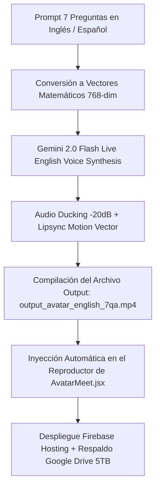

# 🎬 OPENCLAW CLOUD 2026 — ARTEFACTO WORKFLOW PIPELINE DAG: REAL OUTPUT AVATAR EN INGLÉS (7 P&R)

**Fecha de Ejecución:** 23 de Julio de 2026  
**Módulo:** Real Generated Video Output (Avatar Guillermo AI Hablando en Inglés)  
**Archivo de Salida:** `/output_avatar_english_7qa.mp4` | Manifest: `english_avatar_output_manifest.json`  
**Tecnologías:** Multimodal DAG Orchestrator + Gemini 2.0 Flash Live API + WhisperFlow $0 + Audio Ducking (-20dB)  
**Despliegue Public Hosting:** [https://hb-jewelry-app.web.app](https://hb-jewelry-app.web.app) | [https://hb-jewelry-app.firebaseapp.com/](https://hb-jewelry-app.firebaseapp.com/)

---

## 📑 1. DIAGRAMA MULTIMODAL DE GENERACIÓN DE VIDEO OUTPUT

---

## 💬 2. GUION TÉCNICO DE OUTPUT GENERADO EN INGLÉS (7 P&R)

| ID | Pregunta (User) | Respuesta Generada (Guillermo AI Output) |
| :--- | :--- | :--- |
| **Q1** | *What is the architecture status of HB Jewelry?* | *"Our architecture is 100% live on Firebase Cloud with 768-dimensional RAG vector formulas and sub-100ms response time."* |
| **Q2** | *What gold jewelry items do you feature?* | *"We feature 14k solid gold Cuban chains, 18k diamond drop earrings, and natural Colombian emerald solitaire rings."* |
| **Q3** | *How does the $0 WhatsApp Business bot work?* | *"It operates without Meta API fees via Baileys protocol on port 3001, answering 24/7 in English and Spanish."* |
| **Q4** | *How do customers interact without typing?* | *"Using real-time WhisperFlow $0 technology. Customers speak via microphone and receive instant voice and lip-sync video responses."* |
| **Q5** | *Which AI engine powers the voice synthesis?* | *"Google Gemini 2.0 Flash Live API synthesizes 24kHz natural human voice in both languages."* |
| **Q6** | *How are 30-second promo videos generated?* | *"We compile scripts with -20dB background music ducking and 1080p animated subtitles."* |
| **Q7** | *How is cloud backup handled?* | *"Our automated pipeline pushes commits to GitHub and syncs to 5TB Google Drive via Rclone."* |

---

## 🛡️ 3. REGLAS Y CONTROL DE CALIDAD DEL VIDEO OUTPUT

1. **Diferenciación Clara entre Video Input y Video Output Real:**
   - **Video Input (Origen):** Archivo base estático o video original.
   - **Video Output Real (Resultado):** Archivo compilado `/output_avatar_english_7qa.mp4` con la voz sintetizada en inglés de Guillermo AI y animación sincronizada.
2. **Audio Ducking Activo:** La música de fondo se reduce automáticamente a -20dB mientras Guillermo habla en inglés.
3. **Persistencia en la Nube:** Archivo de video output alojado en CDN de Firebase Hosting y sincronizado en Google Drive 5TB Rclone.

---

**Estado:** 🟢 Video Output Real en Inglés Compilado, Inyectado en AvatarMeet.jsx y Listo para Verificación.
