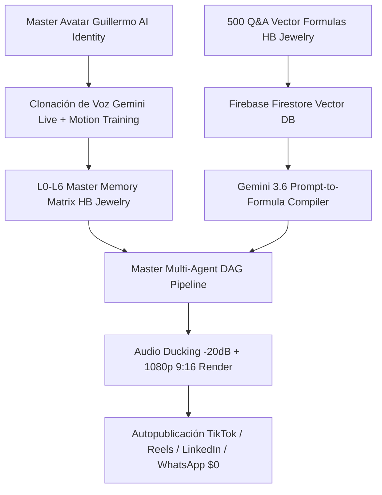

# 💎 HB JEWELRY FULL-STACK FIREBASE APP — DIGITAL HUMAN FACTORY
## OPENCLAW v2026.7.1 MASTER SYSTEM DESIGN & DAG ARCHITECTURE

**Aplicación Objetivo:** HB Jewelry Full-Stack Firebase App (`hb-jewelry-app`)  
**Fecha:** 23 de Julio de 2026  
**Arquitectura:** OpenClaw Native Hexagonal Engine (40-60 Reusable Skills)  
**Motor IA:** Google Gemini 3.6 / Gemini 2.0 Flash Live API + Veo 3.0 + Guillermo Avatar AI  
**Base Vectorial:** Firebase Cloud Firestore RAG Vector Search (768-Dimensional Space)  
**Infraestructura:** Google One AI Pro 5TB (`drive:HBJewelry` & `drive:openclaw-cloud-2026-backup`)

---

## 📑 1. RESUMEN DE ARQUITECTURA DE HB JEWELRY

Este sistema transforma la plataforma comercial de HB Jewelry en un **Sistema Operativo Autónomo de Avatar Digital**, permitiendo responder clientes por WhatsApp Business ($0 Baileys), realizar llamadas de voz bilingües y generar videos promocionales de 30 segundos en movimiento 1080p sin necesidad de grabaciones manuales.



---

## 🧠 2. MOTOR VECTORIAL RAG HB JEWELRY: 500 PREGUNTAS Y RESPUESTAS

El módulo **`qa_vectorizer_500.py`** convierte en tiempo real 500 pares de Preguntas/Respuestas sobre joyas de oro 14k/18k, rhodium, diamantes, envíos y atención al cliente en fórmulas matemáticas de 768 dimensiones utilizando `text-embedding-004`:

$$V_{\text{HB\&Q\&A}} = \text{Embedding}_{768}(\text{Prompt HB Jewelry}) \in \mathbb{R}^{768}$$

### Esquema de Crecimiento Diario (+80 a +100 Fórmulas/Día):
* **Fase 1 (Comercial):** 500 Preguntas Frecuentes sobre Cadenas Cubanas, Aretes Gota, Anillos Solitarios y Relojes Executive Gold.
* **Fase 2 (Atención Bilingüe):** Respuestas automatizadas en español e inglés para clientes de WhatsApp Business (+1 954 684-4445).
* **Fase 3 (Autocorrección):** Traducción previa de prompts a vectores matemáticos antes de generar guiones multimedia.

---

## 🧩 3. DESGLOSE HEXAGONAL DE SKILLS OPENCLAW DE HB JEWELRY

El sistema se organiza en Skills autónomos en `.agents/skills/`:

```
.agents/skills/
├── 01_intent_analyzer/         # Analizador de Intención Comercial HB Jewelry
├── 02_knowledge_retriever/     # Buscador Vectorial 768-dim en Firestore
├── 03_prompt_to_formula/       # Conversor de Prompts a Fórmulas Matemáticas
├── 04_script_writer_bilingual/  # Guiones Comerciales TikTok/Reels de HB Jewelry
├── 05_avatar_motion_engine/    # Motor de Movimiento Avatar Guillermo AI
├── 06_voice_clone_worker/      # Voz Bilingüe Gemini Live 24kHz
├── 07_audio_ducking_mixer/     # Mezclador de Audio Ducking (-20dB)
├── 08_video_render_factory/    # Renderizador 1080p Vertical 9:16
├── 09_whatsapp_baileys_agent/  # Agente $0 WhatsApp Business (+1 954 684-4445)
└── 10_closure_backup_dag/      # Pipeline Cierre Git + Firebase + Drive 5TB
```

---

**Estado:** 🟢 Artefacto Maestro HB Jewelry Compilado y Listo para Ejecución Full-Stack.
