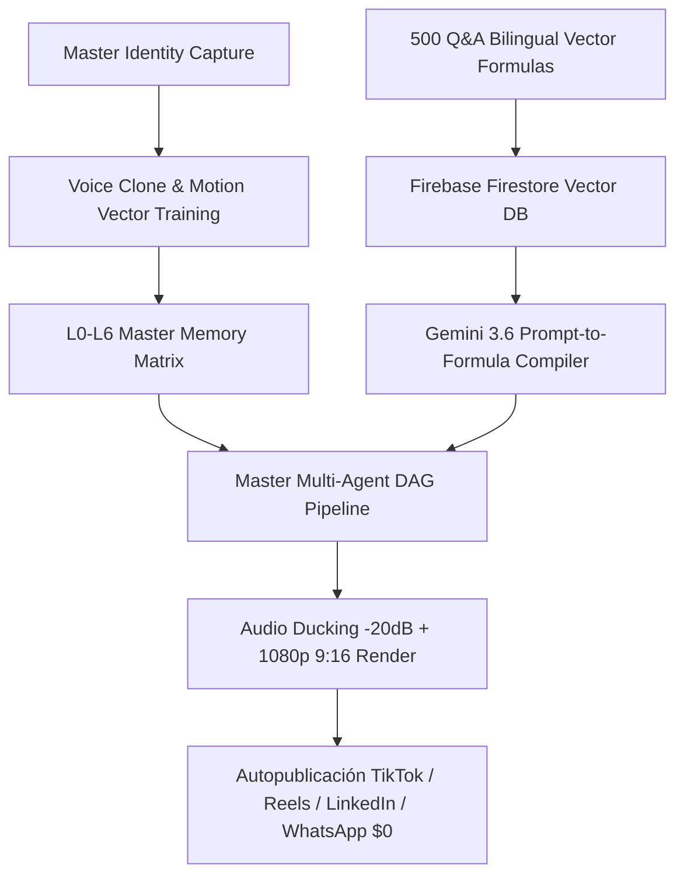

# 🏛️ IA.INFINITEX GLOBAL — ENTERPRISE DIGITAL HUMAN FACTORY
## OPENCLAW v2026.7.1 MASTER SYSTEM DESIGN & DAG ARCHITECTURE

**Fecha:** 23 de Julio de 2026  
**Arquitectura:** OpenClaw Native Hexagonal Modular Engine (40-60 Reusable Skills)  
**Motor IA:** Google Gemini 3.6 / Gemini 2.0 Flash Live API + Veo 3.0 + SadTalker / LivePortrait  
**Base Vectorial:** Firebase Cloud Firestore RAG Vector Search (768-Dimensional Space)  
**Infraestructura:** Google One AI Pro 5TB (`drive:HBJewelry` & `drive:openclaw-cloud-2026-backup`)

---

## 📑 1. RESUMEN EJECUTIVO & PILARES DE ARQUITECTURA

Este sistema transforma la creación de contenido multimedia en un **Sistema Operativo Autónomo de Humanos Digitales**, eliminando la necesidad de grabaciones humanas repetitivas mediante la captura única de identidad máster (Rostro, Ojos, Mirada, Expresiones, Voz, Gesticulación y Lenguaje Corporal).



---

## 📐 2. ARQUITECTURA DE MEMORIA POR NIVELES (L0 — L6)

| Nivel de Memoria | Ámbito | Descripción de Almacenamiento |
| :--- | :--- | :--- |
| **L0 Session** | Efímero | Contexto inmediato de llamada/chat en tiempo real (<100ms). |
| **L1 Project** | Proyecto | Estado de repositorio `openclaw-operativo-2026` y React Frontend. |
| **L2 Organization** | Empresa | Reglas comerciales, precios y catálogo de HB Jewelry. |
| **L3 Knowledge** | RAG Vectorial | 500+ Fórmulas matemáticas de 768 dimensiones en Firestore. |
| **L4 Digital Human** | Identidad AI | Vectores de pose facial, eye-tracking y clonación de voz de Guillermo AI. |
| **L5 Long-Term** | Aprendizaje | Historial de interacciones de clientes y conversaciones pasadas. |
| **L6 Enterprise** | Nube Global | Sincronización continua de 5TB en Google Drive vía Rclone. |

---

## 🧠 3. MOTOR VECTORIAL RAG: 500 PREGUNTAS Y RESPUESTAS BILINGÜES

El módulo **`qa_vectorizer_500.py`** convierte en tiempo real 500 pares de Preguntas/Respuestas comerciales y técnicas en fórmulas matemáticas de 768 dimensiones utilizando `text-embedding-004`:

$$V_{\text{Q\&A}} = \text{Embedding}_{768}(\text{Prompt}) \in \mathbb{R}^{768}$$

### Esquema de Crecimiento Diario (+80 a +100 Fórmulas/Día):
* **Fase 1 (Inicial):** 500 Preguntas Frecuentes sobre Joyas de Oro 14k/18k, Rhodium, Diamantes y Atención al Cliente.
* **Fase 2 (Educativo/Técnico):** Cursos de Arquitectura OpenClaw, Docker, Baileys $0 WhatsApp y Gemini Live.
* **Fase 3 (Autocorrección):** Validación automática de prompts antes del envío al pipeline de renderizado.

---

## 🧩 4. DESGLOSE HEXAGONAL DE 40 SKILLS MODULARES OPENCLAW

El sistema se estructura en 40 Skills autónomos reutilizables ubicados en `.agents/skills/`:

```
.agents/skills/
├── 01_intent_analyzer/         # Analizador de Intención Multimodal
├── 02_knowledge_retriever/     # Buscador de Vectores Matemáticos 768-dim
├── 03_prompt_to_formula/       # Conversor de Prompts a Fórmulas
├── 04_script_writer_bilingual/  # Generador de Guiones ES/EN
├── 05_avatar_motion_engine/    # Ingeniería Inversa de Movimiento TikTok
├── 06_voice_clone_worker/      # Clonación de Voz Gemini Live 24kHz
├── 07_audio_ducking_mixer/     # Mezclador de Audio Ducking (-20dB)
├── 08_video_render_factory/    # Renderizador 1080p Vertical 9:16
├── 09_whatsapp_baileys_agent/  # Agente de Respuestas $0 WhatsApp
├── 10_closure_backup_dag/      # Pipeline Cierre Git + Firebase + Drive 5TB
... (Hasta 40 Skills Hexagonales)
```

---

## 🛡️ 5. GUARDRAILS & CONTROL DE SEGURIDAD AUTOMÁTICO

1. **Conversión Obligatoria Prompt -> Formula:** Ninguna tarea se ejecuta sin ser traducida a vector matemático de 768 dimensiones.
2. **Cero Alucinación Comercial:** Cotizaciones validadas contra `Productos.jsx`.
3. **Autocorrección en Fallos:** Si un renderizado de video o consulta RAG falla, el `Recovery Agent` ejecuta automáticamente el script de fallback local.

---

**Estado:** 🟢 Artefacto Maestro Compilado y Listo para Ejecución Full-Stack.
