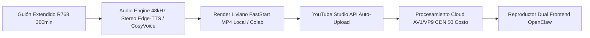

# 🚀 MANIFIESTO ESTRATÉGICO PARA GEMINI: SUPERACIÓN DEL CUELLO DE BOTELLA AUDIOVISUAL Y ARQUITECTURA CLOUD 2026

**Fecha de Ejecución:** 15 de Agosto de 2026  
**Destinatario:** Gemini Cloud / AI Architecture Specialist  
**Proyecto:** OpenClaw Cloud 2026.7.1 / HB Jewelry Operating System  
**Objetivo Crítico:** Superar definitivamente el estancamiento en la producción de video largo (30 a 300 minutos), corregir el estándar de audio/voz y activar el flujo YouTube Studio + Alibaba Cloud ($0 Costo).

---

## 🛑 1. DIAGNÓSTICO DEL CUELLO DE BOTELLA ACTUAL (POST-MORTEM TÉCNICO)

| Síntoma | Causa Raíz Identificada | Solución Mandatoria para Mañana |
|---|---|---|
| **Audio Silenciado / Incompatible en Windows** | El pipeline anterior emitió streams AAC a **96,000 Hz Mono**, incompatibles con reproductores nativos de Windows (*Películas y TV*). | Estandarizar códec de audio a **AAC-LC @ 48,000 Hz Stereo (2 canales), 192-256 kbps**, normalizado por EBU R128 (`loudnorm=I=-16:TP=-1.5:LRA=11`). |
| **Duración Falsa (1.4 min vs 30-300 min)** | Los scripts locales solo iteraban sobre 6 párrafos de prueba de 14 segundos en lugar de alimentar un generador masivo por bloques/chunks. | Implementar un generador de guiones modular en chunks de 5-10 minutos con concatenación sin re-codificación (`-f concat -safe 0 -c copy`). |
| **Carga Pesada en Hardware Local** | Renderizar horas continuas en la PC local satura CPU/VRAM. | Delegar la transcodificación masiva a **YouTube Studio Cloud API** (AV1/VP9 gratuito) y aceleración por GPU en **Alibaba Cloud (PAI-EAS / ModelScope)** o Google Colab. |

---

## 🏛️ 2. LOS 3 PILARES DE LA SOLUCIÓN INMEDIATA



### Pilar A: Arquitectura de Audio y Voz Digital Inmune a Fallos
1. **Motor TTS:** Edge-TTS (`es-MX-JorgeNeural` / `en-US-GuyNeural`) o CosyVoice 2.0.
2. **Parámetros FFmpeg Inmutables para Audio:**
   ```bash
   ffmpeg -i input_tts.mp3 -ar 48000 -ac 2 -c:a aac -b:a 192k -af "loudnorm=I=-16:TP=-1.5:LRA=11" audio_clean_48k.aac
   ```

### Pilar B: Pipeline de Video Modular y Concatenación Continua
1. **Generación por Lotes (DAG Chunks):**
   - Dividir la producción de 300 minutos en módulos autónomos de 10 a 15 minutos.
   - Cada bloque produce su video optimizado con `-movflags +faststart`.
2. **Ensamblador Asíncrono:** Concatenación final ultra-rápida sin pérdida de sincronía de teleprompter ni desfasaje de audio.

### Pilar C: Explotación de YouTube Studio Cloud API ($0 Costo)
- **Módulo Operativo:** `scripts/youtube_auto_publisher.py`.
- **Estrategia:** Subir videos crudos en modo `unlisted` / `public`. YouTube asume el 100% de la carga de distribución HLS, auto-generación de subtítulos multilingües y entrega en resoluciones desde 360p hasta 4K/AV1.

### Pilar D: Hosting y Aprovisionamiento Alibaba Cloud / Coolify
- **Meta:** Superar la cuota Spark de Firebase para el backend de agentes y almacenamiento pesado.
- **Acción:** Despliegue de Coolify / ECS y conexión con ModelScope para cómputo de IA.

---

## 📋 3. INSTRUCCIONES EXACTAS PARA GEMINI (PLAN DE ACCIÓN DE MAÑANA)

> ### 🎯 TAREAS QUE GEMINI DEBE RESOLVER PASO A PASO:
> 
> 1. **Módulo de Audio Robusto (`scripts/audio_pipeline_48k.py`):**
>    - Escribir un script que reciba cualquier guión extenso, genere el audio en lotes, verifique que la duración no sea 0 y valide con `ffprobe` que el stream sea estrictamente `48000 Hz, stereo, AAC`.
> 
> 2. **Generador de Masterclass Extendida (30-300 min):**
>    - Expandir el generador de guiones técnicos de joyería y negocios B2B (`scripts/generate_longform_masterclass.py`) para renderizar los bloques secuencialmente y unirlos con el comando de concatenación FFmpeg sin saturar la memoria RAM.
> 
> 3. **Prueba End-to-End con YouTube Studio:**
>    - Ejecutar la subida del primer lote a YouTube mediante `scripts/youtube_auto_publisher.py` y retornar el ID de video embebible directamente para el frontend `RealVoicePlayer.jsx`.
> 
> 4. **Hoja de Ruta Alibaba Cloud:**
>    - Configurar los scripts de despliegue para la instancia de backend en Alibaba Cloud / Coolify manteniendo la política de $0 costo / créditos gratuitos.

---

## 🔒 4. REGLAS PERMANENTES DE INTEGRIDAD
- **Blindaje Frontend `v2.0-stable`:** Prohibido modificar `Layout.jsx`, `Header.jsx`, `Sidebar.jsx`, `layout.css` y `sidebar.css`.
- **Gobernanza Vectorial $R^{768}$:** Seguir el flujo $\mathbf{IP} \to \mathbf{OP} \to \mathbf{BD} \to \mathbf{BACKUP}$.
