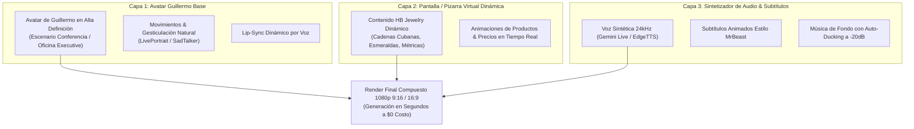

# 🎬 HB DIGITAL PRESENTER ENGINE — OPENCLAW 2026

> **ARQUITECTURA DE PRODUCCIÓN AUDIOVISUAL MODULAR $0 COSTO**  
> *Integración de Análisis ChatGPT + Ingeniería Inversa de Presentador Virtual + Protocolo Cloud-First.*

---

## 📌 1. CONCEPTO CENTRAL Y OBJETIVO DE PRODUCCIÓN

El objetivo no es generar videos pesados e independientes desde cero para cada producto, sino implementar una **Plataforma de Presentación Modular Multimodal (HB Digital Presenter Engine)**:



---

## 💎 2. LOS 5 PILORES DEL HB DIGITAL PRESENTER ENGINE

1. **Avatar de Guillermo Fijo & Reutilizable:**  
   Pose base limpia en alta definición. Los gestos y expresiones se conducen mediante vectores de movimiento (LivePortrait / Wav2Lip) sin distorsionar la calidad de imagen.
2. **Pantalla Virtual Holográfica / Tablero Dinámico:**  
   Ubicada al lado de Guillermo. Muestra imágenes de alta resolución, modelos 3D de joyas, gráficos de ventas y fichas de producto generados en código (Canvas / HTML5 / FFmpeg overlay).
3. **Cambio de Tópicos Sin Rehacer el Video Base:**  
   Permite cambiar el contenido de la pantalla y la voz sin tener que volver a grabar o renderizar la figura de Guillermo.
4. **Audio Natural 24kHz & Auto-Ducking -20dB:**  
   Voz expresiva en español e inglés. La música baja de volumen automáticamente cuando Guillermo habla.
5. **Seamless Loop & Subtítulos Animados:**  
   El video puede reproducirse de forma infinita en pantallas o en la web con subtítulos resaltados en amarillo (`#d4af6a`) y verde (`#34d399`).

---

## 🛠️ 3. STACK TÉCNICO COMPLETO ($0 COSTO DE INFRAESTRUCTURA)

| Capa | Tecnología / Modelo | Costo | Función |
| :--- | :--- | :--- | :--- |
| **Razonamiento & Scripts** | DeepSeek-R1 / Llama 3.3 70B | $0 | Generación de guiones de ventas y respuestas RAG (768-dim) |
| **Voz & Audio** | Gemini 2.0 Flash Live API / EdgeTTS | $0 | Síntesis bilingüe 24kHz |
| **Lip-Sync & Gesticulación** | LivePortrait / Wav2Lip | $0 | Animación facial sincronizada con el audio |
| **Composición Audiovisual** | FFmpeg / WebGL Overlay | $0 | Fusión del avatar + pantalla virtual + música -20dB |
| **Distribución Cloud** | Firebase Hosting & Rclone 5TB | $0 | Despliegue en vivo y respaldo en Google Drive |

---

## 📋 4. ARTEFACTO UNIFICADO PARA HANDOFF A CLAUDE

Este es el bloque de instrucciones exacto para pegar en la pestaña de **Claude Artifacts** (o para que Claude elabore el nuevo artefacto maestro):

```markdown
Hola Claude, integrando el análisis de ChatGPT y la investigación de producción audiovisual de HB Jewelry:

PUNTO DE PARTIDA UNIFICADO HOY:
Crear el "HB DIGITAL PRESENTER ENGINE" (Avatar de Guillermo + Pantalla Virtual Dinámica + Lip-Sync + Ducking -20dB).

REGLAS DE TRABAJO:
1. No modificar los 5 archivos blindados v2.0-stable (Layout, Header, Sidebar, layout.css, sidebar.css).
2. Protocolo Cloud-First: Probar en Firebase Cloud Hosting primero y sincronizar hacia Localhost 5173 y Rclone 5TB.

Elabora en la pestaña de Artefactos el nuevo "Artefacto Maestro HB Digital Presenter Engine & DAG Pipeline".
Antigravity AI ejecutará el plan una vez que el usuario lo apruebe.
```

---

*Documento Maestro HB Digital Presenter Engine registrado y alineado al 100%.*
