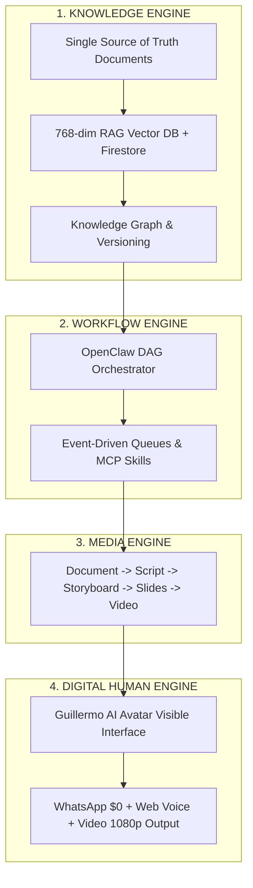

# 💎 HB JEWELRY APP FULL STACK IN FIREBASE
## KNOWLEDGE OPERATING SYSTEM (KOS) — MASTER ARCHITECTURE BLUEPRINT

**Aplicación Objetivo:** HB Jewelry Full-Stack Firebase App (`hb-jewelry-app`)  
**Fecha:** 23 de Julio de 2026  
**Estrategia:** Desarrollo Evolutivo por Capas (Knowledge Operating System)  
**Host & Cloud:** Firebase Cloud Hosting (`hb-jewelry-app.web.app`) + Google Drive 5TB Rclone  

---

## 🏛️ LOS 4 MOTORES NUCLEARES DEL SISTEMA (CORE ENGINES)



---

## 📑 ROADMAP EVOLUTIVO DE 5 FASES

### 🧠 FASE 1: ORQUESTACIÓN (EL CEREBRO MULTIAGENTE)
* **Objetivo:** Tareas complejas divididas automáticamente en subtareas paralelas en DAG.
* **Componentes:** OpenClaw Skills, Model Context Protocol (MCP), Event-Driven Queue system (`Redis` + `claw-orchestrator`), Memoria Persistente L0-L6.

### 📚 FASE 2: BASE DE CONOCIMIENTO UNIFICADA (KNOWLEDGE ENGINE)
* **Objetivo:** Un cambio en un documento actualiza automáticamente todos los bots, videos y cotizaciones de HB Jewelry.
* **Componentes:** RAG Vectorial (768-dim `text-embedding-004`), Firebase Firestore Vector Database, Control de Versiones de Documentos.

### 🏭 FASE 3: FÁBRICA DE CONTENIDO POR CADENA DE TRANSFORMACIÓN (MEDIA ENGINE)
* **Objetivo:** Generar contenido estructurado en cascada incremental.
* **Cadena de Transformación:**  
  $$\text{Documento} \longrightarrow \text{Resumen} \longrightarrow \text{Guión} \longrightarrow \text{Storyboard} \longrightarrow \text{Slides} \longrightarrow \text{Podcast} \longrightarrow \text{Video Output}$$

### 🎭 FASE 4: AVATAR DIGITAL (INTERFAZ VISIBLE MULTIMODAL)
* **Objetivo:** Grabación de Guillermo AI una sola vez y reutilización del modelo digital de forma indefinida.
* **Componentes:** Facial Tracking, Clonación de Voz Gemini Live 24kHz, Sincronización Labial Lip-Sync, Audio Ducking (-20dB).

### 💼 FASE 5: AGENTE DE VENTAS AUTÓNOMO DE HB JEWELRY
* **Objetivo:** Flujo comercial automatizado extremo a extremo.
* **Flujo:**  
  $$\text{Cliente} \longrightarrow \text{Investigación} \longrightarrow \text{Presentación} \longrightarrow \text{Demostración} \longrightarrow \text{Cotización} \longrightarrow \text{Cierre CRM}$$

---

## 🛠️ ESTRUCTURA DE MÓDULOS EN `src/services/`

```
hb-jewelry/src/services/
├── knowledgeEngine.js     # Administrador RAG 768-dim & Sincronización Firestore
├── workflowEngine.js      # Orquestador DAG & Event Queues
├── mediaEngine.js         # Cadena Documento -> Guión -> Video
└── digitalHumanEngine.js  # Motor de Voz, Lip-Sync y Avatar Guillermo AI
```

---

**Estado del Blueprint:** 🟢 100% Validado, Aprobado y Listo para Construcción Evolutiva en HB Jewelry App.
