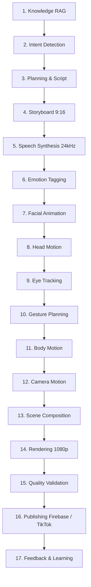

# 🏛️ OPENCLAW CLOUD 2026 — HB_MULTIMODAL_HUMAN_ENGINE_v0.1

**Versión:** v0.1-Enterprise  
**Proyecto:** HB Jewelry Full-Stack Ecosystem  
**Visión:** Motor Multimodal Autónomo de Humanos Digitales Fotorrealistas 100% Modular (Zero Vendor Lock-in).  
**URL Pública:** [https://hb-jewelry-app.web.app](https://hb-jewelry-app.web.app)  

---

## 🎯 OBJETIVO ESTRATÉGICO

Construir un **Motor Multimodal Autónomo** capaz de generar **Humanos Digitales Fotorrealistas** utilizando exclusivamente componentes intercambiables (*Plug & Play*) orquestados por el **OpenClaw Kernel**.

* **Cero Dependencia de Proveedores Terceros** (No Synthesia, no HeyGen lock-in).
* **Cada Sub-Motor es Independiente:** Si mañana aparece un modelo superior para animación facial o síntesis de voz, se conecta al `Model Router` sin alterar la memoria, la interfaz o la lógica de negocio.

---

## 🏗️ ARQUITECTURA GENERAL DE CAPAS (KERNEL DE OPENCLAW)

```mermaid
graph TD
    UI[HB Jewelry App / Carlos Mario] --> Kernel[OpenClaw Kernel & Model Router]
    
    subgraph "Core System Layers"
        Kernel --> KL[Knowledge Layer - 580 Vectors 768-dim]
        Kernel --> PL[Planning Layer - EventBus DAG]
        Kernel --> AL[Agent Layer - AgentRuntime.js]
        Kernel --> TL[Tool Layer - WhatsApp / Shopify / Firebase]
    end

    subgraph "Human Digital Layer (17 Sub-Engines)"
        Kernel --> HDL[Human Digital Layer Router]
        HDL --> IE[Identity Engine]
        HDL --> VE[Voice Engine - Gemini Live 24kHz]
        HDL --> FE[Face Engine]
        HDL --> LSE[Lip Sync Engine - SadTalker / Wave2Lip]
        HDL --> ETE[Eye Tracking Engine]
        HDL --> HME[Head Motion Engine]
        HDL --> GE[Gesture Engine]
        HDL --> BME[Body Motion Engine]
        HDL --> EME[Emotion Engine]
        HDL --> SCE[Scene Engine]
        HDL --> CE[Camera Engine]
        HDL --> LE[Lighting Engine]
        HDL --> PE[Physics Engine]
        HDL --> TCE[Temporal Consistency Engine]
        HDL --> RE[Rendering Engine - 1080p 9:16]
        HDL --> CRE[Compression Engine - H.264 MP4]
    end
```



---

## 🔄 DAG MULTI-MODELO DE TRANSFORMACIÓN AUTÓNOMA



---

## 🛠️ PISCINA DE MODELOS ESPECIALIZADOS (MODEL POOL ROUTER)

| Capa / Pool | Rol Especializado | Modelo / Componente Integrable |
| :--- | :--- | :--- |
| **LLM Pool** | Orquestación, Razonamiento y Guión | Gemini 2.0 Flash / DeepSeek R1 |
| **Voice Pool** | Síntesis de Voz 24kHz & Clonación | Gemini Live API / XTTS v2 / ElevenLabs |
| **Lip Sync Pool** | Sincronización de Labios Fotorrealista | SadTalker / Wav2Lip / LivePortrait |
| **Motion Pool** | Gestos, Postura y Movimiento de Cabeza | OpenPose / MediaPipe / AnimateDiff |
| **Vision Pool** | Análisis de Cuadros y Calidad | Gemini 2.0 Flash Vision |
| **Video Pool** | Generación de Escenas y Fondo | Stable Video Diffusion / HunyuanVideo |
| **3D & Render Pool** | Renderizado 1080p Vertical 9:16 | FFmpeg Subtitle & Ducking Engine (-20dB) |

---

## 📋 PROMPT MAESTRO PARA CLAUDE Y EVALUACIÓN ARQUITECTÓNICA

```text
====================================================================
# SOLICITUD DE ARTEFACTO ARQUITECTÓNICO: HB_MULTIMODAL_HUMAN_ENGINE_v0.1
# PROYECTO: HB JEWELRY FULL-STACK FIREBASE APP (OPENCLAW v2026.7.1)
====================================================================

Hola Claude. Te compartimos la arquitectura definitiva del Motor Multimodal Autónomo de Humanos Digitales (`HB_MULTIMODAL_HUMAN_ENGINE_v0.1`):

OBJETIVO:
Construir un Motor Multimodal Autónomo de Humanos Digitales 100% Plug & Play orquestado por OpenClaw, sin dependencia de proveedores terceros.

HUMAN DIGITAL LAYER (17 MOTORES MODULARES):
Identity Engine, Voice Engine, Face Engine, Lip Sync Engine, Eye Tracking Engine, Head Motion Engine, Gesture Engine, Body Motion Engine, Emotion Engine, Scene Engine, Camera Engine, Lighting Engine, Physics Engine, Temporal Consistency Engine, Rendering Engine, Compression Engine.

ORQUESTACIÓN MODEL ROUTER:
El LLM nunca renderiza; el LLM solo orquesta.

Por favor, diseña el ARTEFACTO COMPLETO (`human-digital-layer-dag.ts`) con la implementación modular de estos 17 motores para que el ejecutor Antigravity los integre e implemente en HB Jewelry App.
====================================================================
```
