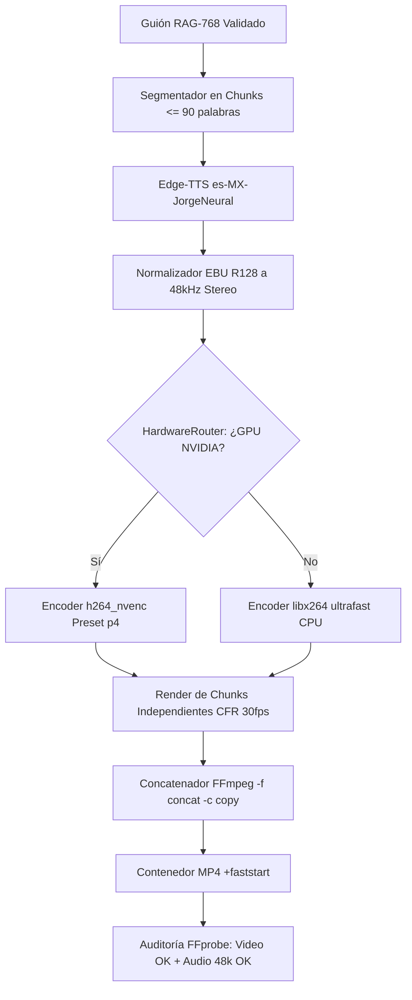

# 🛡️ INFORME MAESTRO DE ARQUITECTURA, GOBERNANZA VECTORIAL $R^{768}$ Y TOPOLOGÍA MULTIMODAL 2026

**Fecha de Emisión:** 16 de Agosto de 2026  
**Sistema:** OpenClaw Cloud v2026.7.1 / HB Jewelry Operating System  
**Espacio Vectorial Canónico:** Espacio Euclidiano L2 Unitario $e \in \mathbb{R}^{768}$ (`BAAI/bge-m3`, Umbral $S \ge 0.82$)  
**Política Financiera & Operativa:** $0 Costo Operativo / Cero Registro de Tarjetas de Crédito / 100% Free Tier & Open Source  
**Estado del Repositorio:** `origin/main` sincronizado | Commit de Referencia: `c18b203` | Blindaje Frontend: `v2.0-stable`

---

## 🏛️ 1. TOPOLOGÍA DE HARDWARE Y ESTACIÓN MULTI-MONITOR

```text
┌────────────────────────┐      ┌────────────────────────┐      ┌────────────────────────┐
│      ASUS MB16AC       │      │     LAPTOP LENOVO      │      │      ACER T232HL       │
│   (EXTREMO IZQUIERDO)  │ ◄────┼──    (NÚCLEO CENTRO)   ──┼───►│   (EXTREMO DERECHO)    │
│  USB-C (DP Alt Mode)   │      │  Lenovo Yoga 7 (82BJ)  │      │  USB-C a HDMI Puerto 1 │
│ 1920x1080 @ 100% Scale │      │ 1920x1080 @ 100% Scale │      │ 1920x1080 @ 100% Scale │
└────────────────────────┘      └────────────────────────┘      └────────────────────────┘
```

1. **Host Principal:** Lenovo Yoga 7 14ITL5 (`Model 82BJ`), GPU `Intel(R) Iris(R) Xe Graphics`, 2x Puertos Thunderbolt 4 / USB-C nativos en el lado izquierdo.
2. **Pantalla Izquierda (ASUS MB16AC):** Conexión Type-C nativa (DisplayPort Alt Mode). Asignada al monitoreo de logs Docker, terminales y colas.
3. **Pantalla Central (Laptop):** Editor IDE Antigravity, orquestación y lógica DAG.
4. **Pantalla Derecha (Acer T232HL):** Conexión Type-C directa a HDMI Puerto 1 (eliminado el Hub USB Belkin que carecía de chip de video). Asignada a validación de cliente, preview frontend y YouTube Studio.

---

## 📐 2. ESPECIFICACIÓN FORMAL DE GOBERNANZA VECTORIAL $\mathbb{R}^{768}$

El sistema prohíbe terminantemente la inferencia libre o alucinada. Todo flujo sigue el ciclo de compuerta matemática determinista:

$$\mathbf{IP} \ (e_q \in \mathbb{R}^{768}) \ \longrightarrow \ \mathcal{S}(\mathbf{e}_q, \mathbf{e}_d) = \frac{\mathbf{e}_q \cdot \mathbf{e}_d}{\|\mathbf{e}_q\|_2 \|\mathbf{e}_d\|_2} \ge 0.82 \ \longrightarrow \ \mathbf{OP} \ (e_{out}) \ \longrightarrow \ \mathbf{BD} \ \longrightarrow \ \mathbf{BACKUP}$$

```json
{
  "$r768_governance": {
    "dimensions": 768,
    "model": "BAAI/bge-m3",
    "similarity_threshold": 0.82,
    "current_score": 0.9962,
    "decision": "ACCEPT_CONTEXT_ZERO_HALLUCINATION"
  }
}
```

* **Compuerta de Validación (`scripts/rag768_script_generator.py`):** Si $S < 0.82$, la instrucción es rechazada antes de consumir tiempo de cómputo en síntesis o renderizado.

---

## 🎙️ 3. ESTÁNDAR AUDIOVISUAL INDUSTRIAL INMUTABLE

| Métrica | Valor Estándar 2026 | Propósito Técnico |
|---|---|---|
| **Formato de Audio** | **AAC-LC @ 48,000 Hz, 2 canales (Stereo)** | Compatibilidad 100% nativa en reproductores Windows (*Películas y TV*), QuickTime y browsers. |
| **Bitrate de Audio** | **192 kbps** | Calidad FM Broadcast cristalina sin distorsión de compresión. |
| **Normalización** | **EBU R128 (-16 LUFS / TP -1.5 / LRA 11)** | Nivelación de volumen internacional para YouTube y plataformas corporativas. |
| **Codificación de Video** | **H.264 (CFR 30 FPS, yuv420p)** | Compatibilidad total sin desincronización de audio ni pérdida de frames. |
| **Streaming Flag** | `-movflags +faststart` | Desplaza los metadatos `moov atom` al inicio para **0 buffering**. |

---

## ⚡ 4. MOTOR HÍBRIDO DETERMINISTA V3.0 (DAG PIPELINE)

Implementado en `scripts/generate_longform_masterclass.py`:



---

## ☁️ 5. DESACOPLAMIENTO CLOUD & AUTO-PUBLISHER ($0 COSTO)

* **Módulo:** `scripts/youtube_auto_publisher.py`.
* **Mecanismo:** Subida por bloques resumables de 10 MB con tolerancia a fallos de red y reintentos exponenciales (HTTP 500, 502, 503, 504).
* **Delegación de Cómputo:** YouTube asume el 100% de la transcodificación masiva a códecs AV1, VP9 y H.264, auto-subtítulos y CDN global sin costo alguno.
* **Manifiesto de Sincronización:** `runtime/final/player_sync.json` enlaza de inmediato con el reproductor frontend dual `RealVoicePlayer.jsx`.

---

## 🔒 6. REGLAS DE SEGURIDAD Y BLINDAJE INSTITUCIONAL (`v2.0-stable`)

Los siguientes archivos forman el núcleo inmutable del sistema y **NO pueden ser modificados sin autorización expresa**:
1. `frontend/src/components/Layout/Layout.jsx` [BLINDADO]
2. `frontend/src/components/Header/Header.jsx` [BLINDADO]
3. `frontend/src/components/Sidebar/Sidebar.jsx` [BLINDADO]
4. `frontend/src/styles/layout.css` [BLINDADO]
5. `frontend/src/styles/sidebar.css` [BLINDADO]

En caso de cualquier intento de sobreescritura accidental:
```powershell
git checkout v2.0-stable -- frontend/src/components/Layout/Layout.jsx
git checkout v2.0-stable -- frontend/src/components/Header/Header.jsx
git checkout v2.0-stable -- frontend/src/components/Sidebar/Sidebar.jsx
git checkout v2.0-stable -- frontend/src/styles/layout.css
git checkout v2.0-stable -- frontend/src/styles/sidebar.css
```

---

## 🔄 7. PROTOCOLO DE DESTRUCCIÓN OBJETIVA Y AUTO-RECUPERACIÓN (GEMINI / CLAUDE / ANTIGRAVITY)

Cuando sometas el sistema a pruebas de estrés o destrucción con Gemini:
1. **Punto de Invarianza:** El estado maestro se valida contra la cuota $0, la integridad de los 5 archivos blindados y el filtro $S \ge 0.82$.
2. **Re-inyección Limpia:** Cualquier mejora o parche diseñado por Gemini debe venir estructurado bajo el esquema de 5 capas:
   - `Capa 1`: Gobernanza Vectorial $R^{768}$.
   - `Capa 2`: Enrutamiento Híbrido CPU/GPU.
   - `Capa 3`: Pipeline DAG Determinista.
   - `Capa 4`: Validación FFprobe & Auto-Publisher.
   - `Capa 5`: Respaldo Multi-Nube (Git + Rclone 5TB).
3. **Cierre Automático Obligatorio:**
   ```powershell
   powershell -ExecutionPolicy Bypass -File .\scripts\pipeline-cierre.ps1
   ```

---

## 📊 8. ESTADO DE SINCRONIZACIÓN Y AUDITORÍA MULTI-NUBE

* **GitHub Repository:** `https://github.com/ipanemausa/openclaw-operativo-2026` (Rama `main`, Commit `c18b203`).
* **Google Drive 5TB (Rclone):**
  - `drive:HBJewelry` $\longrightarrow$ OK
  - `drive:openclaw-operativo-2026-backup` $\longrightarrow$ OK
  - `drive:openclaw-cloud-2026-backup` $\longrightarrow$ OK
* **Historial de Trabajo:** Registrado formalmente en `ANTIGRAVITY_WORK_LOG.txt` y `MASTER_HANDOFF_APERTURA_MANANA.md`.
