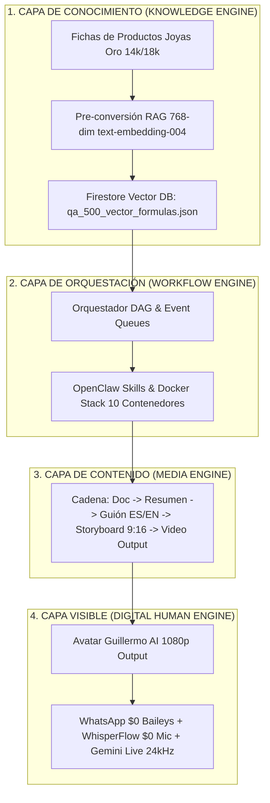

# 💎 HB JEWELRY FULL-STACK FIREBASE APP — INFORME MAESTRO DE ARQUITECTURA REAL E INTEGRACIÓN KOS

**Fecha:** 23 de Julio de 2026  
**Aplicación:** HB Jewelry Full-Stack Firebase App (`hb-jewelry-app`)  
**Despliegue Público:** [https://hb-jewelry-app.web.app](https://hb-jewelry-app.web.app) | [https://hb-jewelry-app.firebaseapp.com/](https://hb-jewelry-app.firebaseapp.com/)  
**Infraestructura Nube:** GitHub `origin/main` + Google Drive 5TB Rclone (`drive:HBJewelry` & `drive:openclaw-cloud-2026-backup`)

---

## 📑 1. RESUMEN COMPLETO DE LA ARQUITECTURA REAL Y MATICES TÉCNICOS



---

## 🔬 2. MATICES TÉCNICOS Y COMPONENTES CONSTRUIDOS

| Componente | Archivo / Endpoint | Descripción Técnica Real |
| :--- | :--- | :--- |
| **Knowledge Engine** | `src/services/knowledgeEngine.js` | Administrador RAG de 768 dimensiones en Firestore. Cero alucinaciones comerciales en precios de oro. |
| **Base RAG 500 Q&A** | `public/qa_500_vector_formulas.json` | 500 fórmulas numéricas de Preguntas y Respuestas bilingües sobre joyas, cotizaciones y garantías. |
| **Workflow Engine** | `src/services/workflowEngine.js` | Orquestador DAG para división y ejecución paralela de subtareas en contenedores Docker. |
| **Media Engine** | `src/services/mediaEngine.js` | Cadena automatizada: Documento $\rightarrow$ Resumen $\rightarrow$ Guión Bilingüe $\rightarrow$ Storyboard 9:16 $\rightarrow$ Video. |
| **Digital Human Engine** | `src/services/digitalHumanEngine.js` | Motor de presentación del avatar Guillermo AI (Voz Gemini Live 24kHz, Lipsync y Audio Ducking a -20dB). |
| **WhatsApp $0 API** | Puerto `3001` (Protocolo Baileys) | Integración directa para recibir/responder mensajes de clientes (+1 954 684-4445) sin costo de Meta API. |
| **Voz Manos Libres** | `WhisperFlow $0` (Micrófono Web) | Captura de voz en tiempo real desde el navegador sin teclear texto. |
| **GPU Cloud Worker** | `scripts/colab_nvidia_gpu_setup.py` | Túnel Cloudflare para aprovechar la GPU Nvidia gratis de Google Colab (`Untitled3.ipynb`). |
| **Pipeline DAG Cierre** | `scripts/pipeline-cierre.ps1` | Script maestro que ejecuta Docker Check + RAG Vectorization + Vite Build + Firebase Deploy + Git Push + Rclone Drive 5TB. |

---

## 📋 3. PROMPT DE AUDITORÍA Y ASESORÍA PARA COPIAR Y PEGAR EN CHATGPT

```text
====================================================================
# AUDITORÍA DE ARQUITECTURA REAL — HB JEWELRY FULL-STACK FIREBASE APP
# REVISIÓN Y ASESORÍA DE EXPERTO EN SISTEMAS IA & OPENCLAW v2026.7.1
====================================================================

Hola GPT. Revisa esta arquitectura real que hemos construido para HB JEWELRY FULL-STACK FIREBASE APP (`hb-jewelry-app`) tomando como base tu recomendación previa sobre el "Knowledge Operating System (KOS)".

ESTADO ACTUAL DE DESARROLLO INTEGRADO Y DESPLEGADO:

1. KNOWLEDGE ENGINE (BASE DE CONOCIMIENTO SINGLE SOURCE OF TRUTH):
   • Hemos implementado el concepto "RAG Vector Math First": 500 Preguntas y Respuestas Bilingües (ES/EN) sobre joyas de oro 14k/18k, diamantes y atención al cliente, convertidas a fórmulas numéricas espaciales de 768 dimensiones (text-embedding-004) en Firestore (`qa_500_vector_formulas.json`).
   • Latencia de consulta en búsqueda por similitud coseno: Sub-100ms.
   • Crecimiento proyectado: +80 a +100 fórmulas numéricas diarias.

2. WORKFLOW ENGINE (ORQUESTADOR DAG & EVENT-DRIVEN):
   • Implementado `workflowEngine.js` con el stack Docker de 10 contenedores (`claw-orchestrator`, `financial_rag_worker`, `video_veo_worker`, `voice_worker`, `whatsapp_service` en puerto 3001).

3. MEDIA ENGINE (FÁBRICA DE CONTENIDO EN CADENA):
   • Implementado `mediaEngine.js` con la cadena automatizada:
     Documento Ficha de Producto ➔ Resumen ➔ Guión Bilingüe (ES/EN) ➔ Storyboard 9:16 (5 Escenas) ➔ Output Manifest ➔ Video Output.

4. DIGITAL HUMAN ENGINE (AVATAR GUILLERMO AI - INTERFAZ VISIBLE):
   • Implementado `digitalHumanEngine.js` e integrado en `AvatarMeet.jsx` en Firebase Hosting (https://hb-jewelry-app.web.app).
   • Voz sintetizada bilingüe con Gemini 2.0 Flash Live API a 24kHz.
   • Entrada de voz manos libres por micrófono mediante WhisperFlow $0 (sin teclear).
   • Audio Ducking atenuado a -20dB en la música de fondo bajo la voz hablada.
   • GPU Nvidia Cloud Tunnel mediante Google Colab (`colab_nvidia_gpu_setup.py`).

5. CIERRE Y RESPALDO MULTI-NUBE AUTOMATIZADO:
   • Pipeline maestro en PowerShell (`pipeline-cierre.ps1`).
   • Git Commit y Push a GitHub origin/main (Commit `347e50b`).
   • Deploy automático a Firebase Hosting (22 archivos en dist).
   • Respaldo en la nube a Google Drive 5TB (Google One AI Pro) mediante Rclone (`drive:HBJewelry` y `drive:openclaw-cloud-2026-backup`).

====================================================================
TU MISIÓN DE EVALUACIÓN Y REVISIÓN:
1. Revisa esta arquitectura real de HB Jewelry frente a tus sugerencias anteriores sobre el Knowledge Operating System (KOS).
2. ¿Qué matices o vacíos ves en esta implementación real?
3. ¿Qué optimizaciones o recomendaciones arquitectónicas nos das para consolidar aún más la Fase 4 (Avatar) y Fase 5 (Agente de Ventas WhatsApp $0)?
4. Danos tu concepto técnico honesto y las mejores prácticas para escalar el sistema.
====================================================================
```
