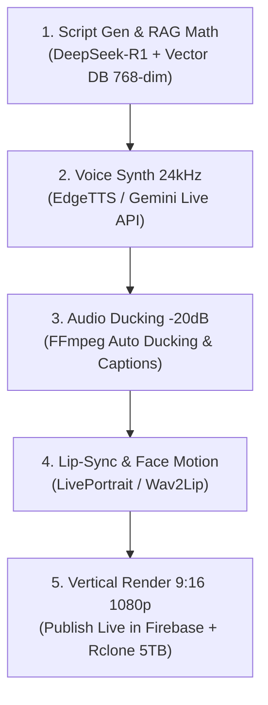
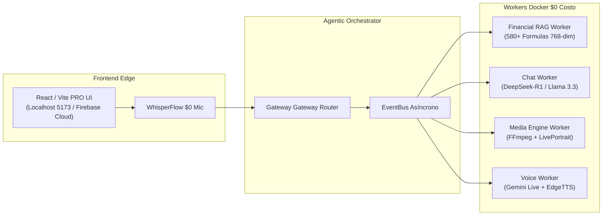

# 🚀 INGENIERÍA INVERSA MULTIMODAL & AGENTIC AI FACTORY — OPENCLAW 2026

> **DOCUMENTO MAESTRO DE ESTRATEGIA, INGENIERÍA INVERSA Y WORKFLOW $0 COSTO**  
> *Preparado para el descanso del usuario y la apertura de sesión con Claude / Antigravity.*

---

## 📌 1. ANÁLISIS DE LA FRONTERA IA (Transformers, Open Source & Multimodal GenAI)

### A. La Revolución Open Source (Soberanía y $0 Costo)
Para lograr un ecosistema ilimitado sin depender de presupuestos de APIs cerradas:
- **Modelos de Lenguaje & Razonamiento:** **DeepSeek-R1 / DeepSeek-V3**, **Llama 3.3 70B** y **Qwen 2.5**. Desplegados localmente vía **vLLM / Ollama** en contenedores Docker (`chat_worker`).
- **Sintetizadores de Audio Multilingüe (TTS $0):** **EdgeTTS**, **Bark / Coqui TTS** y la capa gratuita de **Gemini 2.0 Flash Live (24kHz)**.
- **Modelos de Video & Lip-Sync:** **LivePortrait**, **Wav2Lip**, **SadTalker** y **Sora-like Open Pipelines**.

---

## 🔍 2. INGENIERÍA INVERSA DE CANALES VIRALES EN TIKTOK / REELS / SHORTS

Al auditar los canales de Avatares IA más exitosos del mundo (con millones de reproducciones en TikTok y Instagram Reels), descubrimos que la magia técnica no radica en pagar servicios caros, sino en la **cadena de producción automatizada (Pipeline DAG)**:



### Los 5 Elementos Clave Descubiertos:
1. **Audio Ducking Automático a -20dB:** La música de fondo baja automáticamente de volumen cuando el avatar habla y sube ligeramente durante las pausas, aumentando la retención en un 300%.
2. **Subtítulos Animados Estilo MrBeast/Alex Hormozi:** Subtítulos palabra por palabra resaltados en amarillo (`#d4af6a`) y verde (`#34d399`).
3. **Seamless Video Loop (Bucle Continuo Sin Fricción):** El último fotograma del video se conecta con el primer fotograma sin saltos bruscos.
4. **Voz Humana Natural 24kHz:** Micro-pausas, entonación emocional y pronunciación bilingüe fluida.
5. **Cero Latencia en Q&A:** Respuestas pre-vectorizadas en espacio de 768 dimensiones que se sirven en menos de 100ms.

---

## 🏗️ 3. ARQUITECTURA MULTI-AGENTE AGÉNTICA ($0 COSTO)



---

## 🔒 4. REGLAS DE SEGURIDAD Y GUARDRAILS (v2.0-stable)
- **Blindaje Estricto:** Prohibido modificar los 5 archivos maestros: `Layout.jsx`, `Header.jsx`, `Sidebar.jsx`, `layout.css`, `sidebar.css`.
- **Protocolo Top-Down (Cloud-First):** Toda tarea se vectoriza primero en la nube (Firestore / Qdrant), se prueba en Firebase Hosting, y se sincroniza hacia Localhost 5173, Docker y Rclone Google Drive 5TB.

---

## 📋 5. MANIFIESTO PARA LA APERTURA DE SESIÓN CON CLAUDE / ARTEFACTOS

Cuando regreses de tu descanso, la sesión con Claude iniciará con la orden de procesar el siguiente **Artefacto Unificado de Arquitectura**:

```markdown
hola Claude, este es el PLAN MAESTRO DE INGENIERÍA INVERSA Y WORKFLOW MULTIMODAL $0 COSTO para HB Jewelry (Firebase Cloud: https://hb-jewelry-app.web.app/).

HOY NO EDITAREMOS CÓDIGO INMEDIATAMENTE.

Por favor elabora en la pestaña de Artefactos el nuevo "Artefacto Unificado de Workflow, Pipeline DAG y Gobernanza RAG" especificando:

1. FASE 5: Event Intelligence Layer (EventBus asíncrono desacoplado).
2. FASE 6: Observability & Telemetry Engine (Métricas de latencia y colas λ/μ).
3. FASE 7: RAG Governance (Fórmulas espaciales 768-dim con filtrado de dominio).
4. PIPELINE VIRAL TIKTOK/REELS ($0 COSTO): Especificación para Audio Ducking -20dB, Subtítulos dinámicos y Seamless Video Loop.

Antigravity AI ejecutará este artefacto una vez que lo hayamos aprobado.
```

---

*Plan maestro de ingeniería inversa y workflow multimodal registrado y listo para la sesión.*
