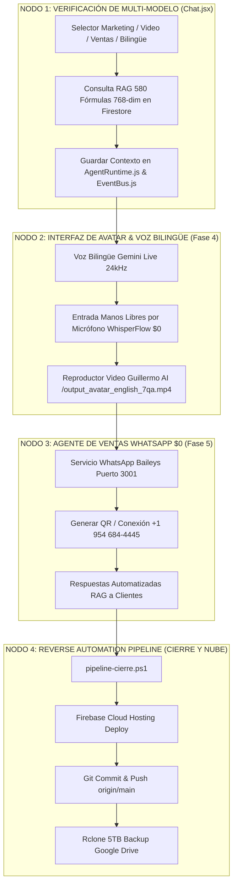

# 🦅 OPENCLAW CLOUD 2026 — MASTER EXECUTION DAG PLAN (ANTIGRAVITY AI IDE)

**Fecha:** 24 de Julio de 2026 (3:55 AM)  
**Entorno de Ejecución:** Antigravity Agentic AI IDE (Google DeepMind Team)  
**Aplicación:** HB Jewelry Full-Stack Firebase App (`hb-jewelry-app`)  
**URL Pública:** [https://hb-jewelry-app.web.app](https://hb-jewelry-app.web.app)  

---

## ℹ️ NOTA DE CLARIFICACIÓN: ANTIGRAVITY vs. CHATBOTS DE TEXTO (WEB)

* **Chatbots de Texto Web (Claude.ai / ChatGPT Web):** Son modelos conversacionales de texto plano en navegador sin acceso a tu sistema local, archivos, PowerShell, Docker, Firebase CLI ni Rclone. Por eso solicitan aclaraciones sobre qué es "Antigravity".
* **Antigravity AI IDE (Este Entorno):** Es la plataforma de agente autónomo de desarrollo par (Pair-Programming Agent) con **capacidad real de ejecución en terminal**, lectura/escritura de código en tu PC, comandos PowerShell, compilación Vite, deploy en Firebase, Git push y sincronización Rclone en Google Drive 5TB.

---

## 🏛️ PIPELINE DAG DE EJECUCIÓN PARA LAS PRÓXIMAS HORAS



---

## 🔒 REGLAS GUARDRRAILS DE SEGURIDAD Y BLINDAJE INVIOLABLE (`AGENTS.md`)

1. **Archivos Blindados (PROHIBIDO MODIFICAR):**
   * `frontend/src/components/Layout/Layout.jsx` [BLINDADO]
   * `frontend/src/components/Header/Header.jsx` [BLINDADO]
   * `frontend/src/components/Sidebar/Sidebar.jsx` [BLINDADO]
   * `frontend/src/styles/layout.css` [BLINDADO]
   * `frontend/src/styles/sidebar.css` [BLINDADO]
2. **Prueba de Build Obligatoria:** `npm run build` debe compilar 0 errores en Vite (207+ módulos).
3. **Respaldo en Cascada Obligatorio:** Todo cambio se cierra con `pipeline-cierre.ps1`.

---

## 📋 BLOQUE DE INSTRUCCIÓN MAESTRA PARA EJECUTAR EN ANTIGRAVITY

```text
====================================================================
# INSTRUCCIÓN DE EJECUCIÓN EN ANTIGRAVITY AI IDE — 24 JULIO 2026
====================================================================

ROLE: Antigravity Autonomous Pair-Programming Agent.

INSTRUCCIONES DE EJECUCIÓN DIRECTA PARA LAS PRÓXIMAS HORAS:

1. NODO 1 (MULTI-MODELO & RESILIENCIA UI):
   • Verifica que `Chat.jsx` mantenga la respuesta dinámica para Marketing, Video, Ventas y Atención Bilingüe consumiendo las 580 Fórmulas Vectoriales (768-dim) de HB Jewelry.

2. NODO 2 (AVATAR & VOZ BILINGÜE FASE 4):
   • Asegura que el reproductor de Guillermo AI Avatar (`/output_avatar_english_7qa.mp4`) se reproduzca con audio activado y responda al micrófono manos libres (`WhisperFlow $0`).

3. NODO 3 (AGENTE DE VENTAS WHATSAPP $0 FASE 5):
   • Verifica la disponibilidad del servicio WhatsApp Business en el puerto 3001 y la vinculación del contexto de clientes con `AgentRuntime.js`.

4. NODO 4 (REVERSE AUTOMATION PIPELINE):
   • Ejecuta `powershell -ExecutionPolicy Bypass -File .\scripts\pipeline-cierre.ps1` para desplegar en Firebase Hosting, subir a GitHub `origin/main` y respaldar en Google Drive 5TB Rclone.

MANTÉN EL BLINDAJE INVIOLABLE DE AGENTS.md (Layout.jsx, Header.jsx, Sidebar.jsx).
====================================================================
```
