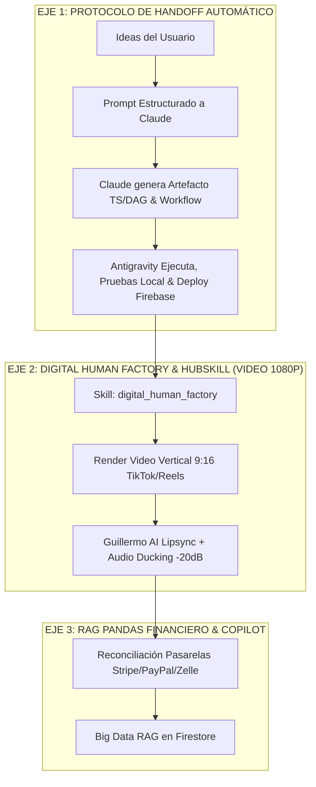

# 🦅 OPENCLAW CLOUD 2026 — PROPUESTA MAESTRA DE ARQUITECTURA PARA CLAUDE

**Fecha:** 24 de Julio de 2026  
**Ecosistema:** HB Jewelry Full-Stack Firebase App (`hb-jewelry-app`)  
**Estrategia:** Claude (Arquitecto Maestro de Artefactos/DAG) ➔ Antigravity (Ejecutor Autónomo Local & Deployer)  

---

## 🏛️ 1. ORGANIZACIÓN DE LAS 3 IDEAS CLAVE PARA CLAUDE



---

## 📋 2. PROMPT MAESTRO PARA COPIAR Y PEGAR EN CLAUDE

```text
====================================================================
# SOLICITUD DE ARTEFACTO MAESTRO DAG: VIDEO AVATAR HUBSKILL & RAG PANDAS
# PROYECTO: HB JEWELRY FULL-STACK FIREBASE APP (OPENCLAW v2026.7.1)
====================================================================

Hola Claude. Siguiendo nuestro protocolo estricto (Tú como ARQUITECTO MAESTRO que diseña artefactos/DAGs y Antigravity como EJECUTOR LOCAL que compila, prueba y despliega en Firebase), te entregamos las 3 ideas organizadas para que diseñes el NUEVO ARTEFACTO MAESTRO:

1. EJE DE VIDEO AVATAR & HUBSKILL (PRIORIDAD DE IMPACTO VISUAL):
   • Integra el skill `digital_human_factory` de OpenClaw.
   • Orquesta la generación automática de videos promocionales 1080p verticales (9:16) para TikTok/Reels con Guillermo AI Avatar, sincronización de labios (Lipsync) y atenuación de audio a -20dB.

2. EJE DE GOBERNANZA RAG PANDAS FINANCIERO:
   • Orquestación de Big Data para transacciones de oro 14k/18k y pasarelas de pago (Stripe, PayPal, Zelle, Plaid).

3. PROTOCOLO DE HANDOFF AUTOMÁTICO:
   • Manifiesto técnico listo en https://hb-jewelry-app.web.app/claude_hybrid_handoff.txt para cerrar cada bloque de tareas y proyectar la siguiente fase.

Por favor, elabora el ARTEFACTO COMPLETO (`video-hubskill-dag.ts`) con los workflows, checkpoints y reglas de seguridad para que Antigravity lo implemente de inmediato en HB Jewelry App.
====================================================================
```
