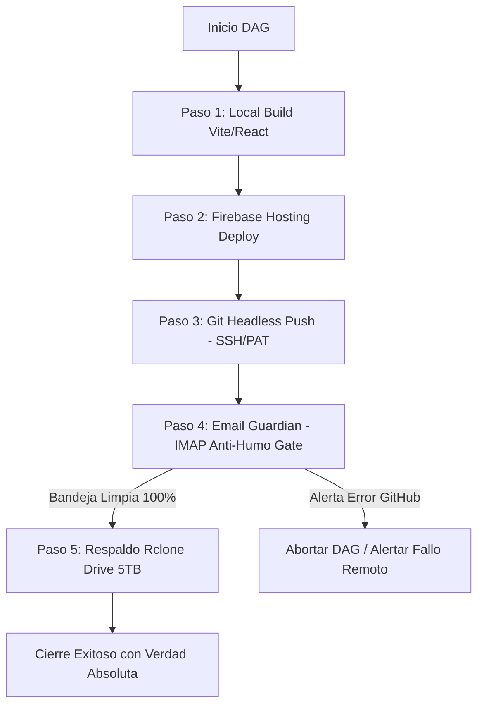

# ==============================================================================
# MASTER ARTIFACT: DAG CONTINUITY + EMAIL GUARDIAN + GIT HEADLESS 2026
# FECHA: 2026-08-17 | CLASIFICACIÓN: GOBERNANZA OPERATIVA & VERIFICACIÓN POST-DEPLOY
# GOBERNANZA: R^768 (S >= 0.82) | PROTOCOLO ZERO-COST ($0) | BLINDAJE v2.0-STABLE
# ==============================================================================

## 1. ESPECIFICACIÓN DEL ENTORNO Y VARIABLES (.openclaw-master.env)

Ruta canónica: `C:\Users\ipane\.openclaw-master.env`

```ini
# ==============================================================================
# CREDENCIALES Y PROTOCOLOS HEADLESS OPENCLAW 2026
# ==============================================================================
# Autenticación Git Headless (PAT con scopes repo + workflow)
GH_TOKEN=ghp_TU_PERSONAL_ACCESS_TOKEN_AQUI

# Email Guardian Agent (IMAP / SMTP SSL)
MAIL_SERVER=imap.gmail.com
MAIL_PORT=993
MAIL_USER=tu_correo@gmail.com
MAIL_PASS=tu_app_password_16_caracteres_sin_espacios
MAIL_ALERT_FROM=notifications@github.com

# Remotos Rclone Drive 5TB
RCLONE_REMOTE_JEWELRY=drive:HBJewelry
RCLONE_REMOTE_OPERATIVO=drive:openclaw-operativo-2026-backup
RCLONE_REMOTE_CLOUD=drive:openclaw-cloud-2026-backup
```

---

## 2. ARQUITECTURA DE FLUJO DEL PIPELINE DAG (ORDEN DE DEPLOY INMUTABLE)



---

## 3. COMPONENTES IMPLEMENTADOS

| Componente | Archivo | Responsabilidad |
| :--- | :--- | :--- |
| **Pipeline DAG 2026-08-17** | [`scripts/pipeline-dag-2026-08-17.ps1`](file:///c:/Users/ipane/openclaw-operativo-2026/scripts/pipeline-dag-2026-08-17.ps1) | Ejecutor autónomo de las 5 tareas en estricto orden inmutable. |
| **Email Guardian Agent** | [`scripts/mail_guardian_agent.py`](file:///c:/Users/ipane/openclaw-operativo-2026/scripts/mail_guardian_agent.py) | Sondeo IMAP de alertas de fallo y asistente de emails. |
| **Master Env Centralizado** | `C:\Users\ipane\.openclaw-master.env` | Fuente única de verdad de tokens y contraseñas de app. |

---

## 4. INSTRUCCIÓN DE EJECUCIÓN DIARIA

Para ejecutar el ciclo completo de validación, despliegue y respaldo con verificación de correo:

```powershell
powershell -ExecutionPolicy Bypass -File .\scripts\pipeline-dag-2026-08-17.ps1
```
