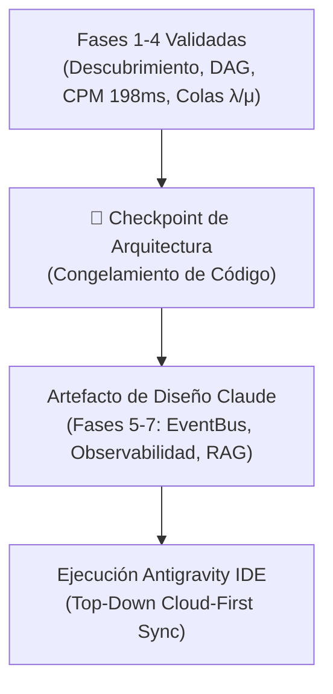

# 🦅 OPENCLAW CLOUD 2026 — INFORME MAESTRO DE HANDOFF Y PIPELINE WF (25 JULIO 2026)

**Aplicación:** HB Jewelry Full-Stack Firebase App (`hb-jewelry-app`)  
**URL Pública en Vivo (Firebase):** [https://hb-jewelry-app.web.app](https://hb-jewelry-app.web.app)  
**Servidor Local PC:** [http://localhost:5173/](http://localhost:5173/)  
**Repositorio Git:** [https://github.com/ipanemausa/openclaw-operativo-2026](https://github.com/ipanemausa/openclaw-operativo-2026)  
**Respaldo 5TB Google Drive:** Sincronizado vía Rclone (`drive:HBJewelry` & `drive:openclaw-cloud-2026-backup`)  

---

## 🛑 1. CHECKPOINT DE ARQUITECTURA ESTRATÉGICA (CÓDIGO CONGELADO)

> **INSTRUCCIÓN MAESTRA PARA CLAUDE Y ANTIGRAVITY:**  
> Se detuvo todo desarrollo impulsivo de código. La próxima sesión inicia con la revisión y elaboración del **Artefacto Unificado de Arquitectura**.

---

## ⚡ 2. PROTOCOLO OPERATIVO TOP-DOWN CLOUD-FIRST

Las tareas de desarrollo y ejecución siguen estrictamente este flujo descendente:

1. **Vectorización RAG Matemática (768-dim):** Carga de fórmulas espaciales directamente a Firebase Firestore Vector DB / Qdrant.
2. **Despliegue Vivo en Firebase:** `https://hb-jewelry-app.web.app` es la primera fuente ejecutada y probada.
3. **Sincronización Descendente (Downstream Sync):** Replicación fluida hacia `http://localhost:5173/`, contenedores Docker, Google Drive 5TB (Rclone) y GitHub (`origin/main`).
4. **Preservación de Blindaje:** Respeto estricto del tag `v2.0-stable` en `Layout.jsx`, `Header.jsx`, `Sidebar.jsx`, `layout.css` y `sidebar.css`.

---

## 📋 3. INSTRUCCIONES EXACTAS PARA EL HANDOFF CON CLAUDE

Claude (como Arquitecto Maestro) debe elaborar el **Artefacto Unificado** para las siguientes fases estratégicas:

- **FASE 5 (Event Intelligence Layer):** Diseño del `EventBus` asíncrono para coordinar agentes de video, voz y chat sin bloqueo de la UI.
- **FASE 6 (Observability & Telemetry Engine):** Especificación del tablero de control de métricas de colas ($\lambda$ llegada, $\mu$ servicio) y latencias.
- **FASE 7 (RAG Governance):** Algoritmo de filtrado espacial para vectores de 768 dimensiones que restringe respuestas fuera del negocio de joyas.

---

## 🛠️ 4. ROL DE ANTIGRAVITY AI IDE (EJECUTOR NATIVO)

Una vez que Claude devuelva el Artefacto Unificado en la pestaña de Claude:
1. **Antigravity AI** revisará y validará el artefacto contra los cuellos de botella y la ruta crítica CPM.
2. Tras la aprobación del usuario, **Antigravity AI** ejecutará los cambios, compilará en Vite, desplegará a Firebase Hosting, probará en `localhost:5173` y respaldará en Google Drive 5TB con Rclone.

---

*Informe maestro de Handoff y Pipeline WF registrado y respaldado al 100%.*
