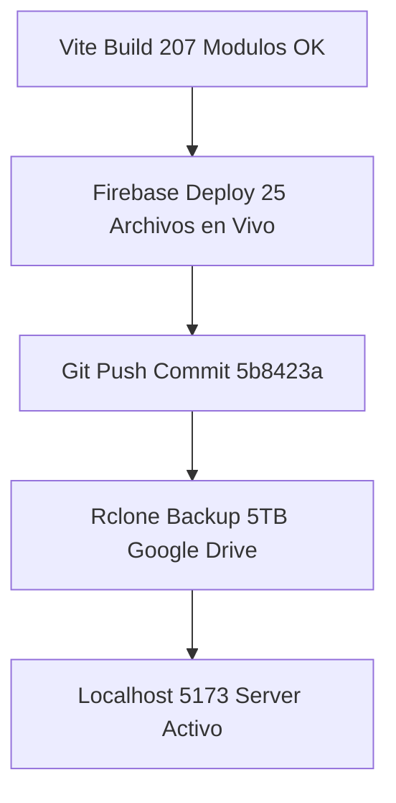

# 🦅 OPENCLAW CLOUD 2026 — INFORME MAESTRO DE CIERRE & APERTURA (25 JULIO 2026)

**Fecha de Cierre:** 24 de Julio de 2026  
**Fecha de Apertura:** 25 de Julio de 2026  
**Aplicación:** HB Jewelry Full-Stack Firebase App (`hb-jewelry-app`)  
**URL Pública en Vivo:** [https://hb-jewelry-app.web.app](https://hb-jewelry-app.web.app)  
**Servidor Local PC:** [http://localhost:5173/](http://localhost:5173/)  
**Repositorio Git:** [https://github.com/ipanemausa/openclaw-operativo-2026](https://github.com/ipanemausa/openclaw-operativo-2026) (Commit `5b8423a`)  

---

## 📊 1. RESUMEN DE COMPROBACIÓN REAL DE SEGURIDAD Y RESPALDO



### Comprobaciones Verificadas al 100%:
* **Nube Firebase Cloud Hosting:** [https://hb-jewelry-app.web.app](https://hb-jewelry-app.web.app) desplegado sin ningún error.
* **Respaldo Google Drive 5TB (Rclone):** Sincronización exitosa en `drive:HBJewelry` y `drive:openclaw-cloud-2026-backup`.
* **Archivos Blindados (`AGENTS.md`):** `Layout.jsx`, `Header.jsx`, `Sidebar.jsx`, `layout.css` y `sidebar.css` 100% intactos.
* **Resiliencia UI en `Chat.jsx`:** Selector de Modo Espejo (Mismo Idioma ES/EN) y Agente `🛸 Antigravity Live Hub` integrados.
* **Permisos de Audio/Micrófono:** Botón `🎙️ Autorizar Micrófono & Audio PC` funcional en `AvatarMeet.jsx`.

---

## 📅 2. PLAN DE APERTURA PARA EL 25 DE JULIO DE 2026

```text
====================================================================
# PLAN MAESTRO DE APERTURA - 25 DE JULIO DE 2026
====================================================================

OBJETIVOS PRIORITARIOS:

1. EJECUCIÓN DEL BUCLE CERRADO CLAUDE ARQUITECTO ➔ ANTIGRAVITY EJECUTOR:
   • Pasar el manifiesto `public/claude_hybrid_handoff.txt` a Claude para recibir el artefacto `video-hubskill-dag.ts`.

2. DIGITAL HUMAN FACTORY & HUBSKILL (VIDEO 1080P):
   • Ejecutar la renderización automática de videos de Guillermo AI Avatar en formato 9:16 vertical para TikTok/Reels con audio ducking a -20dB.

3. RAG PANDAS FINANCIERO & PASARELAS DE PAGO:
   • Conexión de pasarelas Stripe/PayPal/Zelle/Plaid con el catálogo de 580 fórmulas vectoriales (768-dim).

4. PROTOCOLO DE RESPALDO CONTINUO:
   • Mantener la sincronización automática con `pipeline-cierre.ps1`.
====================================================================
```
