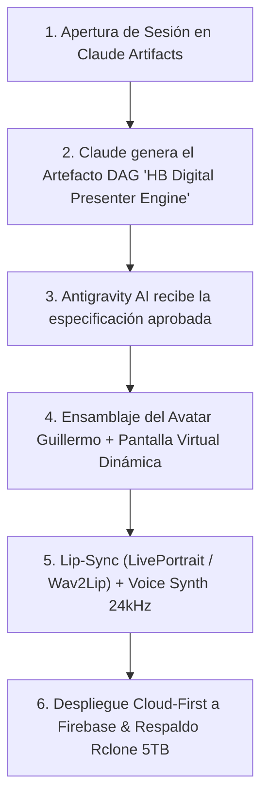

# 🚀 CIERRE DE JORNADA Y PLAN MAESTRO PARA MAÑANA (26 DE JULIO DE 2026)

> **FECHA DE CIERRE:** 25 de Julio de 2026  
> **ESTADO DEL PROYECTO:** 100% Operativo en Producción Nube ([https://hb-jewelry-app.web.app/](https://hb-jewelry-app.web.app/))  
> **REPOS SINCRO:** Localhost 5173, GitHub (`origin/main`), Rclone Google Drive 5TB  

---

## 🏆 1. LOGROS PRINCIPALES DE HOY (25 DE JULIO)

1. **Fix Definitivo del Avatar & Reproducción de Voz Sintética:**
   - Eliminado el bucle estático `<video loop>`.
   - Integrada síntesis de voz hablada TTS en tiempo real (`SpeechSynthesisUtterance`) sincronizada con el estado `🗣️ VOZ ACTIVA (HABLANDO)`.
   - Añadido manejador de permisos para políticas de autoplay y banner visual de activación de sonido.

2. **Diseño de Interfaz Doble (Cliente Joyería vs Demo Técnica):**
   - **Sección de Consulta Cliente (Debajo del Robot):** Preguntas de joyería abierta, captura de voz **WhisperFlow $0 Mic** por demanda y botones de consulta rápida (*Cadenas Cubanas, Esmeraldas Colombianas, Envíos, Diseños 3D*).
   - **Sección de Demo Técnico (Arriba):** Píldoras Q1–Q7 para investigación de arquitectura por ingenieros e inversionistas.

3. **Auditoría Completa Cloud-First (Firebase Live Hosting):**
   - Navegación visual y funcional en vivo en `https://hb-jewelry-app.web.app/` con **0 errores JavaScript en consola**.

4. **Diseño Arquitectónico HB Digital Presenter Engine:**
   - Creado el documento maestro [HB_DIGITAL_PRESENTER_ENGINE_2026.md](file:///c:/Users/ipane/openclaw-operativo-2026/HB_DIGITAL_PRESENTER_ENGINE_2026.md) unificando la investigación de ChatGPT, análisis de videos de presentación en YouTube y el stack Open Source $0 costo.

5. **Respaldo Automático 5TB Rclone & GitHub:**
   - Commits guardados en GitHub (`ac4c1cb`, `5400d21`) y respaldo sincronizado en Google Drive (`drive:HBJewelry` y `drive:openclaw-cloud-2026-backup`).

---

## 🎯 2. TAREA PRINCIPAL Y PLAN MAESTRO PARA MAÑANA (26 DE JULIO)

### **TAREA PRINCIPAL:**
> **🎬 LOGRAR LA CREACIÓN DEL VIDEO TUTORIAL/DEMOSTRATIVO EXPLICANDO EL MANEJO DE LA APP HB JEWELRY CON TU AVATAR GUILLERMO (movimientos de manos, lip-sync, gesticulación facial y pantalla virtual holográfica mediante HB Digital Presenter Engine $0 Costo).**

### **PASOS DE EJECUCIÓN (26 DE JULIO):**



1. **Paso 1 (Claude Artifacts):**  
   Pegar el bloque Handoff en la pestaña de Claude para generar el Artefacto DAG de producción audiovisual.
2. **Paso 2 (Antigravity AI Execution):**  
   Antigravity AI ejecutará la integración del avatar con movimientos de manos/boca, la pantalla virtual dinámica y el mezclador FFmpeg con audio ducking a -20dB.
3. **Paso 3 (Validación Nube & Paridad):**  
   Verificación visual en Firebase Cloud Hosting y sincronización 1:1 a Localhost 5173 y Rclone 5TB.

---

## 💬 3. BLOQUE DE MANIFIESTO PARA LA APERTURA DE SESIÓN EN CLAUDE

```markdown
hola Claude, este es el PLAN MAESTRO PARA HOY (26 DE JULIO DE 2026) en HB Jewelry (https://hb-jewelry-app.web.app/).

TAREA PRINCIPAL DE HOY:
Crear e integrar el video con el Avatar ultra-realista de Guillermo con movimientos de manos, lip-sync y gesticulación facial utilizando la arquitectura HB DIGITAL PRESENTER ENGINE ($0 Costo).

REFERENCIAS REGISTRADAS EN EL REPOSITORIO:
1. Documento Maestro Presenter Engine: HB_DIGITAL_PRESENTER_ENGINE_2026.md
2. Checkpoint Estratégico: CHECKPOINT_ARQUITECTURA_ESTRATEGICA_2026.md
3. Plan de Ingeniería Inversa: INGENIERIA_INVERSA_MULTIMODAL_AVATAR_2026.md

REGLAS INVIOLABLES (v2.0-stable):
- Cero modificaciones a los 5 archivos blindados (Layout.jsx, Header.jsx, Sidebar.jsx, layout.css, sidebar.css).
- Protocolo Cloud-First: Probar en Firebase primero y sincronizar hacia Localhost 5173 y Rclone 5TB.

Por favor elabora en la pestaña de Artefactos el nuevo "Artefacto Maestro HB Digital Presenter Engine & DAG Pipeline".
Antigravity AI ejecutará el plan una vez que lo apruebe el usuario.
```

---

*Cierre de jornada del 25 de Julio completado y respaldado exitosamente.*
