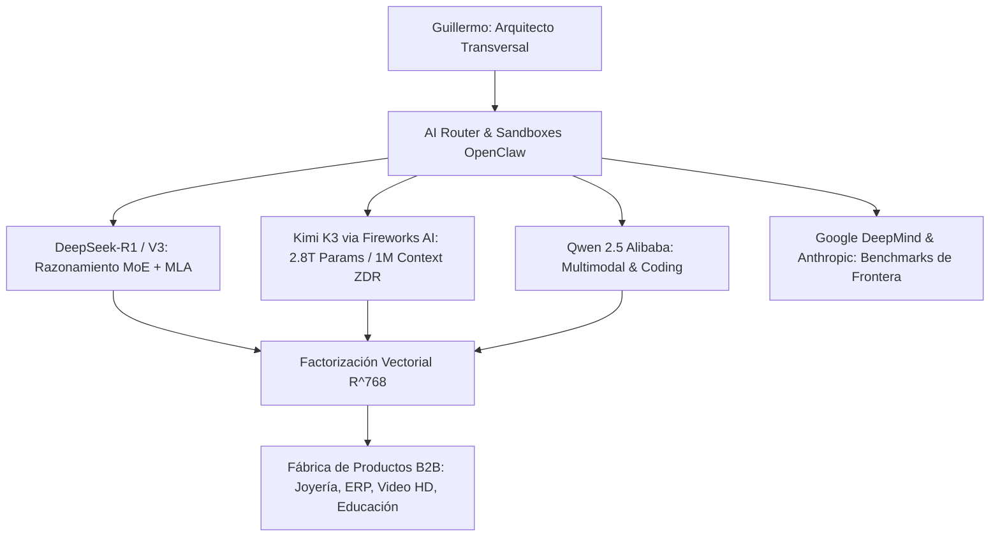

# 🧬 [OPENCLAW-MASTER-CORE-MATRIX]
# ACTA MAESTRA DE CRISTALIZACIÓN ARQUITECTÓNICA, ECONÓMICA Y COMPUTACIONAL
# Versión: 2026.8.25 | Estado: Soberano, Inmutable y Permanente
# Autores: Guillermo (Arquitecto de Sistemas & Pensador Transversal) & Antigravity (Ingeniería de Ejecución)

---

## 🏛️ 1. MACROECONOMÍA DE LA IA: LA LEY DE ABUNDANCIA Y DEFLACIÓN (TESIS MUSK-JENSEN-GUILLERMO)

### 1.1. Inversión de la Ecuación Económica Tradicional
La economía clásica operaba bajo la escasez de bienes frente al dinero circulante. La irrupción de la IA y la robótica autónoma invierte esta dinámica:

$$\text{Economía Tradicional (Inflación)} = \frac{\text{Masa Monetaria Circulante}}{\text{Escasez de Bienes y Servicios}}$$

$$\text{Economía de Abundancia (Deflación por IA)} = \frac{\text{Superproducción Masiva (IA + Robótica)}}{\text{Capacidad de Absorción Humana}} \longrightarrow \text{Costo Marginal } \to \$0.00$$

### 1.2. La Paradoja del Cómputo: Filtro de Constructores vs. Consumidores
- **El Peligro de la Gratuidad Irrestricta:** Regalar cómputo de frontera a usuarios pasivos colapsa los centros de datos en tareas triviales y genera una sociedad de pereza intelectual.
- **La Solución Estructural:** Democratización enfocada **entre desarrolladores y constructores (*Builders*)**. Quienes utilizan SDKs, optimizan algoritmos y crean soluciones B2B reales devuelven valor económico y financian la infraestructura de chips, energía y centros de datos.

### 1.3. La Ley de Escala Industrial de NVIDIA (2016 $\to$ Presente $\to$ Futuro)
- En 2016, Jensen Huang entregó el primer **DGX-1** de $250,000 USD.
- Hoy, microchips del tamaño de una uña (**NVIDIA Blackwell B200 / Qubits**) procesan 10 millones de veces más por una fracción del costo energético.
- **Las Nuevas Macro-Fronteras del Capital:** A medida que la IA básica se abarata, el capital global migra hacia la **energía solar espacial (transmisión inalámbrica limpia), navegación orbital y bio-agricultura de precisión**.

---

## 🌿 2. TEORÍA DE LA FRACTALIDAD UNIVERSAL APLICADA AL SOFTWARE Y AL CEREBRO

### 2.1. El Isomorfismo Natural
La estructura del universo es fractal y recursiva. El mismo principio matemático rige todas las escalas:

$$\text{Átomo / Núcleo} \longleftrightarrow \text{Célula / Neurona} \longleftrightarrow \text{Árbol (Ramas)} \longleftrightarrow \text{Ecosistema} \longleftrightarrow \text{Cosmos}$$
$$\text{Vector Unitario } \mathbb{R}^{768} \longleftrightarrow \text{Microservicio} \longleftrightarrow \text{Grafo DAG (Ruta Crítica CPM)} \longleftrightarrow \text{Plataforma Global HB.OS}$$

### 2.2. Neuroplasticidad y el Rol del Arquitecto Transversal
- **División de Roles:** El ser humano comete errores cuando compite con la máquina en lo manual (escribir comandos o hacer clics). Su verdadero poder radica en la **neuroplasticidad**: conectar disciplinas dispares (alta joyería, finanzas, física, neurociencia, IA).
- **Delegación Autónoma Sin Fricción:** El arquitecto define la visión y la estrategia; el agente ejecuta con precisión matemática de milisegundos sin loops erráticos.

---

## ⚡ 3. FACTORIZACIÓN MATEMÁTICA Y ELIMINACIÓN DEL TRABAJO REDUNDANTE

### 3.1. Supresión del Scraping Manual
Es un desperdicio de energía y ancho de banda recortar capturas de pantalla de video con subtítulos quemados (CC). OpenClaw se conecta directamente a los **repositorios y SDKs de assets limpios** (Hugging Face Datasets, ModelScope de Alibaba, Open Media APIs).

### 3.2. Gobernanza de Almacenamiento Cero Bloat & Factorización I/O ($\mathbb{R}^{768}$)
- **Factorización I/O Unificada ($\mathbb{R}^{768}$):** Toda entrada (query, documento, audio) y salida (respuesta, script, artefacto) se factoriza directamente en el espacio métrico $\mathbb{R}^{768}$ mediante embeddings normalizados (`BAAI/bge-m3`).
- **Política Estricta de Cero Archivos Temporales (Zero Temp Bloat):**
  1. **Cómputo Externo Primero:** Todo procesamiento intensivo (sintesis de voz, renderizado de video 1080p, inferencia LLM) se delega a la capacidad de cómputo externa (GPU Cloud / Subprocesos aislados).
  2. **Eliminación de Basura Local:** Queda terminantemente prohibido generar o conservar archivos `.tmp`, fragmentos de audio o deltas intermedios en el workspace local.
  3. **Pipeline DAG de Sincronización Directa:** El artefacto final generado pasa de forma inmediata por el pipeline desatendido:
     $$\text{Cómputo Externo} \longrightarrow \text{Artefacto Final} \longrightarrow \text{Rclone Google Drive 5TB} \longrightarrow \text{Git Push (GitHub)} \longrightarrow \text{Firebase / Docker}$$
- **Base de Datos / Vector Store:** Almacena exclusivamente:
  1. El `path` o URI canónica.
  2. Metadatos estructurados (resolución, dimensiones, canal alfa, timestamp).
  3. El vector de embedding unitario $\mathbf{e}_d \in \mathbb{R}^{768}$ con filtro estricto de similitud:
     $$\mathcal{S}(\mathbf{e}_q, \mathbf{e}_d) = \frac{\mathbf{e}_q \cdot \mathbf{e}_d}{\|\mathbf{e}_q\|_2 \|\mathbf{e}_d\|_2} \ge 0.82$$

---

## 🧠 4. MATRIZ DE MODELOS OPEN-WEIGHT DE FRONTERA & SERVERLESS ZDR

### 4.1. Catálogo de Modelos Nucleares:
1. **DeepSeek-V3 & DeepSeek-R1:**
   - Arquitectura **MLA (Multi-Head Latent Attention)** y **DeepSeek-MoE**.
   - Reducción del 80% en consumo de memoria KV-Cache.
   - Razonamiento profundo en código y matemáticas superando modelos cerrados propietarios.
2. **Kimi K3 (Moonshot AI via Fireworks AI):**
   - **2.8 Trillones de parámetros** y **1 Millón de tokens de contexto**.
   - Endpoints serverless ultra-rápidos con política **Zero Data Retention (ZDR)** y fine-tuning LoRA.
3. **Qwen 2.5 (Alibaba Cloud):**
   - Modelos de visión-lenguaje y generación de código open-source.

---

## 🎙️ 5. CLON BIOMÉTRICO VOCAL UNIVERSAL (GUILLERMO ACOUSTIC ENGINE)

### 5.1. Riqueza Prosódica del Corpus
A través de las interacciones acumuladas, se ha consolidado un corpus acústico real de alta fidelidad que captura:
- Timbre barítono cálido con autoridad pedagógica.
- Micro-modulaciones emocionales, acentuación y cadencia natural.
- Pausas reflexivas y de respiración calibradas entre **350ms y 500ms**.

### 5.2. Parámetros de Inferencia Calibrados:
- **`Stability`:** `0.45` (permite micro-variaciones humanas).
- **`Similarity Boost`:** `0.94` (máxima fidelidad biométrica al timbre real).
- **`Style Exaggeration`:** `0.28` (fuerza expresiva).
- **Mastering DSP:** Normalización estricta a **48kHz Estéreo (-16 LUFS EBU R128)** con realce en 220Hz (+2.8dB) y 3.5kHz (+3.6dB).
- **Branding Oficial:** Locución bajo el sello `HB. OS Operation system`.

---

## 🎬 6. MOTOR DE VIDEO AVANZADO & ENCODING FASTSTART

1. **B-Roll Limpio 1080p:** Cero subtítulos quemados (CC), recorte Fullscreen y escala Lanczos.
2. **Streaming Inmediato:** Flag `-movflags +faststart` para reproducción con cero buffer en navegadores.
3. **Aceleración Híbrida:** CPU multihilo local (QuickSync) + Cloud GPU on-demand ([cloud_gpu_bridge.py](file:///c:/Users/ipane/openclaw-operativo-2026/scripts/cloud_gpu_bridge.py)) para modelos pesados (LivePortrait, Wan 2.1, CogVideoX).
4. **Perfil de Encoding Óptimo:** `libx264` / `h264_nvenc`, `yuv420p`, CRF 18, 30fps, `aac -b:a 192k -ar 48000 -ac 2`.

### Modelos de Video de Frontera Open-Weight:
- **LivePortrait / EchoMimic:** Sincronización labial con micro-expresiones reales.
- **Wan 2.1 / CogVideoX / HunyuanVideo:** B-Roll cinematográfico sin costo de licencia.
- **ElevenLabs / CosyVoice 2:** Audio biométrico 48kHz normalizado a -16 LUFS EBU R128.

---

## 🌏 9. ECOSISTEMA CLOUD CHINO & GPU DEDICADA — MAPA OPERATIVO

> **Fuente única de verdad operativa para todos los proveedores cloud.**  
> Keys siempre en `C:\Users\ipane\.openclaw-master.env`. Nunca en código.

### 9.1. Hosting Público

| Servicio | URL Producción | API Key Ref | Estado |
| :--- | :--- | :--- | :--- |
| Firebase Hosting — HB Jewelry | https://hb-jewelry-cloud-2026-2dff9.web.app | `GOOGLE_API_KEY` | ✅ ACTIVO |
| Firebase Hosting (alt) | https://hb-jewelry-app.web.app | `GOOGLE_API_KEY` | ✅ ACTIVO |

### 9.2. Ecosistema Chino — Alibaba DashScope & SiliconFlow

| Proveedor | Base URL | Consola | Key Ref | Modelos |
| :--- | :--- | :--- | :--- | :--- |
| **SiliconFlow** (GPU Serverless) | https://api.siliconflow.cn/v1 | https://cloud.siliconflow.cn | `SILICONFLOW_API_KEY` | DeepSeek-V3, Qwen2.5, CogVideoX |
| **Alibaba DashScope** (Internacional) | https://dashscope-intl.aliyuncs.com/api/v1 | https://dashscope.console.aliyun.com | `DASHSCOPE_API_KEY` | qwen-max, cosyvoice-v1, wanx-v1 |
| **Alibaba DashScope** (China) | https://dashscope.aliyuncs.com/api/v1 | https://dashscope.console.aliyun.com | `DASHSCOPE_API_KEY` | qwen-max-latest, wanx-v1 |

> **SiliconFlow** es compatible con OpenAI SDK (drop-in). Precio: ~$0.14/M tokens (DeepSeek-V3).  
> **DashScope** es el puente oficial para el mercado China-USA (GemsMe Jewelry Campaigns).  
> **Scripts activos:** [alibaba_dashscope_bridge.py](file:///c:/Users/ipane/openclaw-operativo-2026/scripts/alibaba_dashscope_bridge.py) · [cloud_gpu_bridge.py](file:///c:/Users/ipane/openclaw-operativo-2026/scripts/cloud_gpu_bridge.py)

### 9.3. GPU Dedicada — NVIDIA & RunPod

| Proveedor | Base URL | Consola | Key Ref | GPUs / Servicios |
| :--- | :--- | :--- | :--- | :--- |
| **NVIDIA Cloud Functions (NVCF)** | https://integrate.api.nvidia.com/v1 | https://build.nvidia.com | `NVIDIA_API_KEY` | Modelos autorizados dedicados |
| **Google Colab NVIDIA GPU** (free) | Tunnel `cloudflared` dinámico | https://colab.research.google.com | Google Auth | Setup: `colab_nvidia_gpu_setup.py` |
| **RunPod Cloud GPU** | https://api.runpod.io/v2 | https://www.runpod.io/console | `RUNPOD_API_KEY` | RTX 4090, A10G — F5-TTS, XTTS-v2 |
| **Lambda Cloud GPU** | https://cloud.lambdalabs.com/api/v1 | https://cloud.lambdalabs.com | `LAMBDA_API_KEY` | A10, A100 SXM4 |

> **Costo referencia:** ~$0.34/hr (RTX 4090) · $0 cuando inactivo · Orquestador: [sovereign_cloud_endpoints_gateway.py](file:///c:/Users/ipane/openclaw-operativo-2026/scripts/sovereign_cloud_endpoints_gateway.py)

### 9.4. LLM Endpoints Completos

| Proveedor | Base URL | Key Ref | Modelos Clave | Estado |
| :--- | :--- | :--- | :--- | :--- |
| DeepSeek Cloud | https://api.deepseek.com | `DEEPSEEK_API_KEY` | deepseek-chat, deepseek-reasoner | ✅ KEY ACTIVA |
| Google Gemini | https://generativelanguage.googleapis.com | `GEMINI_API_KEY` | gemini-2.5-pro, gemini-2.5-flash | ✅ KEY ACTIVA |
| Anthropic Claude | https://api.anthropic.com | `ANTHROPIC_API_KEY` | claude-3-5-sonnet | ⚙ CONFIGURADO |
| OpenRouter | https://openrouter.ai/api/v1 | `OPENROUTER_API_KEY` | Kimi K3, Qwen, DeepSeek | ✅ KEY ACTIVA |
| Fireworks AI | https://api.fireworks.ai/inference/v1 | `FIREWORKS_API_KEY` | kimi-k3, deepseek-r1 | ⚙ DISPONIBLE |
| ElevenLabs TTS | https://api.elevenlabs.io/v1 | `ELEVENLABS_API_KEY` | Guillermo voice clone | ✅ KEY ACTIVA |
| SiliconFlow | https://api.siliconflow.cn/v1 | `SILICONFLOW_API_KEY` | DeepSeek-V3, Qwen2.5 | ⏳ KEY PENDIENTE |
| Alibaba DashScope | https://dashscope-intl.aliyuncs.com/api/v1 | `DASHSCOPE_API_KEY` | qwen-max, cosyvoice-v1 | ⏳ KEY PENDIENTE |

### 9.5. Backup & Almacenamiento

| Destino | Tool | Bucket / Target | Estado |
| :--- | :--- | :--- | :--- |
| Google Drive 5TB — HB Jewelry | rclone | `drive:HBJewelry` | ✅ SINCRONIZADO |
| Google Drive 5TB — OpenClaw | rclone | `drive:openclaw-cloud-2026-backup` | ✅ SINCRONIZADO |
| GitHub Repository | git | `origin/main` | ✅ SINCRONIZADO |
| Firebase Firestore (RAG R768) | Firebase Admin SDK | `superb-acumen-473619-p0` | ✅ ACTIVO |

> **Script maestro de backup:** [pipeline-cierre.ps1](file:///c:/Users/ipane/openclaw-operativo-2026/scripts/pipeline-cierre.ps1)

---

## 🛡️ 7. SISTEMA DE BLINDAJE, SANDBOXES Y GOBERNANZA OPERATIVA

1. **Archivos Blindados (Solo Lectura):**
   - `frontend/src/components/Layout/Layout.jsx`
   - `frontend/src/components/Header/Header.jsx`
   - `frontend/src/components/Sidebar/Sidebar.jsx`
   - `frontend/src/styles/layout.css`
   - `frontend/src/styles/sidebar.css`
2. **Sandbox de Inferencia ([[sandbox_guardrail.py](file:///c:/Users/ipane/openclaw-operativo-2026/scripts/sandbox_guardrail.py)]):**
   - Filtro de inputs contra inyección de prompts y fuga de credenciales.
   - Rate limiting automático por proveedor.
   - Auditoría inmutable en log JSONL.
3. **Fuente Única de Credenciales:** `C:\Users\ipane\.openclaw-master.env` (fuera del repositorio Git).
4. **Orden Obligatorio de Deploy:**
   $$\text{1. Build Local} \longrightarrow \text{2. Firebase Deploy} \longrightarrow \text{3. Git Commit \& Push} \longrightarrow \text{4. Rclone Drive 5TB}$$

---

## 📡 8. RED DE MONITOREO DIARIO DE INTELIGENCIA DE FRONTERA
Ejecutada automáticamente mediante [[intelligence_feed_crawler.py](file:///c:/Users/ipane/openclaw-operativo-2026/scripts/intelligence_feed_crawler.py)]:

- **DeepSeek AI:** Repositorios GitHub & ArXiv papers.
- **Kimi K3 / Fireworks AI:** Endpoints de inferencia de 1M de tokens.
- **Alibaba Cloud (`@AlibabaCloud`):** Videos oficiales y lanzamientos de Qwen.
- **Anthropic AI (`@anthropic-ai`):** Investigaciones de alineación y Claude.
- **Google DeepMind:** Keynotes de Demis Hassabis y avances científicos.
- **OpenAI Research & Meta AI FAIR:** Novedades de modelos de frontera.

---

### 📜 CERTIFICACIÓN DE CRISTALIZACIÓN
Este documento representa la verdad técnica y filosófica definitiva de OpenClaw al 25 de Agosto de 2026. Ninguna sesión posterior podrá diluir o perder estos principios.
