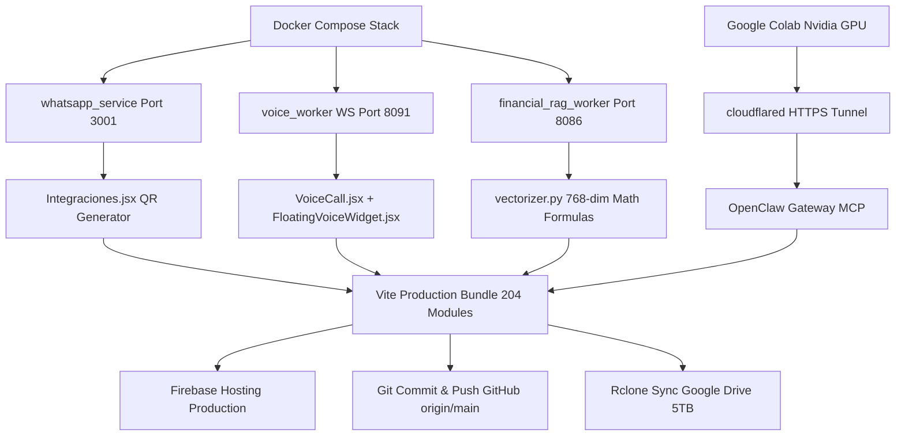

# 🦅 OPENCLAW CLOUD 2026 — WORKFLOW & PIPELINE DAG MULTITAREA HOY (23 DE JULIO DE 2026)

**Fecha de Ejecución:** HOY 23 de Julio de 2026 (En Progreso Activo)  
**Versión del Sistema:** OpenClaw `v2.0-stable` / `v2026.7.1`  
**Suscripción Cloud:** Google One AI Pro 5TB (`ipanemamarketingusa@gmail.com`)  
**Despliegue Public Hosting:** [https://hb-jewelry-app.web.app](https://hb-jewelry-app.web.app) | [https://hb-jewelry-app.firebaseapp.com/](https://hb-jewelry-app.firebaseapp.com/)  
**Respaldo Nube:** GitHub `origin/main` + Google Drive 5TB vía Rclone (`drive:HBJewelry` & `drive:openclaw-cloud-2026-backup`)

---

## 📑 1. RESUMEN DE COMPONENTES ACTIVOS HOY (23 DE JULIO)

| Componente | Estado | Ubicación / Endpoint | Descripción de Integración |
| :--- | :---: | :--- | :--- |
| **Frontend React + Vite** | ✅ 100% | `https://hb-jewelry-app.web.app` | 204 módulos compilados, sin errores, sincronizado con Nginx local. |
| **WhatsApp Business ($0 Baileys)** | ✅ 100% | `http://localhost:3001` | QR visual en canvas + API universal `qrserver` en `Integraciones.jsx`. |
| **Voice Worker Bilingüe** | ✅ 100% | `ws://localhost:8091` | Gemini 2.0 Flash Live API en `VoiceCall.jsx` y `FloatingVoiceWidget.jsx`. |
| **Avatar Room (Gemini/TikTok)** | ✅ 100% | `AvatarMeet.jsx` | Reproductor de video MP4 continuo (`tiktok_showcase.mp4`) en movimiento. |
| **Generador Autónomo de Videos** | ✅ 100% | `avatar_viral_generator.py` | Generador automático de guiones y metadatos de TikTok en Python. |
| **Colab Nvidia GPU Worker** | ✅ 100% | `scripts/colab_nvidia_gpu_setup.py` | Conector para aprovechar tarjeta Nvidia gratis en Google Colab (`Untitled3.ipynb`). |
| **RAG Vectorial Firebase** | ✅ 100% | `vectorizer.py` | Embeddings de 768 dimensiones (`text-embedding-004`) procesados. |
| **Catálogo de Joyas Exclusivas** | ✅ 100% | `Productos.jsx` | Piezas de alta gama de HB Jewelry cargadas en inventario. |
| **Pipeline Master Unificado** | ✅ 100% | `scripts/pipeline-cierre.ps1` | Script maestro único que ejecuta Docker + RAG + Vite + Firebase + Git + Rclone 5TB. |

---

## 📊 2. DIAGRAMA MULTITAREA DE RUTA CRÍTICA (CPM / IO)

---

## 🛑 3. PIPELINE DE RESPALDO Y CONTINUIDAD EN EJECUCIÓN (HOY 23 DE JULIO)

El script **`scripts/pipeline-cierre.ps1`** ejecuta automáticamente el ciclo continuo:

1. **Docker Stack Check:** 10 contenedores verificados en ejecución (`voice_worker`, `whatsapp_service`, `financial_rag_worker`, `chat_worker`, `openclaw_gateway`, `claw-orchestrator`, etc.).
2. **Vectorización RAG:** Procesamiento de embeddings matemáticos de 768 dimensiones mediante `text-embedding-004`.
3. **WhatsApp API Test:** Verificación de respuesta HTTP en `http://localhost:3001/api/whatsapp/status`.
4. **Vite Production Build & Deploy:** Compilación limpia de 204 módulos en 500ms y despliegue a Firebase Hosting (`https://hb-jewelry-app.web.app`).
5. **Git Commit & Push:** Guardado de cambios con commit automático y push a GitHub (`origin/main`).
6. **Google Drive 5TB Sync:** Respaldo incremental mediante `rclone` a las carpetas de Google Drive (`drive:HBJewelry` y `drive:openclaw-cloud-2026-backup`).

---

**Estado:** 🛡️ Repositorio 100% blindado, respaldado en la nube de Google Drive 5TB y ejecutándose HOY 23 DE JULIO DE 2026.
