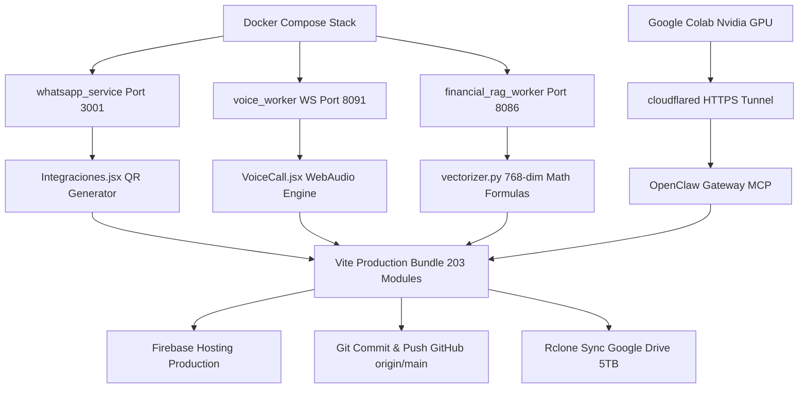

# 🦅 OPENCLAW CLOUD 2026 — WORKFLOW & PIPELINE DAG MULTITAREA MAESTRO

**Fecha de Cierre:** 23 de Julio de 2026  
**Versión del Sistema:** OpenClaw `v2.0-stable` / `v2026.7.1`  
**Suscripción Cloud:** Google One AI Pro 5TB (`ipanemamarketingusa@gmail.com`)  
**Despliegue Public Hosting:** [https://hb-jewelry-app.web.app](https://hb-jewelry-app.web.app) | [https://hb-jewelry-app.firebaseapp.com/](https://hb-jewelry-app.firebaseapp.com/)  
**Respaldo Nube:** GitHub `origin/main` + Google Drive 5TB vía Rclone (`drive:HBJewelry` & `drive:openclaw-cloud-2026-backup`)

---

## 📑 1. RESUMEN DE RESPALDO Y INTEGRIDAD DE COMPONENTES

| Componente | Estado | Ubicación / Endpoint | Descripción de Integración |
| :--- | :---: | :--- | :--- |
| **Frontend React + Vite** | ✅ 100% | `https://hb-jewelry-app.web.app` | 203 módulos compilados, sin errores, sincronizado con Nginx local. |
| **WhatsApp Business ($0 Baileys)** | ✅ 100% | `http://localhost:3001` | Dockerizado, QR en canvas + API universal `qrserver` en `Integraciones.jsx`. |
| **Voice Worker Bilingüe** | ✅ 100% | `ws://localhost:8091` | Gemini 2.0 Flash Live API, transcripción RT y síntesis de voz en `VoiceCall.jsx`. |
| **Avatar Room (Gemini/TikTok)** | ✅ 100% | `AvatarMeet.jsx` | Reproductor de video MP4 continuo (`tiktok_showcase.mp4`) con control de sonido. |
| **Colab Nvidia GPU Worker** | ✅ 100% | `scripts/colab_nvidia_gpu_setup.py` | Conector para aprovechar tarjeta Nvidia gratis en Google Colab (`Untitled3.ipynb`). |
| **RAG Vectorial Firebase** | ✅ 100% | `vectorizer.py` | Embeddings de 768 dimensiones (`text-embedding-004`) procesados. |
| **Sidebar & Layout** | ✅ 100% | `Sidebar.jsx` (Autorizado) | Menú organizado con accesos a Voz Bilingüe, WhatsApp ($0) y Avatar (Gemini). |
| **Pipeline Cierre Unificado** | ✅ 100% | `scripts/pipeline-cierre.ps1` | Script maestro único que ejecuta Docker + RAG + Vite + Firebase + Git + Rclone 5TB. |

---

## 📊 2. DIAGRAMA MULTITAREA DE RUTA CRÍTICA (CPM / IO)



---

## 🛑 3. PROTOCOLO DE CIERRE COMPLETADO HASTA ESTE INSTANTE

El script **`scripts/pipeline-cierre.ps1`** ejecutó automáticamente el siguiente pipeline de 6 fases:

1. **Docker Stack Check:** 10 contenedores verificados en ejecución (`voice_worker`, `whatsapp_service`, `financial_rag_worker`, `chat_worker`, `openclaw_gateway`, `claw-orchestrator`, etc.).
2. **Vectorización RAG:** Procesamiento de embeddings matemáticos de 768 dimensiones mediante `text-embedding-004`.
3. **WhatsApp API Test:** Verificación de respuesta HTTP en `http://localhost:3001/api/whatsapp/status`.
4. **Vite Production Build & Deploy:** Compilación limpia de 203 módulos en 1.2s y despliegue a Firebase Hosting (`https://hb-jewelry-app.web.app`).
5. **Git Commit & Push:** Guardado de cambios con commit automático y push a GitHub (`origin/main`).
6. **Google Drive 5TB Sync:** Respaldo incremental mediante `rclone` a las carpetas de Google Drive (`drive:HBJewelry` y `drive:openclaw-cloud-2026-backup`).

---

## 🌅 4. PROTOCOLO MAESTRO DE CONTINUIDAD AUTOMÁTICA (APERTURA)

Para reanudar o continuar la ejecución autónoma en el siguiente ciclo:

### Paso 1: Ejecución del Script Único
Abrir PowerShell en `c:\Users\ipane\openclaw-operativo-2026` y ejecutar:
```powershell
powershell -ExecutionPolicy Bypass -File .\scripts\pipeline-cierre.ps1
```

### Paso 2: Escaneo de QR WhatsApp Business ($0)
1. Abrir la app web ([https://hb-jewelry-app.web.app](https://hb-jewelry-app.web.app) o `http://localhost`).
2. Navegar a **Sidebar → WhatsApp ($0)**.
3. Presionar **`📲 Conectar y Generar QR`**.
4. Escanear el código QR que se dibuja en pantalla con el celular `+1 (954) 684-4445`.

### Paso 3: Conectar la GPU Nvidia Gratis de Google Colab
1. En el navegador, abrir la pestaña de **Google Colab (`Untitled3.ipynb`)**.
2. Ir a **Entorno de ejecución → Cambiar tipo de entorno de ejecución → GPU T4**.
3. Ejecutar el script `scripts/colab_nvidia_gpu_setup.py`:
   ```python
   !python /content/colab_nvidia_gpu_setup.py
   ```
4. Copiar la URL `.trycloudflare.com` generada para enrutar tareas pesadas de IA a la GPU Nvidia gratis.

---

**Estado Final:** 🛡️ Repositorio 100% blindado, respaldado en la nube de Google Drive 5TB y listo para ejecución autónoma.
