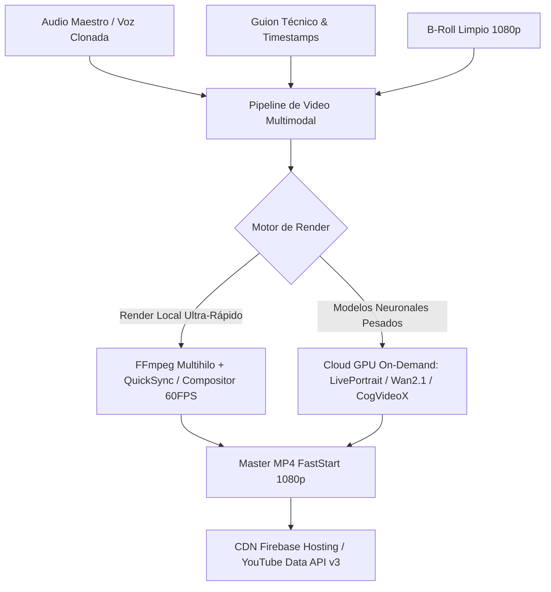

# 🎬 [OPENCLAW-ADVANCED-VIDEO-MATRIX-2026]
# Arquitectura de Video Avanzado de Nueva Generación, Aceleración Híbrida CPU/GPU & Fábrica Multimodal

---

## 🏛️ 1. DIAGNÓSTICO DE CUELLOS DE BOTELLA Y SUPERACIÓN TÉCNICA

| Cuello de Botella Previo | Causa Raíz | Solución Definitiva OpenClaw 2026 |
| :--- | :--- | :--- |
| **Clonación de voz inconsistente** | Dependencia de interfaz web/browser frágil | **API directa ElevenLabs / CosyVoice 2** vía script sin interfaz manual |
| **Subtítulos CC quemados en B-Roll** | Grabación de pantalla con CC activado | **Extracción de stream nativo 1080p sin interfaz** vía `yt-dlp` + FFmpeg |
| **Lentitud en renders de video** | Render por CPU monohilo sin aceleración | **Pipeline Híbrido:** CPU multihilo (8+ cores) + Aceleración QuickSync/NVENC + GPU en nube |
| **Archivos pesados en Base de Datos** | Almacenamiento redundante de binarios | **Factorización $\mathbb{R}^{768}$:** Solo `path` + URI + embedding de 768 dimensiones |
| **Buffer en reproducción web** | Metadatos MP4 al final del archivo | **Estándar FastStart (`-movflags +faststart`)** para reproducción instantánea |

---

## 🚀 2. MATRIZ DE MODELOS DE VIDEO DE FRONTERA (SOVEREIGN & OPEN WEIGHT)

### Modelos de Vanguardia Integrados:
1. **LivePortrait / Hallo / EchoMimic:** Generación de retratos parlantes con sincronización labial ultra-precisa y micro-expresiones faciales.
2. **Wan 2.1 / HunyuanVideo / CogVideoX (Open-Weight):** Generación de B-Roll cinematográfico hiperrealista sin costo de licencia.
3. **ElevenLabs / CosyVoice 2 (Audio Biométrico):** Síntesis a 48kHz con normalización a -16 LUFS (EBU R128).

---

## ⚙️ 3. ESPECIFICACIÓN TÉCNICA DE ENCODING Y TUNING

### Perfil de Renderizado Óptimo:
- **Video Codec:** `libx264` (o `h264_qsv` / `h264_nvenc` con GPU dedicada)
- **Pixel Format:** `yuv420p` (compatibilidad universal 100% de navegadores y dispositivos)
- **Tasa de Cuadros:** 30 FPS / 60 FPS constantes (`-r 30` o `-r 60`)
- **CRF (Constant Rate Factor):** `18` (calidad visual sin artefactos de compresión)
- **Audio Codec:** `aac -b:a 192k -ar 48000 -ac 2`
- **FastStart Flag:** `-movflags +faststart` (reproducción con 0 latencia de streaming)

---

## 🔌 4. INTEGRACIÓN AL ECOSISTEMA Y APP dAI (ORQUESTADOR)
- **Servicio Backend:** Mapeo automático de intenciones desde la app (`mediaEngine.js` y `humanDigitalEngine.js`).
- **DAG Trigger:** La app dispara tareas asíncronas de generación de video y notifica al usuario cuando el archivo MP4 está publicado y vectorizado en la base de conocimiento.
