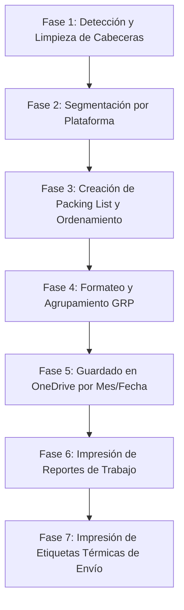

# Reglas de Automatización de Excel y Procesamiento de Pedidos (VBA & Shopify)

Este documento define la arquitectura, fases y reglas del pipeline de procesamiento de pedidos e impresión automatizada de etiquetas en el ecosistema de tiendas (Shopify, TikTok, Walmart, Temu/Shein).

---

## 📋 Estructura de Fases del Pipeline (Flujo de Trabajo)

El procesamiento de archivos WMS y Packing Lists se organiza en **7 fases consecutivas** para garantizar la integridad de los datos sin perder sincronización.



### Fase 1: Detección y Limpieza de Cabeceras
- **Detección Dinámica:** Localiza la cabecera buscando filas con celdas de color de fondo con fuente blanca (al menos 3 coincidencias).
- **Normalización:** Limpia caracteres especiales dejando solo letras y espacios. Traduce sinónimos a cabeceras estandarizadas:
  - `Platform Number`
  - `Recipient Tax ID`
  - `Recipient`
  - `Store`
  - `Tracking No`
  - `SKU`
  - `Outbound Qty`

### Fase 2: Segmentación y Distribución (Split)
- Las filas del archivo WMS se analizan y distribuyen de manera inteligente usando 3 criterios en cascada:
  1. **Sale Platform (Texto):** Identifica `tiktok`, `walmart`, `temu`, `shein`.
  2. **Platform Number (Prefijos):**
     - Empieza con `5` $\rightarrow$ TikTok.
     - Empieza con `1` y tiene `-` $\rightarrow$ Walmart.
     - Empieza con `po-` o `gs` $\rightarrow$ Temu/Shein.
  3. **Client (IDs de Clientes):**
     - Contiene `tiktok(1210017)` $\rightarrow$ TikTok.
     - Contiene `realwe(1210003)` $\rightarrow$ Walmart.
     - Contiene `new jewelry`, `angelgirl`, `faolis`, `shein` $\rightarrow$ Temu/Shein.
- Las filas no asignadas van a una hoja de **Debug** para evitar pérdida de datos.

### Fase 3: Creación y Formateo del Packing List
- Crea una pestaña `Packing list` movida al inicio del libro.
- Extrae únicamente columnas de `SKU` y `Forecast Qty`.
- Ordena los SKUs de la **A a la Z**.
- Aplica formato visual (Encabezados Azul claro a tamaño 20, cantidad en Amarillo a tamaño 17, bordes finos continuos).

### Fase 4: Enriquecimiento de Datos y Capas Visuales
- Agrupa duplicados de `Platform Number` asignándoles un número de grupo (`GRP`) y aplicando una paleta de 18 colores pastel rotativos.
- Combina celdas de cantidad total por SKU (`Total Qty`) para evitar redundancias visuales.
- Resalta condicionalmente tiendas (`GEMSME` en amarillo pastel, `MDFUN` en verde pastel), SKUs con "g" (rojo pastel) y cantidades mayores a 1.

### Fase 5: Guardado Automático Estructurado
> [!IMPORTANT]
> **Regla de Separación de Almacenamiento (Git vs. OneDrive):**
> - **En GitHub:** Solo se guarda el código fuente (.vba, .py, .ps1, .yaml) y la documentación de reglas (.md). **Nunca** subir archivos binarios de Excel (.xlsx) con datos reales a GitHub para evitar bloat del repositorio y proteger datos de clientes.
> - **En OneDrive/Local:** Los archivos Excel históricos y de trabajo diario (`.xlsx`) generados se guardan directamente en el directorio sincronizado de **OneDrive** de la máquina para mantener el historial operativo, respaldos en la nube y accesibilidad local.
- **Ruta de Guardado:** `C:\Users\Andre\OneDrive\1. Power Products LLC-DESKTOP-H9LOLFG\2 Temu Shippings\1 Realwe\`
- **Estructura:** Carpetas dinámicas basadas en el mes actual (ej: `febrero 2026`).
- **Control de Versiones:** Copias independientes libres de macros (`.xlsx`) con un contador de versión automático en caso de duplicidad.

### Fase 6: Impresión de Reportes de Trabajo (Tamaño Carta 8.5x11")
- **Formato:** Configura el tamaño de papel a Carta estándar (`xlPaperLetter` - 8.5" x 11") en orientación horizontal o vertical según corresponda.
- **Encabezados:** Configura `&A` (nombre de hoja), `&D` (fecha), y pie de página con número de página.
- **Enrutamiento:** Envía los reportes a la impresora estándar de la oficina.

### Fase 7: Impresión de Etiquetas (Labels) (Impresora Térmica 4x6")
- **Formato Térmico:** Configura el formato de página a dimensiones térmicas (4" x 6" o `xlPaperUser` / `xlPaperA6` según driver) con márgenes mínimos de 0.1 pulgadas para maximizar área de impresión.
- **Enrutamiento:** Cambia automáticamente la impresora activa del sistema (`Application.ActivePrinter`) a la impresora térmica configurada, realiza la impresión y restaura la impresora estándar para no alterar el flujo posterior.

---

## 🛠️ Código VBA Integrado y Ordenado

El siguiente bloque representa el código VBA estructurado en el orden óptimo de fases e incorporando la **Fase 7** de impresión automática de etiquetas térmicas:

```vba
' ==========================================
' PIPELINE PRINCIPAL DE AUTOMATIZACIÓN DE TIENDAS
' ==========================================
Sub Run_Full_Store_Pipeline()
    Dim ws As Worksheet
    Set ws = ActiveSheet
    
    Dim headerRow As Long
    Dim lastCol As Long, lastRow As Long
    Dim r As Long, c As Long
    Dim matchCount As Long
    
    ' FASE 1: Detección y Limpieza de Cabeceras
    lastCol = ws.Cells(1, ws.Columns.Count).End(xlToLeft).Column
    headerRow = 0
    For r = 1 To 20
        matchCount = 0
        For c = 1 To lastCol
            If ws.Cells(r, c).Interior.Color <> xlNone Then
                If ws.Cells(r, c).Font.Color = RGB(255, 255, 255) Then
                    matchCount = matchCount + 1
                End If
            End If
        Next c
        If matchCount >= 3 Then
            headerRow = r
            Exit For
        End If
    Next r
    
    If headerRow = 0 Then
        MsgBox "Fila de cabecera no encontrada.", vbCritical
        Exit Sub
    End If
    
    ' Limpieza de caracteres y estandarización
    Dim txt As String, i As Long, ch As String, cleaned As String
    For c = 1 To lastCol
        txt = ws.Cells(headerRow, c).Value
        cleaned = ""
        For i = 1 To Len(txt)
            ch = Mid(txt, i, 1)
            If (ch >= "A" And ch <= "Z") Or (ch >= "a" And ch <= "z") Or ch = " " Then
                cleaned = cleaned & ch
            End If
        Next i
        ws.Cells(headerRow, c).Value = Trim(cleaned)
        
        Select Case True
            Case InStr(1, txt, "Platform Number", vbTextCompare) > 0: ws.Cells(headerRow, c).Value = "Platform Number"
            Case InStr(1, txt, "Recipient Tax ID", vbTextCompare) > 0: ws.Cells(headerRow, c).Value = "Recipient Tax ID"
            Case InStr(1, txt, "Recipient", vbTextCompare) > 0: ws.Cells(headerRow, c).Value = "Recipient"
            Case InStr(1, txt, "Store", vbTextCompare) > 0: ws.Cells(headerRow, c).Value = "Store"
            Case InStr(1, txt, "Tracking Status", vbTextCompare) > 0: ws.Cells(headerRow, c).Value = "Tracking Status"
            Case InStr(1, txt, "Tracking", vbTextCompare) > 0: ws.Cells(headerRow, c).Value = "Tracking No"
            Case txt = "SKU": ws.Cells(headerRow, c).Value = "SKU"
            Case InStr(1, txt, "Outbound Qty", vbTextCompare) > 0: ws.Cells(headerRow, c).Value = "Outbound Qty"
        End Select
    Next c
    
    ' FASE 2: Segmentación de Libros por Plataforma
    lastRow = ws.Cells(ws.Rows.Count, 1).End(xlUp).Row
    Dim colSalePlatform As Long, colPlatformNumber As Long, colClient As Long
    For c = 1 To lastCol
        txt = LCase(Trim(ws.Cells(headerRow, c).Value))
        Select Case txt
            Case "sale platform": colSalePlatform = c
            Case "platform number": colPlatformNumber = c
            Case "client": colClient = c
        End Select
    Next c
    
    Dim wbTikTok As Workbook, wbWalmart As Workbook, wbTemu As Workbook
    Dim wsTikTok As Worksheet, wsWalmart As Worksheet, wsTemu As Worksheet
    Dim nextRowTik As Long, nextRowWal As Long, nextRowTemu As Long
    
    Set wbTikTok = Workbooks.Add
    Set wsTikTok = wbTikTok.Sheets(1): wsTikTok.Name = "TikTok"
    ws.Rows(headerRow).Copy wsTikTok.Rows(1): nextRowTik = 2
    
    Set wbWalmart = Workbooks.Add
    Set wsWalmart = wbWalmart.Sheets(1): wsWalmart.Name = "Walmart"
    ws.Rows(headerRow).Copy wsWalmart.Rows(1): nextRowWal = 2
    
    Set wbTemu = Workbooks.Add
    Set wsTemu = wbTemu.Sheets(1): wsTemu.Name = "Temu_Shein"
    ws.Rows(headerRow).Copy wsTemu.Rows(1): nextRowTemu = 2
    
    Dim wsDebug As Worksheet, nextRowDebug As Long
    On Error Resume Next
    Set wsDebug = ws.Parent.Sheets("Debug")
    If wsDebug Is Nothing Then
        Set wsDebug = ws.Parent.Sheets.Add
        wsDebug.Name = "Debug"
    Else
        wsDebug.Cells.Clear
    End If
    On Error GoTo 0
    ws.Rows(headerRow).Copy wsDebug.Rows(1): nextRowDebug = 2
    
    Dim cellSP As String, cellPN As String, cellClient As String
    Dim assigned As Boolean
    
    For r = headerRow + 1 To lastRow
        cellSP = LCase(Trim(ws.Cells(r, colSalePlatform).Text))
        cellPN = LCase(Trim(ws.Cells(r, colPlatformNumber).Text))
        cellClient = LCase(Trim(ws.Cells(r, colClient).Text))
        assigned = False
        
        ' Clasificación por Sale Platform
        If cellSP <> "" Then
            If InStr(cellSP, "tiktok") > 0 Then
                ws.Rows(r).Copy wsTikTok.Rows(nextRowTik): nextRowTik = nextRowTik + 1: assigned = True
            ElseIf InStr(cellSP, "walmart") > 0 Then
                ws.Rows(r).Copy wsWalmart.Rows(nextRowWal): nextRowWal = nextRowWal + 1: assigned = True
            ElseIf InStr(cellSP, "temu") > 0 Or InStr(cellSP, "shein") > 0 Then
                ws.Rows(r).Copy wsTemu.Rows(nextRowTemu): nextRowTemu = nextRowTemu + 1: assigned = True
            End If
        End If
        
        ' Clasificación por Platform Number (Prefijos)
        If Not assigned And cellPN <> "" Then
            If Left(cellPN, 1) = "5" Then
                ws.Rows(r).Copy wsTikTok.Rows(nextRowTik): nextRowTik = nextRowTik + 1: assigned = True
            ElseIf Left(cellPN, 1) = "1" And InStr(cellPN, "-") > 0 Then
                ws.Rows(r).Copy wsWalmart.Rows(nextRowWal): nextRowWal = nextRowWal + 1: assigned = True
            ElseIf Left(cellPN, 3) = "po-" Or Left(cellPN, 2) = "gs" Then
                ws.Rows(r).Copy wsTemu.Rows(nextRowTemu): nextRowTemu = nextRowTemu + 1: assigned = True
            End If
        End If
        
        ' Clasificación por Client
        If Not assigned And cellClient <> "" Then
            Select Case True
                Case cellClient Like "*tiktok(1210017)*"
                    ws.Rows(r).Copy wsTikTok.Rows(nextRowTik): nextRowTik = nextRowTik + 1: assigned = True
                Case cellClient Like "*realwe(1210003)*"
                    ws.Rows(r).Copy wsWalmart.Rows(nextRowWal): nextRowWal = nextRowWal + 1: assigned = True
                Case cellClient Like "*new jewelry(1210018)*", _
                     cellClient Like "*angelgirl jewelry(1210007)*", _
                     cellClient Like "*faolis(1210004)*", _
                     cellClient Like "*shein ??(1210020)*"
                    ws.Rows(r).Copy wsTemu.Rows(nextRowTemu): nextRowTemu = nextRowTemu + 1: assigned = True
            End Select
        End If
        
        ' Sin asignar a Debug
        If Not assigned Then
            ws.Rows(r).Copy wsDebug.Rows(nextRowDebug): nextRowDebug = nextRowDebug + 1
        End If
    Next r
    
    wsTikTok.Columns.AutoFit
    wsWalmart.Columns.AutoFit
    wsTemu.Columns.AutoFit
    wsDebug.Columns.AutoFit
    
    ' FASE 4: Ejecución de Capas Específicas de Formateo
    Call Layer4_TikTok_Workbook(wbTikTok)
    Call Layer5_Walmart_Workbook(wbWalmart)
    Call Layer6_Temu_Shein_Workbook(wbTemu)
    
    ' FASE 5: Guardado en OneDrive por Mes/Fecha
    Dim basePath As String, monthYearFolder As String, fullPath As String, fileDate As String, savePath As String
    Dim counter As Long
    
    basePath = "C:\Users\Andre\OneDrive\1. Power Products LLC-DESKTOP-H9LOLFG\2 Temu Shippings\1 Realwe\"
    monthYearFolder = Format(Date, "mmmm yyyy")
    fullPath = basePath & monthYearFolder & "\"
    If Dir(fullPath, vbDirectory) = "" Then MkDir fullPath
    fileDate = Format(Date, "mm.dd.yyyy")
    
    ' Guardar TikTok
    counter = 1: Do: savePath = fullPath & "TikTok - " & fileDate & "(" & counter & ").xlsx": counter = counter + 1: Loop While Dir(savePath) <> ""
    wbTikTok.SaveAs savePath
    
    ' Guardar Walmart
    counter = 1: Do: savePath = fullPath & "Walmart - " & fileDate & "(" & counter & ").xlsx": counter = counter + 1: Loop While Dir(savePath) <> ""
    wbWalmart.SaveAs savePath
    
    ' Guardar Temu_Shein
    counter = 1: Do: savePath = fullPath & "Temu_Shein - " & fileDate & "(" & counter & ").xlsx": counter = counter + 1: Loop While Dir(savePath) <> ""
    wbTemu.SaveAs savePath
    
    ' FASE 6: Impresión de Hojas de Control (Papel Carta 8.5 x 11")
    ' Enviar reportes a la impresora Epson
    Dim resolvedEpson As String
    resolvedEpson = GetFullPrinterName("Epson")
    Call PrintSheets(wbTikTok, 2, resolvedEpson)
    Call PrintSheets(wbWalmart, 1, resolvedEpson)
    Call PrintSheets(wbTemu, 2, resolvedEpson)
    
    ' FASE 7: Impresión de Etiquetas (Impresora Térmica 4x6")
    ' Enviar etiquetas de envío a la impresora térmica (Nelko / PL70e)
    Dim resolvedNelko As String
    resolvedNelko = GetFullPrinterName("PL70e")
    Call PrintThermalLabels(wbTikTok, resolvedNelko)
    Call PrintThermalLabels(wbWalmart, resolvedNelko)
    Call PrintThermalLabels(wbTemu, resolvedNelko)
    
    MsgBox "Proceso completado exitosamente. Reportes en Epson (Carta) y Etiquetas en PL70e (Térmica) enviados.", vbInformation
End Sub

' ==========================================
' BUSCADOR AUTOMÁTICO DE IMPRESORAS EN WINDOWS (Premium Helper)
' ==========================================
Function GetFullPrinterName(ByVal nameToFind As String) As String
    Dim wshNetwork As Object
    Dim oPrinters As Object
    Dim i As Long
    Dim j As Long
    Dim tempPrinter As String
    
    On Error Resume Next
    Set wshNetwork = CreateObject("WScript.Network")
    Set oPrinters = wshNetwork.EnumPrinterConnections
    
    ' Recorremos todas las conexiones de impresoras instaladas
    For i = 0 To oPrinters.Count - 1 Step 2
        If InStr(1, oPrinters.Item(i + 1), nameToFind, vbTextCompare) > 0 Then
            ' Windows mapea las impresoras en VBA con el puerto (ej: "Nelko on Ne01:")
            ' Probamos los puertos del Ne00 al Ne16 para detectar el activo
            For j = 0 To 16
                tempPrinter = oPrinters.Item(i + 1) & " on Ne" & Format(j, "00") & ":"
                Err.Clear
                Application.ActivePrinter = tempPrinter
                If Err.Number = 0 Then
                    GetFullPrinterName = tempPrinter
                    Exit Function
                End If
            Next j
            ' Retorno alternativo si falla el puerto dinámico
            GetFullPrinterName = oPrinters.Item(i + 1)
            Exit Function
        End If
    Next i
    GetFullPrinterName = "" ' No encontrada
End Function

' ==========================================
' FASE 7: IMPRESIÓN EN IMPRESORA TÉRMICA DEDICADA (NELKO 4x6")
' ==========================================
Sub PrintThermalLabels(wb As Workbook, ByVal thermalPrinterName As String)
    Dim ws As Worksheet
    Dim originalPrinter As String
    
    On Error Resume Next
    Set ws = wb.Sheets(1) ' Hoja principal que contiene datos de envío
    
    If Not ws Is Nothing Then
        ' Guardar impresora original
        originalPrinter = Application.ActivePrinter
        
        ' 1. Configurar página para formato térmico (A6/4x6 pulgadas)
        With ws.PageSetup
            .PaperSize = xlPaperA6 
            .Orientation = xlPortrait
            
            ' Márgenes mínimos para maximizar papel térmico
            .LeftMargin = Application.InchesToPoints(0.1)
            .RightMargin = Application.InchesToPoints(0.1)
            .TopMargin = Application.InchesToPoints(0.1)
            .BottomMargin = Application.InchesToPoints(0.1)
            
            .Zoom = False
            .FitToPagesWide = 1
            .FitToPagesTall = 1
        End With
        
        ' 2. Cambiar temporalmente a la impresora térmica Nelko y enviar trabajo
        If thermalPrinterName <> "" Then
            Application.ActivePrinter = thermalPrinterName
        End If
        
        ws.PrintOut Copies:=1, Collate:=True, IgnorePrintAreas:=False
        
        ' Restaurar impresora original
        Application.ActivePrinter = originalPrinter
    End If
    On Error GoTo 0
End Sub

' ==========================================
' FASE 6: IMPRESIÓN DE REPORTES TAMAÑO CARTA EN EPSON (8.5 x 11")
' ==========================================
Sub PrintSheets(wb As Workbook, sheetsToPrint As Long, ByVal standardPrinterName As String)
    Dim ws As Worksheet
    Dim i As Long
    Dim originalPrinter As String
    
    On Error Resume Next
    originalPrinter = Application.ActivePrinter
    
    ' Cambiar a impresora Epson
    If standardPrinterName <> "" Then
        Application.ActivePrinter = standardPrinterName
    End If
    
    If sheetsToPrint > wb.Sheets.Count Then sheetsToPrint = wb.Sheets.Count
    
    For i = 1 To sheetsToPrint
        Set ws = wb.Sheets(i)
        With ws.PageSetup
            .PaperSize = xlPaperLetter ' Carta 8.5 x 11 pulgadas
            .Orientation = xlLandscape ' Horizontal para reportes anchos
            .CenterHeader = "&A"
            .RightHeader = "&D"
            .RightFooter = "Page &P of &N"
            
            .LeftMargin = Application.InchesToPoints(0.5)
            .RightMargin = Application.InchesToPoints(0.5)
            .TopMargin = Application.InchesToPoints(0.5)
            .BottomMargin = Application.InchesToPoints(0.5)
        End With
        ws.PrintOut
    Next i
    
    ' Restaurar impresora original
    Application.ActivePrinter = originalPrinter
    On Error GoTo 0
End Sub
```

---

## 👥 Equipo y Operación Diaria (Logística Washington)

Para asegurar la correcta integración de tu hijo como **Operador de Logística en Washington**, se establecen los siguientes roles y protocolos de interacción con el sistema:

### 1. Responsabilidades del Operador de Logística
*   **Preparación de Hardware:** Asegurar que la impresora térmica de etiquetas esté encendida, con papel térmico de 4x6" cargado y establecida como **impresora predeterminada** en Windows antes de iniciar.
*   **Ejecución con 1 Click:** Abrir el archivo WMS del día, ejecutar la macro `Run_Full_Store_Pipeline` para automatizar la limpieza, segmentación, guardado en OneDrive e impresión física de etiquetas y hojas de control.
*   **Resolución de Excepciones (Hoja de Debug):** 
    - Revisar diariamente la hoja **Debug** en Excel tras la ejecución.
    - Si hay filas allí, significa que entraron pedidos con formatos de código o nombres de tienda nuevos que la macro aún no reconoce.
    - El operador debe clasificar esos pedidos manualmente y notificar al equipo de desarrollo (Gordon/Antigravity/Tú) para actualizar las reglas de filtrado en GitHub.

### 2. Sincronización en el Contrato de Estado
*   En los archivos de estado compartidos (`state/*.yaml`), las acciones de control manual ejecutadas por él en Washington se registrarán bajo el identificador de actor:
    `meta.last_actor: "operator_washington"`
*   Esto mantendrá a todo el ecosistema (incluyendo a Hermes cuando se integre) al tanto de que la fase física ha sido completada por el operador en Washington.

