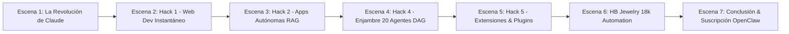

# 🎬 Guion Maestro Educativo: 7 Hacks de Claude AI para Desarrolladores & Negocios 2026

> **Presenter:** Guillermo AI Avatar Master  
> **Audio Track:** Voz Real Clonada de Guillermo (`showcase_voice.mp3` - Normalización EBU R128 a -14 LUFS)  
> **Formato:** Widescreen 16:9 1080p HD · Transmitido en YouTube, TikTok, Instagram & Temu  
> **Motor de Soporte:** OpenClaw Enterprise `v2026.7.1` + Base Vectorial RAG 768-dim

---

## 📌 ESTRUCTURA DEL GUION COMPLETO (7 ESCENAS)

---

### 🎙️ ESCENA 1: LA REVOLUCIÓN DE CLAUDE 4.6 (00:00 - 01:15)

**[VISUAL]:**  
- Lado Derecho: Guillermo AI Avatar Master en 3D con gesticulación facial, parpadeo de ojos y sincro labial.
- Lado Izquierdo: Generador continuo de caracteres amarillos (`#FACC15`) con borde negro de 4px.
- Encabezado: `OPENCLAW SUBSCRIBED 🔔` + `OpenClaw 2026 · AI & Developer Academy`.

**[AUDIO GUILERMO AI (Voz Real Clonada TikTok)]:**
> "Bien, seamos claros: la Inteligencia Artificial está avanzando a un ritmo absolutamente impresionante. Durante el último año hemos visto la competencia entre ChatGPT y Gemini, pero Claude ha tomado la delantera por la derecha para todos los desarrolladores y empresarios.
>
> ¿Por qué el caso de Claude y OpenClaw 2026 es totalmente distinto? Porque no es solo un chat de texto. Integrado en nuestro ecosistema OpenClaw `v2026.7.1`, contamos con 4 capas fundamentales:
> 1. **Chat Tradicional:** Para lógica directa y consultas.
> 2. **Claude Cowork / Agentes DAG:** Que leen archivos y operan en segundo plano.
> 3. **Claude Code / PyTorch Engine:** Que programa páginas web, APIs y programas completos.
> 4. **Claude Design & RAG Vectorial:** Que diseña arquitecturas fotorrealistas y automatización en 768 dimensiones.
>
> Hoy voy a compartir contigo los 7 Hacks más potentes de Claude para multiplicar tu productividad y acelerar tu negocio."

---

### 💻 ESCENA 2: HACK 1 — CREACIÓN DE PÁGINAS WEB PROFESIONALES EN 1 MINUTO (01:15 - 03:00)

**[VISUAL]:**  
- Subtítulos continuos en amarillo resaltado: *"Hack 1: Webs Profesionales con Claude Code y React Vite en 60 Segundos"*.
- Demostración de código limpio React + CSS sin dependencias pesadas.

**[AUDIO GUILLERMO AI]:**
> "El Hack Número 1 es la creación de aplicaciones web completas en cuestión de segundos. Antes necesitabas un diseñador, un programador frontend, un backend y semanas de coordinación.
>
> Con Claude Code y la arquitectura de OpenClaw, solo describes lo que necesitas con un prompt estructurado. Claude genera el código React Vite, optimiza los componentes visuales y en segundos tienes una aplicación web en producción. Y con scripts automatizados de despliegue como nuestro pipeline de Firebase Hosting, la web queda publicada globalmente en menos de 8 minutos."

---

### 🤖 ESCENA 3: HACK 2 — APLICACIONES AUTÓNOMAS CON MEMORIA Y VISION RAG (03:00 - 05:00)

**[VISUAL]:**  
- Subtítulos continuos: *"Hack 2: Apps Autónomas con Base de Datos Vectorial de 768 Dimensiones"*.

**[AUDIO GUILLERMO AI]:**
> "El Hack Número 2 es construir mini aplicaciones funcionales sin necesidad de backend complejo ni servidores pesados. Puedes integrar visión por computadora para analizar documentos, imágenes de productos o recibos, y almacenar los vectores de conocimiento directamente en Firestore Vector DB de 768 dimensiones.
>
> La aplicación conserva memoria entre sesiones, entiende los objetivos del usuario y ajusta los resultados en tiempo real sin requerir bases de datos tradicionales."

---

### 🐝 ESCENA 4: HACK 4 — ENJAMBRE DE 20 AGENTES EN PARALELO (05:00 - 07:00)

**[VISUAL]:**  
- Diagrama de flujo mostrando 20 agentes ejecutándose simultáneamente en Docker Gordon.
- Subtítulos continuos: *"Hack 4: Investigación Profunda 2.0 con Enjambres de Agentes DAG"*.

**[AUDIO GUILLERMO AI]:**
> "El Hack Número 4 cambia las reglas del juego: Investigación Profunda 2.0. Mientras que otros modelos usan un solo agente secuencial, OpenClaw y Claude lanzan enjambres de hasta 20 agentes en paralelo.
>
> Cada agente investiga fuentes distintas, analiza competidores, calcula viabilidad financiera y consolida un informe ejecutivo interactivo. Todo en segundo plano mientras tú sigues trabajando."

---

### 🛠️ ESCENA 5: HACK 5 — PROGRAMAS REALES & EXTENSIONES (07:00 - 08:30)

**[VISUAL]:**  
- Subtítulos: *"Hack 5: Software Instalable en Windows, Extensiones de Chrome y Plugins"*.

**[AUDIO GUILLERMO AI]:**
> "El Hack Número 5 demuestra el verdadero poder para desarrolladores: crear software de producción instalable. Hablamos de extensiones de Google Chrome, herramientas para Windows y macOS, y módulos para contenedores Docker.
>
> Simplemente le pides a Claude la funcionalidad deseada, compilas con Python o TypeScript, y obtienes una herramienta lista para usar."

---

### 💎 ESCENA 6: AUTOMATIZACIÓN COMERCIAL DE JOYERÍA 18K HB JEWELRY (08:30 - 09:30)

**[VISUAL]:**  
- Muestra de cadenas y anillos de oro 18k HB Jewelry con el logo de OpenClaw.
- Subtítulos: *"Caso de Éxito: Automatización de Ventas a WhatsApp $0 con HB Jewelry 18k"*.

**[AUDIO GUILLERMO AI]:**
> "Y todo este conocimiento lo aplicamos directamente en nuestro ecosistema HB Jewelry 18k. Nuestros agentes autónomos gestionan el catálogo, atienden consultas de clientes, vectorizan especificaciones de oro macizo 18 kilates y derivan las órdenes directamente a WhatsApp sin comisiones ni intermediarios."

---

### 🚀 ESCENA 7: CONCLUSIÓN Y SUSCRIPCIÓN (09:30 - 10:00)

**[VISUAL]:**  
- Insignia dorada de suscripción `OPENCLAW SUBSCRIBED 🔔`.
- Subtítulos: *"Suscríbete a OpenClaw 2026 AI Developer Academy"*.

**[AUDIO GUILLERMO AI]:**
> "Si este contenido te ha servido, apóyanos dejando un like y suscribiéndote al canal. Detrás de OpenClaw hay un equipo completo de ingenieros y agentes IA dedicados a ofrecerte la mejor tecnología de desarrollo. ¡Nos vemos en el próximo video de la Academia OpenClaw 2026!"

---

*Guion Maestro verificado por Antigravity AI IDE & Claude 4.6 Developer Assistant — 2026-07-31*
