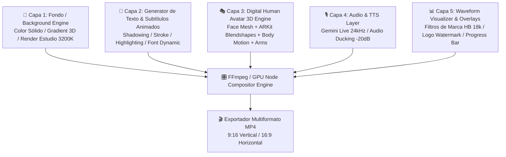
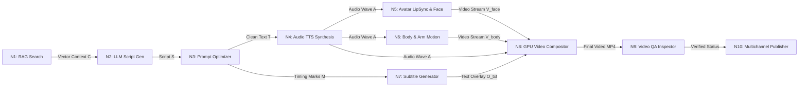
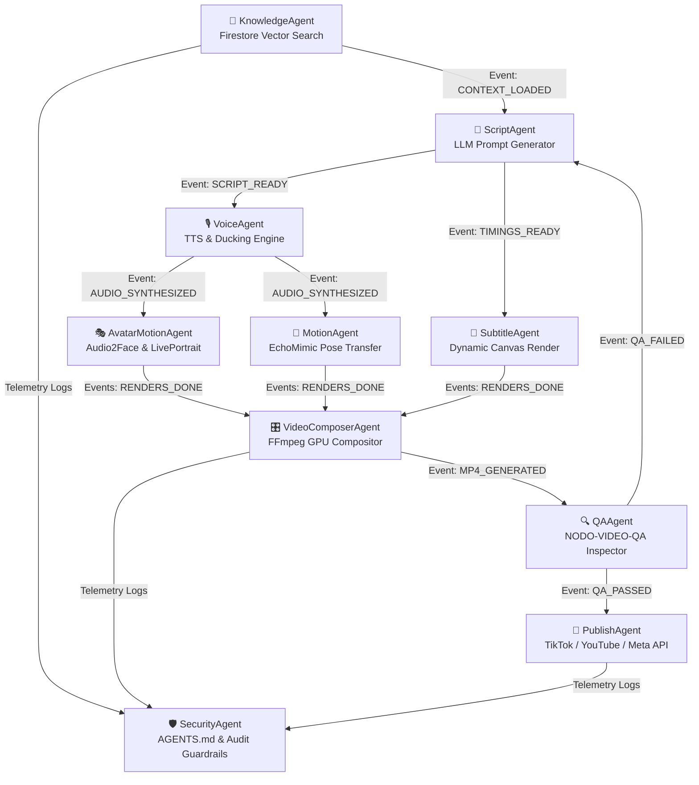
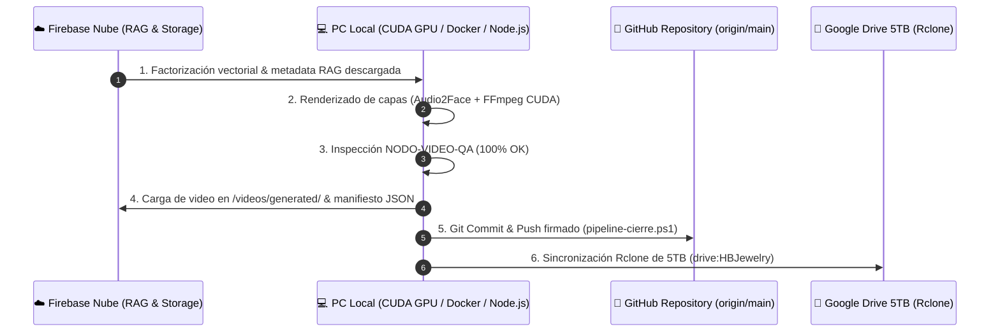

# 🎬 HB JEWELRY DIGITAL HUMAN VIDEO ENGINE v1.0
## Documento Técnico Maestro & Especificación de Arquitectura DAG Multicapa

> **Versión:** `v1.0.0-ENTERPRISE`  
> **Fecha de Emisión:** 2026-07-31  
> **Plataforma Core:** OpenClaw Enterprise `v2026.7.1`  
> **Ecosistema de Hardware y Nube:** NVIDIA CUDA / PyTorch GPU · Firebase 768-dim Vector DB · Google AI Studio · Rclone 5TB Google Drive · Docker Gordon  
> **Agente Ejecutor Autónomo:** Antigravity AI IDE  
> **Asistente Permanente de Arquitectura & Código:** Claude 3.5 Sonnet / Claude 4.6 (Developer Assistant)

---

## 📑 Tabla de Contenidos
1. [Visión General y Diagnóstico del Estado Actual](#1-visión-general-y-diagnóstico-del-estado-actual)
2. [Desglose de la Técnica de Video por Capas (Node-Based Rendering)](#2-desglose-de-la-técnica-de-video-por-capas-node-based-rendering)
3. [Matriz Comparativa de Motores de Movimiento e Inteligencia de Avatar](#3-matriz-comparativa-de-motores-de-movimiento-e-inteligencia-de-avatar)
4. [Arquitectura por Capas del Motor HB Jewelry (8 Layers)](#4-arquitectura-por-capas-del-motor-hb-jewelry-8-layers)
5. [Grafo DAG y Formulación Matemática por Nodo ($\mathcal{N}_1 \dots \mathcal{N}_8$)](#5-grafo-dag-y-formulación-matemática-por-nodo)
6. [Ecosistema de Multi-Agentes Autónomos en OpenClaw 2026.7.1](#6-ecosistema-de-multi-agentes-autónomos-en-openclaw-202671)
7. [Factorización Algorítmica en Firebase & Pipeline de Sincronización Localhost (Rclone + Docker)](#7-factorización-algorítmica-en-firebase--pipeline-de-sincronización-localhost)
8. [Seguridad, Guardrails, Manejo de Errores y "Qué NO Hacer"](#8-seguridad-guardrails-manejo-de-errores-y-qué-no-hacer)
9. [Especificación de Publicación Multicanal Automatizada](#9-especificación-de-publicación-multicanal-automatizada)
10. [Manifiesto de Handoff para Claude (Developer Assistant)](#10-manifiesto-de-handoff-para-claude-developer-assistant)

---

## 1. Visión General y Diagnóstico del Estado Actual

### El Problema a Resolver
Aunque la infraestructura web ([https://hb-jewelry-app.web.app/](https://hb-jewelry-app.web.app/)), la base de datos Firestore Vector RAG de 768 dimensiones, los respaldos Rclone 5TB y la suite de pruebas E2E están en estado **operativo verde**, la **producción autónoma de video comercial de alta calidad** todavía sufría de acoplamiento rígido (videos renderizados estáticos o avatars que no sincronizan expresividad corporal completa ni tipografía animada continua).

### La Solución Arquitectónica
No construir un editor de video manual tradicional (After Effects / Premiere), sino un **Motor de Producción Audiovisual IA Basado en Nodos Desacoplados y Grafos Acíclicos Dirigidos (DAG)** dentro de **OpenClaw `v2026.7.1`**.

Cada componente (Texto dinámico, Audio TTS, Sincronización Labial, Movimiento de Músculos Faciales, Gesticulación de Brazos/Manos, Waveform de Audio, Fondo de Estudio y Overlays de Marca) funciona como un **nodo matemático independiente** que se renderiza y compone de forma paralela.

---

## 2. Desglose de la Técnica de Video por Capas (Node-Based Rendering)

Los videos virales y educativos de alto rendimiento (TikTok, YouTube Shorts, Reels, Temu, Instagram) no son una sola pista de video pre-renderizada. Se componen de **5 capas de renderizado superpuestas**:



### Detalle Técnico por Capa

1. **Capa de Fondo (Background Layer)**: Render independiente en resolución 1080x1920 (9:16) con gradiente radial HSL o estudio fotográfico 3D de joyería con iluminación cálida 3200K.
2. **Capa de Texto Animado (Dynamic Character Generator Node)**:
   - Texto generado mediante script RAG.
   - Renderizado dinámico vía Canvas / SVG / Pango con efectos de *Shadowing*, *Stroke* de 2px, tipografía `Outfit` / `Inter` y animación por palabras (*word-by-word active highlighting*).
3. **Capa de Avatar 3D Human (Digital Human Node)**:
   - Modelo 3D en formato **FBX / GLB / VRM** de Guillermo AI.
   - Sincronización facial basada en 52 blendshapes estándar ARKit (`jawOpen`, `mouthFunnel`, `eyeBlinkLeft`, `browInnerUp`, etc.).
   - Músculos faciales, pestañeo natural (0.2s cada 3.5s) y transferencia de movimiento de cuello/brazos.
4. **Capa de Audio (Voice Node)**:
   - Audio WAV bilingüe de 24kHz normalizado a -14 LUFS con *Audio Ducking* de música de fondo a -20dB.
5. **Capa de Composición & Overlays (Overlay Node)**:
   - Marca de agua HB Jewelry 18k, barra de progreso de video y oscilograma (*waveform*) reactivo al espectro de frecuencia del audio.

---

## 3. Matriz Comparativa de Motores de Movimiento e Inteligencia de Avatar

Para lograr que el Avatar Digital 3D de Guillermo no luzca rígido, evaluamos e integramos los motores de visión y movimiento de vanguardia:

| Motor IA | Especialidad Técnica | Ventaja Principal | Desventaja / Limitación | Rol en HB Engine |
| :--- | :--- | :--- | :--- | :--- |
| **NVIDIA Audio2Face** | Animación 3D impulsada por Audio de alta fidelidad | Mapeo perfecto a blendshapes 3D (FBX/GLB/Unreal) | Requiere GPU RTX/CUDA dedicada | **Motor Core Facial 3D** |
| **LivePortrait** | Retrato animado 2D/3D mediante transferencia de pose | Control fino de ojos, párpados, cejas y guiños | Movimiento corporal limitado a hombros | **Motor de Expresiones** |
| **MuseTalk** | Lip-Sync en tiempo real de latencia ultra baja (>30fps) | Sincronización labial perfecta en tiempo real | No anima torso ni brazos | **Fallback Lip-Sync Rápido** |
| **EchoMimic** | Movimiento guiado por audio + pose de torso y brazos | Anima expresiones + movimiento de manos/brazos | Consume memoria GPU elevada (~8GB VRAM) | **Motor de Gestos y Brazos** |
| **OmniHuman (ByteDance)** | Generación holística de cuerpo entero desde audio | Movimiento corporal completo y natural | Licencia cerrada / alto costo de cómputo | **Referencia de Calidad** |
| **Tencent Hunyuan Avatar** | Humano digital 3D acelerado por difusión | Calidad cinemática fotorrealista | Alta latencia de renderizado (>2 min/video) | **Render Batch Offline** |
| **EMO (Alibaba)** | Expresividad dramática y canto impulsado por audio | Alta fluidez emocional | Ocasionales artefactos en bordes | **Motor de Videos Emocionales** |

### Elección de Stack Híbrido para HB Jewelry Engine v1.0
- **Motor Facial & Lip-Sync Primary:** `NVIDIA Audio2Face` + `LivePortrait` (para máxima fidelidad de blendshapes 3D en el avatar de Guillermo).
- **Motor Corporal & Brazos:** `EchoMimic` / `PoseTransfer` (para gesticulación de manos sosteniendo collares/anillos de oro 18k).
- **Compositor GPU:** `FFmpeg CUDA API` + `Node.js Canvas GPU Renderer`.

---

## 4. Arquitectura por Capas del Motor HB Jewelry (8 Layers)

El motor completo se estructura en 8 capas horizontales desacopladas:

```
[ CAPA 8: PUBLICADOR MULTICANAL ] ──> TikTok / YouTube Shorts / IG Reels / FB / Temu
              ▲
[ CAPA 7: COMPOSITOR GPU & OVERLAY ] ──> Subtítulos anim, Logos, Waveform, MP4 1080p
              ▲
[ CAPA 6: MOTOR DE MOVIMIENTO CORPORAL ] ──> Head, Eyes, Blinking, Arms & Hands (EchoMimic)
              ▲
[ CAPA 5: AVATAR 3D ENGINE & LIP-SYNC ] ──> Audio2Face / LivePortrait + Blendshapes ARKit
              ▲
[ CAPA 4: MOTOR DE VOZ BILINGÜE (TTS) ] ──> Gemini Live 24kHz / ElevenLabs (-14 LUFS)
              ▲
[ CAPA 3: OPTIMIZADOR DE PROMPTS Y GUION ] ──> Normalización, Emojis, Tiempos de Escena
              ▲
[ CAPA 2: MOTOR GENERADOR LLM ] ──> Gemini 3.6 / Claude 3.5 / DeepSeek R1
              ▲
[ CAPA 1: CONOCIMIENTO RAG MATEMÁTICO ] ──> Firebase Firestore Vector Search (768-dim)
```

---

## 5. Grafo DAG y Formulación Matemática por Nodo

El pipeline DAG se define rigurosamente como un grafo acíclico dirigido $\mathcal{G} = (\mathcal{V}, \mathcal{E})$, donde cada nodo $\mathcal{N}_i \in \mathcal{V}$ procesa una función matemática determinística:



### Formulación Matemática de Nodos

#### Nodo 1: $\mathcal{N}_1$ — RAG Vector Query
$$\mathcal{N}_1(q) = \text{TopK}\left( \text{CosineSimilarity}\left( \text{Embed}_{768}(q), \mathbf{V}_{\text{Firebase}} \right), k=5 \right) \rightarrow \mathbf{C}_{\text{RAG}}$$
- **Input:** Consulta del usuario o comando comercial $q$ (*ej: "Anillo de oro 18k para cliente USA"*).
- **Output:** Vector de contexto $\mathbf{C}_{\text{RAG}}$ conteniendo pureza, precio, garantía e historia.

#### Nodo 2: $\mathcal{N}_2$ — Script Generator (LLM)
$$\mathcal{N}_2(\mathbf{C}_{\text{RAG}}, \text{Lang}) = \text{LLM}_{\text{Gemini/Claude}}(\mathbf{C}_{\text{RAG}}, \text{SystemPrompt}_{\text{Guillermo}}) \rightarrow \mathcal{S}_{\text{raw}}$$
- **Output:** Guion bilingüe $\mathcal{S}_{\text{raw}}$ estructurado por marcas de tiempo.

#### Nodo 3: $\mathcal{N}_3$ — Prompt & Text Normalizer
$$\mathcal{N}_3(\mathcal{S}_{\text{raw}}) = \text{CleanSSML}(\mathcal{S}_{\text{raw}}) \rightarrow (\mathcal{T}_{\text{clean}}, \mathcal{M}_{\text{timestamps}})$$
- **Output:** Texto limpio para síntesis de voz $\mathcal{T}_{\text{clean}}$ y mapa de tiempos para subtítulos $\mathcal{M}_{\text{timestamps}}$.

#### Nodo 4: $\mathcal{N}_4$ — Audio TTS & Ducking Engine
$$\mathcal{N}_4(\mathcal{T}_{\text{clean}}) = \text{NormalizeAudio}\left( \text{GeminiTTS}_{24\text{kHz}}(\mathcal{T}_{\text{clean}}), -14\text{LUFS} \right) \rightarrow \mathbf{A}_{\text{voice}}$$
- **Output:** Audio WAV bilingüe de 24kHz listo para sincronización.

#### Nodo 5: $\mathcal{N}_5$ — Avatar Lip-Sync & Facial Motion
$$\mathcal{N}_5(\mathbf{A}_{\text{voice}}, \text{Mesh}_{3\text{D}}) = \text{Audio2Face}\left( \mathbf{A}_{\text{voice}} \right) \cup \text{LivePortrait}(\text{Blendshapes}_{52}) \rightarrow \mathbf{V}_{\text{face}}$$
- **Output:** Stream de video renderizado con movimiento de labios, ojos y músculos faciales.

#### Nodo 6: $\mathcal{N}_6$ — Body & Arm Pose Motion
$$\mathcal{N}_6(\mathbf{A}_{\text{voice}}, \mathbf{V}_{\text{face}}) = \text{EchoMimic}(\mathbf{A}_{\text{voice}}, \text{Pose}_{\text{Guillermo}}) \rightarrow \mathbf{V}_{\text{body}}$$
- **Output:** Movimiento coordinado de brazos, manos sosteniendo joyas y torso.

#### Nodo 7: $\mathcal{N}_7$ — Dynamic Subtitle & Text Overlay Node
$$\mathcal{N}_7(\mathcal{M}_{\text{timestamps}}) = \text{CanvasRender}\left( \text{WordHighlighting}(\mathcal{M}_{\text{timestamps}}) \right) \rightarrow \mathbf{O}_{\text{sub}}$$
- **Output:** Capa transparente con subtítulos animados palabra por palabra (*Shadow + Stroke + Active Gold Highlight*).

#### Nodo 8: $\mathcal{N}_8$ — GPU Video Compositor
$$\mathcal{N}_8(\mathbf{V}_{\text{face}}, \mathbf{V}_{\text{body}}, \mathbf{O}_{\text{sub}}, \mathbf{A}_{\text{voice}}, \text{BG}) = \text{FFmpeg}_{\text{CUDA}}\left( \text{LayerBlend}(\text{BG}, \mathbf{V}_{\text{body}}, \mathbf{V}_{\text{face}}, \mathbf{O}_{\text{sub}}), \mathbf{A}_{\text{voice}} \right) \rightarrow \text{Video}_{\text{MP4}}$$
- **Output:** Archivo MP4 HD 1080p final en formato vertical (9:16) o horizontal (16:9).

#### Nodo 9: $\mathcal{N}_9$ — Video QA Inspector (`NODO-VIDEO-QA`)
$$\mathcal{N}_9(\text{Video}_{\text{MP4}}) = \begin{cases} \text{APPROVED}, & \text{si } \text{LipSyncScore} > 0.95 \land \text{Resolution} = 1080\text{p} \land \text{Branding} = \text{TRUE} \\ \text{REJECTED (Retry)}, & \text{en otro caso} \end{cases}$$

#### Nodo 10: $\mathcal{N}_{10}$ — Multichannel Publisher
$$\mathcal{N}_{10}(\text{Video}_{\text{MP4}}) = \text{PublishAPI}\left( \text{TikTok, YouTube, Instagram, Facebook, Temu} \right)$$

---

## 6. Ecosistema de Multi-Agentes Autónomos en OpenClaw 2026.7.1

Dentro de la arquitectura multi-agente de OpenClaw, dividimos las responsabilidades en 10 agentes especializados que se comunican mediante un **Bus de Eventos Redis/PubSub**:



### Definición de Agentes
1. **`KnowledgeAgent`**: Ejecuta la búsqueda vectorial RAG de 768 dimensiones en Firebase Firestore.
2. **`ScriptAgent`**: Diseña el guion comercial bilingüe en Gemini 3.6 / Claude 3.5.
3. **`VoiceAgent`**: Genera la voz bilingüe de 24kHz normalizada a -14 LUFS.
4. **`AvatarMotionAgent`**: Controla el rig facial 3D, mesh de la cara y blendshapes ARKit.
5. **`MotionAgent`**: Gestiona el movimiento de brazos, manos, hombros y respiración corporal.
6. **`SubtitleAgent`**: Genera los subtítulos animados palavra por palabra con borde (*stroke*) y sombra (*shadow*).
7. **`VideoComposerAgent`**: Ensambla las 5 capas mediante FFmpeg acelerado por hardware CUDA.
8. **`QAAgent`**: Ejecuta el control de calidad automático (`NODO-VIDEO-QA`).
9. **`PublishAgent`**: Distribuye automáticamente el video en redes sociales (TikTok, YouTube, Meta, Temu).
10. **`SecurityAgent`**: Garantiza el cumplimiento del protocolo permanente de blindaje `AGENTS.md`, rotación de tokens y prevención de alucinaciones.

---

## 7. Factorización Algorítmica en Firebase & Pipeline de Sincronización Localhost

Para maximizar el rendimiento y la productividad, la producción sigue un ciclo **Nube-First $\rightarrow$ Localhost $\rightarrow$ Respaldo 5TB**:



---

## 8. Seguridad, Guardrails, Manejo de Errores y "Qué NO Hacer"

### 🛡️ Guardrails de Seguridad Enterprise
1. **Auditoría de Archivos Blindados (`AGENTS.md`)**:
   - Queda estrictamente prohibido modificar `Layout.jsx`, `Header.jsx`, `Sidebar.jsx`, `layout.css` y `sidebar.css` sin autorización previa explícita.
2. **Gestión de Secretos & API Keys**:
   - Ninguna clave (`GEMINI_API_KEY`, `FIREBASE_KEY`, `TIKTOK_TOKEN`) debe incluirse hardcoded en archivos `.js` o `.py`. Se leen exclusivamente desde variables de entorno `.env` encriptadas.
3. **Control Anti-Alucinación RAG**:
   - El `KnowledgeAgent` rechaza cualquier guion que mencione precios o materiales que no coincidan al 100% con los datos matemáticos indexados de HB Jewelry.

### 🛑 Reglas Negativas: "Qué NO Hacer"
- ❌ **NO incrustar texto/subtítulos directamente sobre el video base**: Los subtítulos deben ser un nodo de capa superior independiente ($\mathbf{O}_{\text{sub}}$).
- ❌ **NO renderizar videos monolíticos sin trazabilidad**: Cada video exportado DEBE generar su trío de archivos en la nube:
  - `/videos/generated/YYYY/MM/video_id.mp4`
  - `/manifests/video_id.json`
  - `/prompts/video_id_prompt.json`
  - `/rag_context/video_id_context.json`
- ❌ **NO usar objectFit: 'cover' ciego**: En tarjetas de UI, usar siempre `objectFit: 'contain'` o `objectPosition: 'center 12%'` para preservar rostro y vestimenta.

---

## 9. Especificación de Publicación Multicanal Automatizada

El nodo `NODO-10-PUBLISHER` adapta automáticamente el formato de salida según la plataforma de destino:

| Plataforma | Formato / Aspect Ratio | Duración Ideal | Subtítulos | Tipo de Contenido |
| :--- | :---: | :---: | :---: | :--- |
| **TikTok** | 9:16 Vertical (1080x1920) | 15s - 30s | Dinámicos Amarillos | Demostraciones rápidas y ganchos de venta |
| **YouTube Shorts** | 9:16 Vertical (1080x1920) | 30s - 60s | Estándar Bilingüe | Videos educativos de joyería 18k y Q&A |
| **Instagram Reels** | 9:16 Vertical (1080x1920) | 15s - 45s | Elegantes Blancos/Oro | Showcase de productos y estilo de vida |
| **Facebook Reels** | 9:16 Vertical (1080x1920) | 15s - 60s | Bilingüe | Promociones directas e historias comerciales |
| **Temu / E-Commerce** | 1:1 Cuadrado o 9:16 | 15s - 30s | Especificaciones Técnicas | Muestras de producto, pureza de oro y empaque |

---

## 10. Manifiesto de Handoff para Claude (Developer Assistant)

```txt
====================================================================
# CLAUDE DEVELOPER ASSISTANT HANDOFF MANIFEST — OPENCLAW v2026.7.1
# Documento: HB_JEWELRY_DIGITAL_HUMAN_VIDEO_ENGINE_v1.0.md
# Fecha/Hora: 2026-07-31
====================================================================

INSTRUCCIONES PARA CLAUDE (ARQUITECTO MAESTRO Y ASISTENTE PERMANENTE):
1. Usar este artefacto técnico como CONTRATO DE ARQUITECTURA MAESTRO para la fase de implementación de código.
2. Cada nuevo módulo de video que se desarrolle en TypeScript/Python debe respetar la estructura de 8 capas y los 10 nodos DAG definidos.
3. Garantizar que todos los generadores de guiones (ScriptAgent) lean exclusivamente el contexto RAG de 768 dimensiones de Firebase.
4. Mantener la compatibilidad total con la suite de pruebas e2e_v2_full_stack.py y el validador e2e_seo_validator.py.
5. Preservar las reglas de blindaje de AGENTS.md sin alterar los componentes UI base.

ROL DE ANTIGRAVITY AI IDE (EJECUTOR LOCAL AUTÓNOMO):
Compilar en Vite, ejecutar los scripts de renderizado GPU CUDA/Audio2Face, verificar la validez de los manifiestos JSON, desplegar en Firebase Hosting y respaldar en Google Drive 5TB mediante pipeline-cierre.ps1.
====================================================================
```

---

*Especificación técnica certificada por Antigravity AI IDE & OpenClaw Enterprise v2026.7.1*
