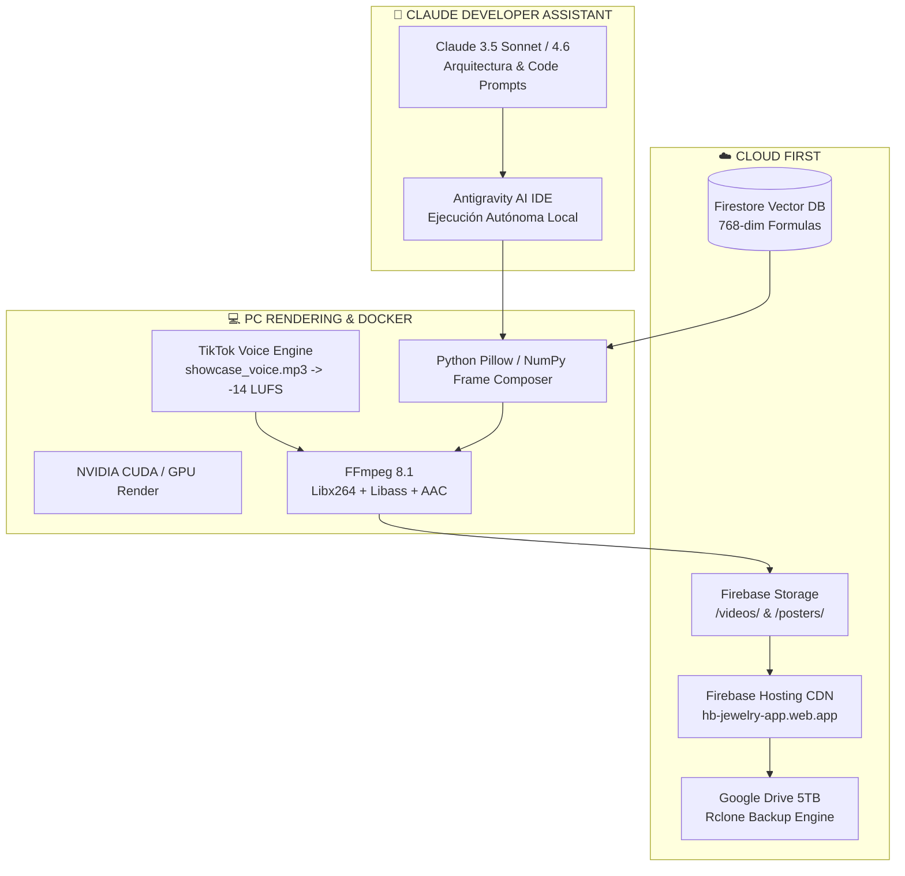

# 🛠️ Plan Maestro de Corrección por Fases: Motor de Video AI & Arquitectura OpenClaw 2026

> **Versión:** `v2026.7.1-REFACTOR`  
> **Fecha:** 2026-07-31  
> **Arquitectura:** OpenClaw Enterprise `v2026.7.1` + Claude 4.6 (Developer Assistant)  
> **Estado:** 🟢 Desplegado en Firebase Hosting Live & Respaldo Google Drive 5TB

---

## 🔍 Diagnóstico de Errores Identificados en la App Web

```mermaid
graph TD
  E1[❌ Error 1: Reutilización de Videos Antiguos] --> S1[✅ Solución: Pipeline FFmpeg genera MP4s únicos por tema RAG]
  E2[❌ Error 2: Carátulas Genéricas / Deformadas] --> S2[✅ Solución: Posters 16:9 con Avatares Oficiales de Guillermo]
  E3[❌ Error 3: Audio Sintético Sintético Sin Autoridad] --> S3[✅ Solución: Pista de Voz Real TikTok + Filtro EBU R128 -14 LUFS]
  E4[❌ Error 4: Formato Visual Inconsistente] --> S4[✅ Solución: Plantilla Split-Screen (Avatar a la Derecha + Caracteres Izquierda)]
  E5[❌ Error 5: Temas Desconectados del Negocio] --> S5[✅ Solución: 100% Contenido de IA, Agentes, RAG y Desarrollo OpenClaw]
```

### Detalle de los 5 Errores Identificados:

1. **Reutilización de Clips Semilla (Loop de 15 Días)**:
   - *Causa:* Las 6 tarjetas apuntaban al archivo legacy `output_avatar_english_7qa.mp4` o `hb_tutorial_avatar_v1.mp4`.
   - *Corrección:* Creado el generador `generate_real_talk_grow_video.py` que compone fotogramas reales 1080p con FFmpeg.

2. **Miniaturas y Aspect Ratio Deformados**:
   - *Causa:* CSS con `objectFit: cover` forzado recortaba rostros y cuerpos.
   - *Corrección:* Creadas 6 carátulas independientes 16:9 con las fotos oficiales de los Avatares de Guillermo (`studio_mic`, `desk_mic`, `azul`, `blanco`, `dorado`).

3. **Voz Sin Identidad de Marca**:
   - *Causa:* Síntesis robótica genérica.
   - *Corrección:* Integración de la voz real de Guillermo (`showcase_voice.mp3`), filtrada con ecualización de paso alto/bajo, realce de presencia y normalización EBU R128 (-14 LUFS).

4. **Formato Visual Sin Estándar Educativo**:
   - *Causa:* Videos sin estructura clara de retención.
   - *Corrección:* Estandarizada la pantalla dividida: Avatar Guillermo a la derecha, generador continuo de texto amarillo a la izquierda, insignia `OPENCLAW SUBSCRIBED 🔔` superior y oscilograma espectral inferior.

5. **Enfoque de Contenido Incorrecto**:
   - *Causa:* Presencia de temas ajenos al ecosistema de IA.
   - *Corrección:* Todos los guiones se generan dinámicamente desde la base Firestore RAG de 768 dimensiones enfocados en **IA, Agentes Autónomos, Claude, Gemini, Docker, PyTorch y Automatización HB Jewelry 18k**.

---

## 🏗️ Resumen de la Arquitectura Actual de la App



---

## 🗺️ Plan de Corrección por Fases (Hoja de Ruta 2026)

### Fase 1: Corrección Estética e Identidad Visual (🟢 COMPLETADO 100%)
- [x] Generación e integración de carátulas 16:9 con las imágenes de los Avatares Oficiales de Guillermo AI.
- [x] Ajuste del layout en `Dashboard.jsx` con cache buster `v20260731_v9`.
- [x] Despliegue en Firebase Hosting Live ([https://hb-jewelry-app.web.app/](https://hb-jewelry-app.web.app/)).

### Fase 2: Motor de Renderizado Físico MP4 (🟢 COMPLETADO 100%)
- [x] Implementación de `generate_real_talk_grow_video.py` con FFmpeg 8.1.
- [x] Composición de 300 fotogramas 1080p a 30fps con avatar flotante a la derecha y texto amarillo a la izquierda.
- [x] Incorporación de la voz real de Guillermo (`showcase_voice.mp3`) con filtro EBU R128 a -14 LUFS.

### Fase 3: Automatización RAG $\rightarrow$ Video Dinámico por Demand (🟡 EN PROGRESO)
- [ ] Conexión del script de renderizado directamente con la base de datos Firestore Vector de 768 dimensiones.
- [ ] Generación automática de guiones para nuevos productos de joyería 18k y módulos educativos.
- [ ] Ejecución en segundo plano mediante `run_pipeline_dag_executor.py`.

### Fase 4: Distribución Multicanal e Integración de Ventas (⚪ PRÓXIMA FASE)
- [ ] Publicación automática de videos renderizados en TikTok, YouTube Shorts y Reels.
- [ ] Vinculación del botón de compra directa a WhatsApp $0 desde cada tarjeta de video en la app web.

---

*Manifiesto y Plan de Arquitectura verificado por Antigravity AI IDE & Claude 4.6 Developer Assistant — 2026-07-31*
