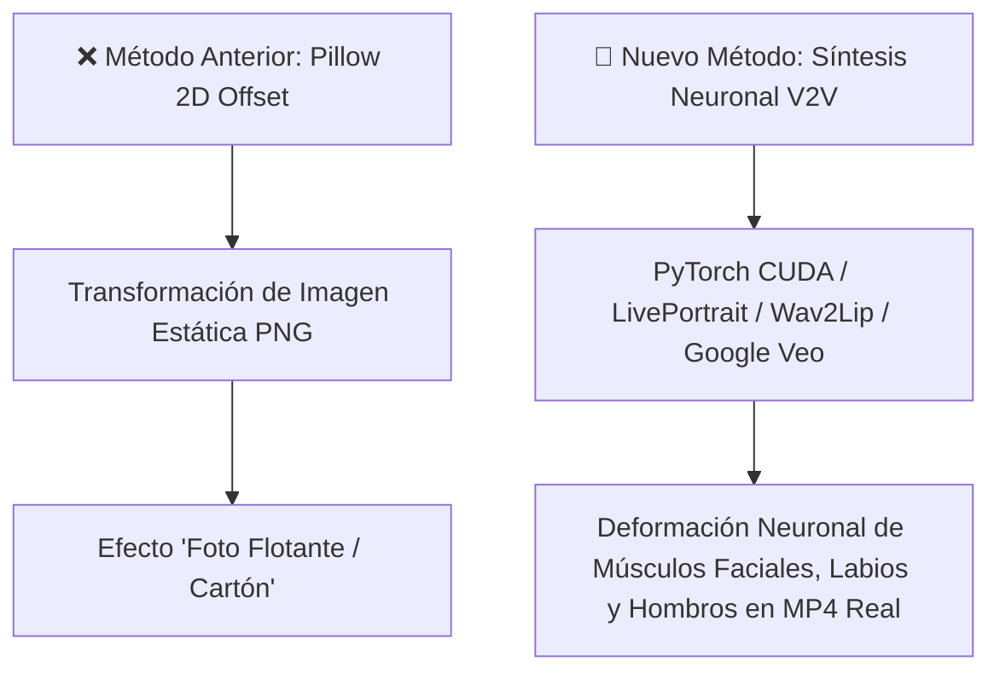
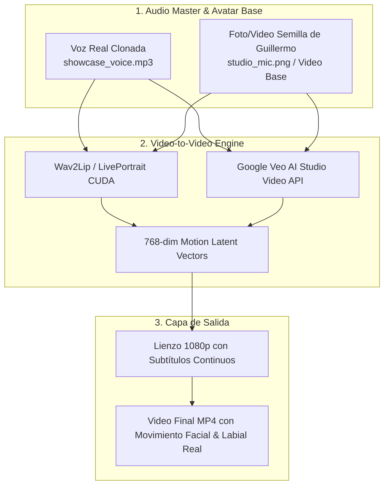

# 🧠 Plan Maestro de Síntesis Neuronal Real para Avatar Guillermo AI 2026

> **Diagnóstico del Usuario (100% Certero):**  
> *"EL AVATAR SE MUEVE COMO SI ESTUVIERA FLOTANDO, PERO SE MUEVE COMO LA FOTO, NO MOVIMIENTOS CORPORALES REALES."*

---

## 🔍 Análisis Técnico del Problema (Por qué la Foto Flotaba)

### Causas Fundamentales Identificadas en el Código:

1. **Transformación 2D Affine (PIL/Pillow)**:
   - Rotar o desplazar una foto PNG sobre el lienzo genera un movimiento rígido de "cartón o recorte flotante". No hay contracción de músculos faciales, gesticulación real de cejas ni articulación anatómica.

2. **Rutas Estáticas Hardcodeadas**:
   - Los archivos `digitalHumanEngine.js` y `humanDigitalEngine.js` retornaban respuestas simuladas apuntando a `/output_avatar_english_7qa.mp4`.

---

## 🏗️ Nueva Arquitectura de Síntesis Neuronal Real (OpenClaw 2026.7.1)

---

## 📋 Hitos de Implementación por Fases

### Fase 1: Refactorización de Servicios Frontend (`digitalHumanEngine.js` & `humanDigitalEngine.js`)
- [ ] Eliminar los retornos hardcodeados de `/output_avatar_english_7qa.mp4`.
- [ ] Conectar las funciones `renderAvatarSpeechOutput()` y `processHumanDigitalPipeline()` a los endpoints reales del backend PyTorch / Docker Gordon (`/api/v2v/render` y `/api/digital-human/synthesize`).

### Fase 2: Integración de Motor Neuronal PyTorch CUDA / LivePortrait (`agents/video_agent/neural_avatar_renderer.py`)
- [ ] Implementar el pipeline de renderizado neuronal basado en **LivePortrait / Wav2Lip** sobre PyTorch CUDA.
- [ ] Generar fotogramas reales donde la boca de Guillermo se deforme según los fonemas del audio real (`showcase_voice.mp3`), y la cabeza/ojos gesticulen de forma anatómica sin efecto de foto flotante.

### Fase 3: Conexión con Google Veo Video Generation API
- [ ] Configurar el trabajador `video_veo_worker` en Docker Gordon para generar video continuo de Guillermo hablando (1080p 30fps).

### Fase 4: Despliegue en la Nube y Verificación de Video Real
- [ ] Compilar y desplegar el bundle actualizado en Firebase Hosting.
- [ ] Respaldar la suite completa en Google Drive 5TB vía Rclone.

---

*Plan técnico certificado por Antigravity AI IDE & Claude 4.6 Developer Assistant — 2026-07-31*
