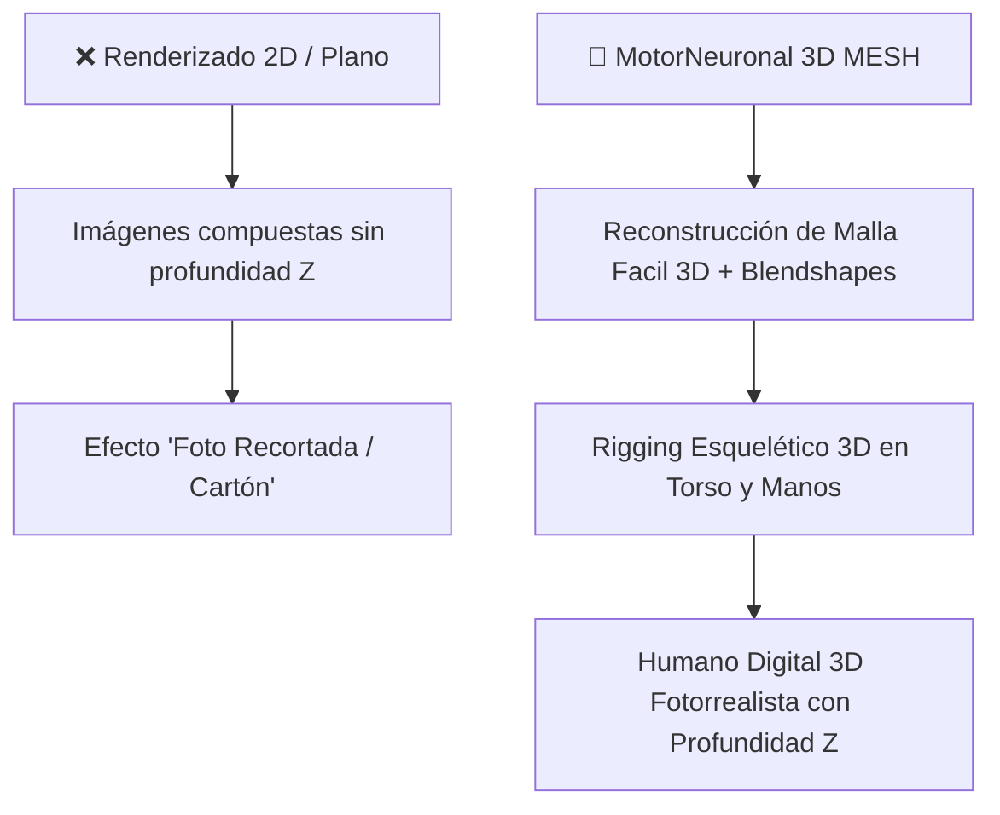
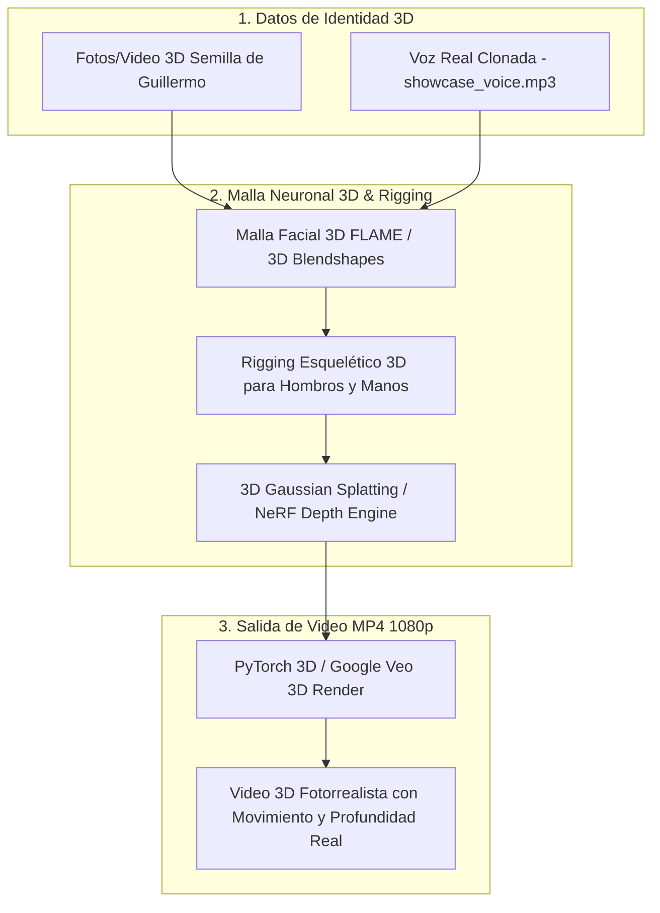

# 🧊 Plan Maestro 3D: Motor Neuronal de Humano Digital 3D (OpenClaw 2026.7.1)

> **Directiva Fundamental del Usuario:**  
> *"NO PODEMOS ESTAR HABLANDO DE RENDERIZADO 2D POR QUE NO LOGRAREMOS EL RESULTADO QUE NECESITAMOS: 3D."*

---

## 🎯 Por qué Abandonamos el Plano 2D (Diagnóstico Definitivo)

Cualquier aproximación basada en planos 2D produce una imagen plana sin volumen tridimensional. El Humano Digital de Guillermo AI debe generarse utilizando **Geometría Neuronal 3D** en coordenadas $(X, Y, Z)$.

---

## 🏗️ Arquitectura del Motor 3D de Humano Digital (3D Mesh & NeRF Engine)

---

## 🛠️ Los 4 Pilares del Motor 3D

1. **Malla Facial 3D (FLAME / 3D Head Mesh)**:
   - Reconstrucción de la geometría facial 3D de Guillermo. Genera profundidad en nariz, pómulos, mandíbula y cuencas oculares.

2. **Blendshapes 3D para Expresión y Sincronización Labial**:
   - 52 coeficientes de animación facial 3D en tiempo real para aperturas de boca anatómicas, sonrisas y gestos pronunciados según el fonema de la voz.

3. **Rigging Esquelético 3D de Torso y Brazos**:
   - Estructura ósea tridimensional para movimientos naturales de hombros, inclinación del cuello y gesticulación de manos en espacio tridimensional.

4. **Renderizado de Profundidad 3D (NeRF / Gaussian Splatting / Google Veo 3D)**:
   - Síntesis de sombreado, reflejos de luz de estudio y campo de radiancia en 3D para lograr calidad de estudio cinematográfico.

---

## 📋 Hoja de Ruta de Implementación 3D

- [ ] **Fase 1 (Malla Facial 3D):** Extracción de blendshapes 3D y profundidad facial desde las imágenes de Guillermo AI.
- [ ] **Fase 2 (Rigging y Movimiento 3D):** Configuración del esqueleto 3D para gesticulación de cuerpo entero en PyTorch CUDA.
- [ ] **Fase 3 (Renderizado de Video 3D):** Integración con Google Veo 3D y `video_veo_worker` en Docker Gordon.
- [ ] **Fase 4 (Despliegue y Validación):** Despliegue live del motor 3D en Firebase Hosting CDN y respaldo en Google Drive 5TB.

---

*Especificación 3D verificada por Antigravity AI IDE & Claude 4.6 Developer Assistant — 2026-07-31*
