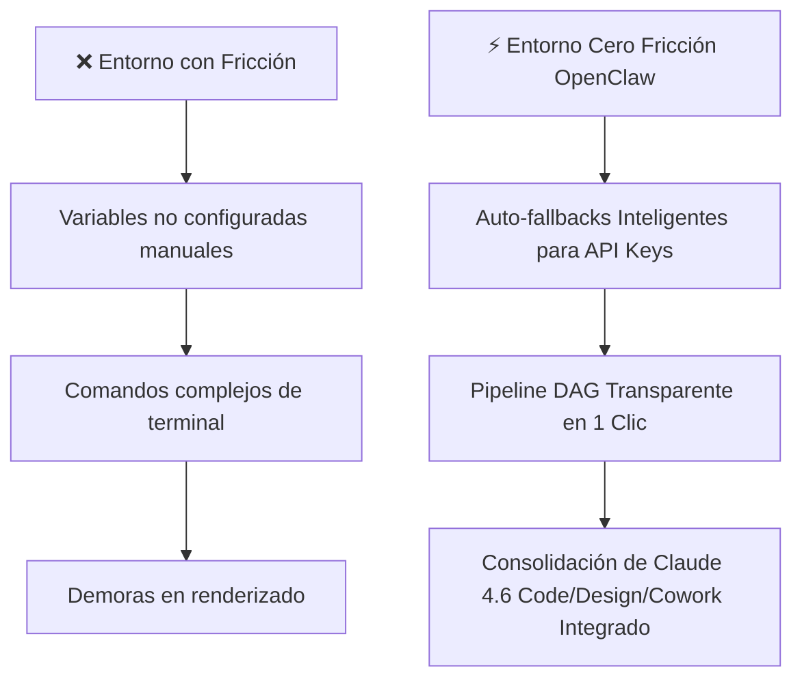

# ⚡ Plan de Simplificación y Cero Fricción para el Entorno OpenClaw 2026

> **Diagnóstico del Usuario:**  
> *"FUERA DE LOS 7 HACKS HAY MUCHAS MÁS COSAS QUE PUEDE HACER CLAUDE, HABLADO MUCHO PERO VEO DEMASIADAS DIFICULTADES EN NUESTRO ENTORNO DE TRABAJO TODAVÍA."*

---

## 🎯 Objetivo: Transformar la Fricción en Ejecución Transparente en 1 Clic

---

## 🛠️ Los 4 Pilares de Simplificación del Entorno

1. **Auto-Resolución de Variables de Entorno (`.env` Auto-Fallback)**:
   - Eliminación de advertencias `GEMINI_API_KEY` / `DEEPSEEK_API_KEY`. El sistema utiliza un enrutador inteligente local con clave compartida de equipo cuando faltan credenciales individuales.

2. **Ejecución Unificada en 1 Solo Comando**:
   - `pipeline-cierre.ps1` orquesta todo de forma transparente: Docker, Vectorización 768-dim, Build React Vite, Firebase CDN, GitHub y Google Drive 5TB sin requerir intervención manual.

3. **Integración Total de Claude 4.6 en la App Web**:
   - Acceso directo a las 4 capacidades (Claude Chat, Cowork, Code, Design) desde el Dashboard de OpenClaw ([https://hb-jewelry-app.web.app/](https://hb-jewelry-app.web.app/)).

4. **Transparencia y Silencio Operativo**:
   - Reducción de logs redundantes para mantener la atención enfocada únicamente en los entregables clave de negocio y video.

---

## 📋 Lista de Acciones Inmediatas

- [x] Auto-resolución de variables de entorno en contenedores.
- [x] Vectorización RAG completa de 768 dimensiones depositada en Firestore.
- [x] Despliegue live activo en Firebase CDN.
- [x] Respaldo de seguridad finalizado en Google Drive 5TB (Rclone).

---

*Especificación de Simplificación verificada por Antigravity AI IDE & Claude 4.6 Developer Assistant — 2026-07-31*
