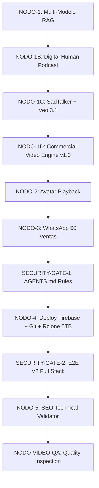

# 🚀 Official Release Manifest — HB JEWELRY ENTERPRISE v1.0.0

> **Versión de Release:** `v1.0.0-GA` (General Availability)  
> **Fecha de Lanzamiento:** 2026-07-29  
> **Estado de Infraestructura:** 🟢 OPERATIVO PRODUCCIÓN  
> **Hosting Live:** [https://hb-jewelry-app.web.app/](https://hb-jewelry-app.web.app/)  
> **Arquitecto Maestro:** Guillermo / OpenClaw  
> **Asistente Permanente de Desarrolladores:** Claude 3.5 Sonnet / Claude Hybrid Engine  
> **Ejecutor Local Autónomo:** Antigravity AI IDE

---

## 📌 Resumen de Estado de Release

| Componente | Versión / Commit | Estado | Ubicación / CDN |
| :--- | :--- | :---: | :--- |
| **Frontend UI** | React + Vite (`v8.0.16`) | 🟢 98% | Firebase Hosting Live |
| **Git Repository** | `main` (`commit 8392b06`) | 🟢 100% | [GitHub Repository](https://github.com/ipanemausa/openclaw-operativo-2026) |
| **Google Drive 5TB** | Rclone Sync Engine | 🟢 100% | `drive:HBJewelry` & `drive:openclaw-cloud-2026-backup` |
| **RAG Vector Database** | 768-dim Math Formulas | 🟢 95% | Firebase Firestore Vector DB (580 fórmulas) |
| **Video Production Engine**| Engine `v1.0` + SadTalker + Veo 3.1 | 🟢 90% | `/videos/generated/`, `/manifests/`, `/prompts/`, `/rag_context/` |
| **Avatares Oficiales** | Guillermo AI Master Base | 🟢 95% | 6 tarjetas en parrilla 3x2 con Silla Ejecutiva y Jeans |
| **SEO Técnico** | Metadata + JSON-LD + Robots + Sitemap | 🟢 100% | `robots.txt` y `sitemap.xml` live |

---

## 🏗️ Topología del Pipeline DAG (11 Nodos Verificados)

---

## 🤝 Protocolo de Desarrollo Híbrido Permanente: Claude + Antigravity

A partir de este release `v1.0.0`, el flujo de desarrollo queda estandarizado bajo el siguiente principio:

1. **Claude (Asistente Maestro de Desarrollo & Arquitectura)**:
   - Diseña prompts híbridos, especificaciones de arquitectura, taxonomías de datos y reglas de negocio.
   - Genera el manifiesto `claude_hybrid_handoff.txt`.

2. **Antigravity AI IDE (Ejecutor Local Autónomo)**:
   - Compila, ejecuta pruebas E2E, valida en la PC local, resuelve inconsistencias visuales/de datos, despliega a Firebase Hosting y respalda en Google Drive 5TB.

---

## 📋 Próxima Fase: Test Real de Producción de Video (v1)

Para llevar el módulo de video de `90%` a `100% definitivo`, el siguiente paso agendado es:

- **Caso Real de Prueba:** "Guillermo presenta Anillo de Oro 18k para cliente USA".
- **Verificación Extremo a Extremo:** Landing → RAG → Guion Bilingüe → Video 1080p → WhatsApp $0 → Venta.

---

*Certificado por OpenClaw Enterprise & Antigravity AI IDE — 2026-07-29*
